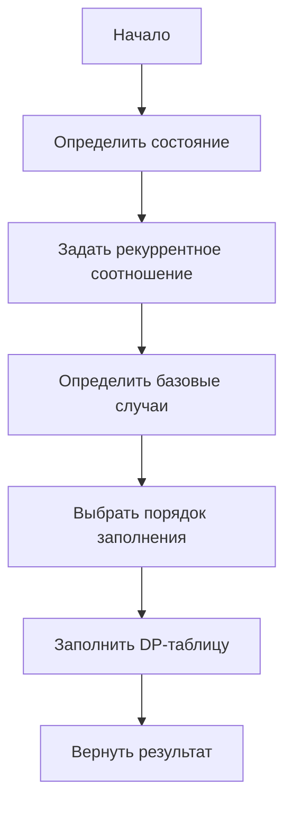

# Одномерная DP (1D DP)

**1D DP** (одномерное динамическое программирование) — это метод решения задач, где состояние описывается одной переменной, а оптимальное решение строится на основе ранее вычисленных подзадач.

## Подробное описание

**Постановка задачи:** дана последовательность или числовая прямая, на которой требуется найти оптимальное значение (максимум, минимум, количество способов) с учётом того, что выбор на текущем шаге зависит от результатов предыдущих шагов.

**Входные данные:** длина последовательности `n`, правила перехода между состояниями (обычно задаются рекуррентным соотношением).

**Выходные данные:** искомое значение (число, булево значение или набор шагов).

**Ключевая идея:** разбить задачу на подзадачи, каждая из которых решается один раз; результат сохраняется в таблице (DP-массиве) и переиспользуется, избегая повторных вычислений.

## Основные принципы

1. **Определение состояния:** выбирается параметр, полностью описывающий подзадачу (обычно индекс в массиве).
2. **Рекуррентное соотношение:** формулируется, как решение для текущего состояния зависит от предыдущих.
3. **Базовый случай:** определяются тривиальные случаи, с которых начинается заполнение таблицы.
4. **Порядок заполнения:** выбирается направление вычислений (обычно слева направо).
5. **Оптимизация памяти:** часто можно хранить только последние несколько значений вместо всей таблицы.

### Математическая формулировка

Для классической задачи чисел Фибоначчи рекуррентное соотношение имеет вид:

$$
F(n) = F(n-1) + F(n-2)
$$

Где:
- $F(n)$ — значение n-го числа Фибоначчи
- $F(0) = 0$, $F(1) = 1$ — базовые случаи

Для задачи о кузнечике количество способов добраться до позиции $n$:

$$
dp[n] = dp[n-1] + dp[n-2]
$$

Где:
- $dp[n]$ — количество способов добраться до позиции $n$
- $dp[1] = 1$, $dp[2] = 2$ — базовые случаи

### Блок-схема



## Пример реализации на Python

```python
from typing import List


def fibonacci(n: int) -> int:
    # Базовые случаи
    if n == 0:
        return 0
    if n == 1:
        return 1

    # Инициализируем массив для хранения промежуточных результатов
    dp: List[int] = [0] * (n + 1)
    dp[0] = 0  # F(0)
    dp[1] = 1  # F(1)

    # Заполняем массив по порядку слева направо
    for i in range(2, n + 1):
        dp[i] = dp[i - 1] + dp[i - 2]  # Рекуррентное соотношение

    return dp[n]


def count_ways(n: int) -> int:
    # Количество способов добраться до позиции n
    if n == 1:
        return 1
    if n == 2:
        return 2  # 1+1 или 2

    dp: List[int] = [0] * (n + 1)
    dp[1] = 1
    dp[2] = 2

    for i in range(3, n + 1):
        dp[i] = dp[i - 1] + dp[i - 2]

    return dp[n]


def fibonacci_optimized(n: int) -> int:
    # Версия с экономией памяти: O(1) вместо O(n)
    if n == 0:
        return 0
    if n == 1:
        return 1

    prev_prev = 0  # F(n-2)
    prev = 1       # F(n-1)

    for _ in range(2, n + 1):
        current = prev + prev_prev
        prev_prev, prev = prev, current

    return prev


if __name__ == "__main__":
    print(f"fibonacci(10) = {fibonacci(10)}")              # 55
    print(f"fibonacci_optimized(10) = {fibonacci_optimized(10)}")  # 55
    print(f"count_ways(5) = {count_ways(5)}")              # 8
```

## Достоинства и недостатки

**Достоинства:**

1. **Эффективность** — каждое состояние вычисляется один раз, что даёт временную сложность $O(n)$.
2. **Простота реализации** — для одномерных задач достаточно одного массива и цикла.
3. **Оптимизация памяти** — во многих случаях можно свести пространственную сложность к $O(1)$.

**Недостатки:**

1. **Ограниченная размерность** — метод применим только когда состояние описывается одной переменной; многомерные задачи требуют более сложных подходов.
2. **Необходимость рекуррентного соотношения** — для ряда задач его трудно или невозможно сформулировать.
3. **Фиксированный порядок вычислений** — не все задачи допускают простое заполнение слева направо.

## Области применения

1. Биотехнологии и медицина (анализ последовательностей ДНК/РНК, поиск паттернов)
2. Экономика и финансы (прогнозирование временных рядов, выявление трендов)
3. Обработка текста (поиск повторяющихся фрагментов, исправление ошибок)
4. Компьютерное зрение (сопоставление одномерных сигналов, например, в спектроскопии)
5. Логистика (оптимизация маршрутов на основе исторических данных перемещений)
