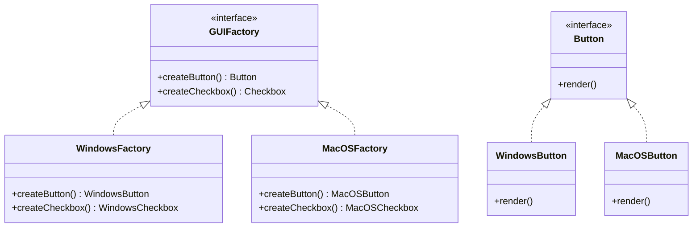

# Абстрактная фабрика (Abstract Factory)

Абстрактная фабрика — это порождающий паттерн проектирования, который позволяет создавать семейства связанных объектов, не привязываясь к конкретным классам создаваемых объектов.

## Основные принципы

Паттерн определяет интерфейс для создания всех доступных типов продуктов. Его конкретные реализации (конкретные фабрики) создают продукты определённой вариации. Клиентский код работает с фабриками и продуктами только через абстрактные интерфейсы.

### Математическая формулировка

Для выбора нужной фабрики используется функция выбора:

$$
F(context) = \begin{cases} ConcreteFactory_1 & \text{если } context == Windows \\ ConcreteFactory_2 & \text{если } context == MacOS \end{cases}
$$

### Блок-схема



## Пример реализации на Python

В следующем примере реализуется система создания UI-компонентов для разных операционных систем.

```python
from abc import ABC, abstractmethod

# Абстрактные продукты
class Button(ABC):
    @abstractmethod
    def render(self) -> str:
        pass

class Checkbox(ABC):
    @abstractmethod
    def render(self) -> str:
        pass

# Конкретные продукты для Windows
class WindowsButton(Button):
    def render(self) -> str:
        return "[Windows Button]"

class WindowsCheckbox(Checkbox):
    def render(self) -> str:
        return "[Windows Checkbox]"

# Конкретные продукты для MacOS
class MacOSButton(Button):
    def render(self) -> str:
        return "(MacOS Button)"

class MacOSCheckbox(Checkbox):
    def render(self) -> str:
        return "(MacOS Checkbox)"

# Абстрактная фабрика
class GUIFactory(ABC):
    @abstractmethod
    def create_button(self) -> Button:
        pass

    @abstractmethod
    def create_checkbox(self) -> Checkbox:
        pass

# Конкретные фабрики
class WindowsFactory(GUIFactory):
    def create_button(self) -> Button:
        return WindowsButton()

    def create_checkbox(self) -> Checkbox:
        return WindowsCheckbox()

class MacOSFactory(GUIFactory):
    def create_button(self) -> Button:
        return MacOSButton()

    def create_checkbox(self) -> Checkbox:
        return MacOSCheckbox()

# Клиентский код
def client_code(factory: GUIFactory):
    button = factory.create_button()
    checkbox = factory.create_checkbox()

    print(f"Кнопка: {button.render()}")
    print(f"Чекбокс: {checkbox.render()}")

if __name__ == "__main__":
    # Создаем фабрику для Windows
    print("Создание UI для Windows:")
    client_code(WindowsFactory())

    print("\nСоздание UI для MacOS:")
    # Создаем фабрику для MacOS
    client_code(MacOSFactory())
```

## Достоинства и недостатки

**Достоинства:**

1. **Изоляция конкретных классов:** Клиентский код работает только с абстрактными интерфейсами, не зная о реализации.
2. **Гарантия сочетаемости продуктов:** Все продукты, созданные одной фабрикой, принадлежат одному семейству и совместимы друг с другом.
3. **Принцип открытости/закрытости:** Можно добавлять новые варианты продуктов, не изменяя существующий клиентский код.

**Недостатки:**

1. **Сложность расширения:** Добавление нового типа продукта требует изменения интерфейса фабрики и всех её подклассов.
2. **Увеличение числа классов:** Введение множества абстракций и реализаций может привести к избыточности кода.
