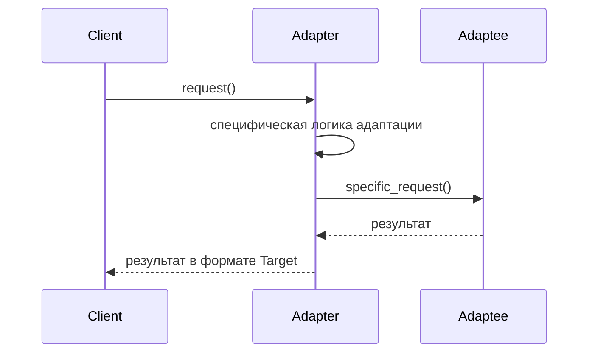

# Адаптер (Adapter)

Адаптер — это структурный паттерн проектирования, который позволяет объектам с несовместимыми интерфейсами работать вместе. Он действует как мост между двумя классами, преобразуя интерфейс одного класса в интерфейс, ожидаемый клиентом.

## Основные принципы

Адаптер оборачивает объект с несовместимым интерфейсом и переводит его вызовы в вызовы, понятные целевому объекту. Выделяют два типа адаптеров:
- **Адаптер объекта** (использует композицию).
- **Адаптер класса** (использует множественное наследование).

### Математическая формулировка

Для преобразования данных от адаптируемого класса к целевому интерфейсу используется функция маппинга:

$$
TargetMethod(args) \rightarrow AdapteeMethod(Transform(args))
$$

### Блок-схема



## Пример реализации на Python

Рассмотрим интеграцию старой платежной системы в новый интерфейс обработки платежей.

```python
from abc import ABC, abstractmethod

# Целевой интерфейс, который ожидает клиент
class PaymentProcessor(ABC):
    @abstractmethod
    def pay(self, amount: float) -> None:
        pass

# Старая система с несовместимым интерфейсом
class LegacyPaymentSystem:
    def make_payment(self, dollars: int, cents: int) -> None:
        print(f"Оплата через Legacy систему: {dollars} долларов и {cents} центов")

# Адаптер для старой системы
class LegacyPaymentAdapter(PaymentProcessor):
    def __init__(self, legacy_system: LegacyPaymentSystem):
        self.legacy_system = legacy_system

    def pay(self, amount: float) -> None:
        # Преобразование float в формат dollars/cents
        dollars = int(amount)
        cents = int((amount - dollars) * 100)
        self.legacy_system.make_payment(dollars, cents)

# Новая система, совместимая с целевым интерфейсом
class ModernPaymentSystem(PaymentProcessor):
    def pay(self, amount: float) -> None:
        print(f"Оплата через Modern систему: {amount:.2f} USD")

# Клиентский код
def process_payment(processor: PaymentProcessor, amount: float):
    processor.pay(amount)

if __name__ == "__main__":
    modern_system = ModernPaymentSystem()
    legacy_system = LegacyPaymentSystem()
    # Оборачиваем старую систему в адаптер
    legacy_adapter = LegacyPaymentAdapter(legacy_system)

    print("Используем Modern систему:")
    process_payment(modern_system, 123.45)

    print("\nИспользуем Legacy систему через адаптер:")
    process_payment(legacy_adapter, 123.45)
```

## Достоинства и недостатки

**Достоинства:**

1. **Реусинг существующего кода:** Позволяет использовать классы, интерфейс которых не соответствует текущим требованиям, без изменения их исходного кода.
2. **Принцип открытости/закрытости:** Можно вводить новые адаптеры без изменения клиентского кода.
3. **Разделение ответственности:** Скрывает от клиента细节 преобразования интерфейсов.

**Недостатки:**

1. **Усложнение кода:** Введение дополнительных классов может запутать архитектуру.
