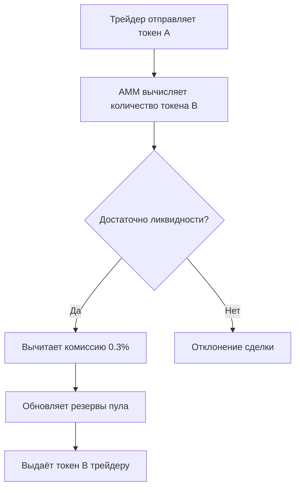

# Автоматический маркет-мейкинг (AMM)

Автоматический маркет-мейкинг (Automatic Market Maker, AMM) — это алгоритмический протокол, который автоматически обеспечивает ликвидность на децентрализованных биржах (DEX) без традиционных маркет-мейкеров. Вместо ордербуков AMM используют математические формулы для определения цены и выполнения сделок.

В традиционных биржах ликвидность предоставляют маркет-мейкеры — участники, выставляющие ордера на покупку и продажу. AMM заменяют их пулами ликвидности, в которых токены хранятся в пропорциональном соотношении. Любой пользователь может стать поставщиком ликвидности, внося токены в пул, и получать комиссию за сделки.

**Входные данные:** два токена, формирующих торговую пару, и их количество в пуле.

**Выходные данные:** количество токена, которое получит трейдер при обмене, с учётом текущего соотношения резервов и комиссии.

**Ключевая идея:** цена актива определяется соотношением резервов в пуле, а не спросом и предложением на ордербуке. При каждой сделке баланс пула смещается, что автоматически корректирует цену.

Протокол AMM был впервые реализован проектом Bancor в 2017 году, но массовую популярность получил благодаря Uniswap (2020), внедрившему модель константного продукта.

## Основные принципы

### Математическая формулировка

Наиболее распространённая модель — константный продукт (Constant Product Formula), используемая в Uniswap:

$$
x \cdot y = k
$$

Где:

- $x$ — количество первого токена (токен A) в пуле
- $y$ — количество второго токена (токен B) в пуле
- $k$ — константа, определяемая при создании пула и меняющаяся только при добавлении/удалении ликвидности

Цена определяется соотношением резервов:

$$
P_A = \frac{y}{x}, \quad P_B = \frac{x}{y}
$$

При обмене токена A на токен B трейдер вносит количество $\Delta x$ в пул, а получает $\Delta y$, при этом выполняется условие:

$$
(x + \Delta x) \cdot (y - \Delta y) = k
$$

Откуда:

$$
\Delta y = y - \frac{k}{x + \Delta x}
$$

**Проскальзывание (slippage)** — разница между спотовой ценой и фактической ценой сделки. Чем больше размер сделки относительно ликвидности пула, тем выше проскальзывание.

**Комиссия** — в Uniswap комиссия составляет 0,3% от суммы сделки и автоматически добавляется в пул, увеличивая $k$ и принося доход поставщикам ликвидности.

### Диаграмма работы AMM



## Реализация на Python

```python
import math
from decimal import Decimal

class ConstantProductAMM:
    def __init__(self, token_a: str, token_b: str, initial_a: float, initial_b: float):
        self.token_a = token_a
        self.token_b = token_b
        self.reserve_a = Decimal(str(initial_a))
        self.reserve_b = Decimal(str(initial_b))
        self.k = self.reserve_a * self.reserve_b

    def get_price(self, from_token: str, to_token: str) -> Decimal:
        """Получить текущую цену пары"""
        if from_token == self.token_a and to_token == self.token_b:
            return self.reserve_b / self.reserve_a
        elif from_token == self.token_b and to_token == self.token_a:
            return self.reserve_a / self.reserve_b
        else:
            raise ValueError("Неверная пара токенов")

    def calculate_output_amount(self, input_token: str, input_amount: float) -> Decimal:
        """Рассчитать количество выходного токена при обмене"""
        input_amount_dec = Decimal(str(input_amount))

        if input_token == self.token_a:
            new_reserve_a = self.reserve_a + input_amount_dec
            new_reserve_b = self.k / new_reserve_a
            output_amount = self.reserve_b - new_reserve_b
        elif input_token == self.token_b:
            new_reserve_b = self.reserve_b + input_amount_dec
            new_reserve_a = self.k / new_reserve_b
            output_amount = self.reserve_a - new_reserve_a
        else:
            raise ValueError("Неверный входной токен")

        if output_amount <= 0:
            raise ValueError("Недостаточная ликвидность")

        return output_amount

    def swap(self, input_token: str, input_amount: float) -> Decimal:
        """Выполнить обмен токенов"""
        output_amount = self.calculate_output_amount(input_token, input_amount)
        input_amount_dec = Decimal(str(input_amount))

        if input_token == self.token_a:
            self.reserve_a += input_amount_dec
            self.reserve_b -= output_amount
        else:
            self.reserve_b += input_amount_dec
            self.reserve_a -= output_amount

        self.k = self.reserve_a * self.reserve_b
        return output_amount

    def get_reserves(self) -> tuple:
        """Получить текущие резервы"""
        return float(self.reserve_a), float(self.reserve_b)


if __name__ == "__main__":
    amm = ConstantProductAMM("ETH", "USDT", 1000, 2000000)

    print("=== Инициализация пула ===")
    print(f"Резервы: {amm.get_reserves()}")
    print(f"Цена ETH в USDT: {amm.get_price('ETH', 'USDT'):.2f}")
    print(f"Цена USDT в ETH: {amm.get_price('USDT', 'ETH'):.6f}")
    print()

    print("=== Покупка 1 ETH за USDT ===")
    eth_received = amm.swap("USDT", 2000)
    print(f"Получено ETH: {eth_received:.6f}")
    print(f"Новые резервы: {amm.get_reserves()}")
    print(f"Новая цена ETH: {amm.get_price('ETH', 'USDT'):.2f}")
    print()

    print("=== Продажа 0.5 ETH за USDT ===")
    usdt_received = amm.swap("ETH", 0.5)
    print(f"Получено USDT: {usdt_received:.2f}")
    print(f"Новые резервы: {amm.get_reserves()}")
    print(f"Новая цена ETH: {amm.get_price('ETH', 'USDT'):.2f}")
```

### Расширенная реализация с комиссиями и управлением ликвидностью

```python
class AdvancedAMM(ConstantProductAMM):
    def __init__(self, token_a: str, token_b: str, initial_a: float, initial_b: float, fee: float = 0.003):
        super().__init__(token_a, token_b, initial_a, initial_b)
        self.fee = Decimal(str(fee))
        self.lp_total_supply = Decimal('0')
        self.lp_balances = {}

    def add_liquidity(self, amount_a: float, amount_b: float, provider: str) -> Decimal:
        """Добавить ликвидность с выпуском LP-токенов"""
        amount_a_dec = Decimal(str(amount_a))
        amount_b_dec = Decimal(str(amount_b))

        if self.lp_total_supply == 0:
            liquidity = math.sqrt(amount_a_dec * amount_b_dec)
        else:
            liquidity_a = (amount_a_dec / self.reserve_a) * self.lp_total_supply
            liquidity_b = (amount_b_dec / self.reserve_b) * self.lp_total_supply
            liquidity = min(liquidity_a, liquidity_b)

        if liquidity <= 0:
            raise ValueError("Неверное количество ликвидности")

        self.reserve_a += amount_a_dec
        self.reserve_b += amount_b_dec
        self.k = self.reserve_a * self.reserve_b

        self.lp_total_supply += liquidity
        self.lp_balances[provider] = self.lp_balances.get(provider, Decimal('0')) + liquidity

        return liquidity

    def remove_liquidity(self, liquidity: float, provider: str) -> tuple:
        """Удалить ликвидность и получить обратно токены"""
        liquidity_dec = Decimal(str(liquidity))

        if provider not in self.lp_balances or self.lp_balances[provider] < liquidity_dec:
            raise ValueError("Недостаточно LP-токенов")

        share = liquidity_dec / self.lp_total_supply
        amount_a = share * self.reserve_a
        amount_b = share * self.reserve_b

        self.reserve_a -= amount_a
        self.reserve_b -= amount_b
        self.k = self.reserve_a * self.reserve_b
        self.lp_balances[provider] -= liquidity_dec
        self.lp_total_supply -= liquidity_dec

        return float(amount_a), float(amount_b)

    def swap(self, input_token: str, input_amount: float) -> Decimal:
        """Обмен с учётом комиссии"""
        input_amount_dec = Decimal(str(input_amount))
        input_amount_after_fee = input_amount_dec * (Decimal('1') - self.fee)

        if input_token == self.token_a:
            new_reserve_a = self.reserve_a + input_amount_after_fee
            new_reserve_b = self.k / new_reserve_a
            output_amount = self.reserve_b - new_reserve_b
            self.reserve_a += input_amount_dec
            self.reserve_b -= output_amount
        else:
            new_reserve_b = self.reserve_b + input_amount_after_fee
            new_reserve_a = self.k / new_reserve_b
            output_amount = self.reserve_a - new_reserve_a
            self.reserve_b += input_amount_dec
            self.reserve_a -= output_amount

        self.k = self.reserve_a * self.reserve_b
        return output_amount


if __name__ == "__main__":
    amm = AdvancedAMM("ETH", "USDT", 100, 200000, 0.003)

    print("=== Расширенный AMM с комиссиями ===")
    lp_tokens = amm.add_liquidity(10, 20000, "provider1")
    print(f"Выпущено LP-токенов: {lp_tokens:.2f}")

    eth_received = amm.swap("USDT", 1000)
    print(f"Получено ETH за 1000 USDT: {eth_received:.6f}")
    print(f"Новые резервы: {amm.get_reserves()}")

    amount_a, amount_b = amm.remove_liquidity(float(lp_tokens), "provider1")
    print(f"Извлечено: {amount_a:.2f} ETH, {amount_b:.2f} USDT")
```

## Достоинства и недостатки

**Достоинства:**

1. Доступность — любой пользователь может предоставить ликвидность без разрешений и KYC-процедур
2. Автоматизация — цены определяются математической формулой без необходимости в ордербуках и маркет-мейкерах
3. Постоянная ликвидность — торговля возможна в любое время для любого объёма, ограниченного только размером пула
4. Прозрачность — все операции записываются в блокчейн, формула ценообразования открытая
5. Пассивный доход — поставщики ликвидности получают комиссию с каждой сделки

**Недостатки:**

1. Имперманентная потеря — при изменении цены токенов поставщик ликвидности может получить меньше, чем просто храня токены
2. Проскальзывание — крупные сделки проходят по значительно худшей цене из-за смещения баланса пула
3. Ограниченная эффективность ценообразования — цена отслеживает рыночную с задержкой, открывая возможности для арбитража
4. Вектор атак — уязвимость к манипуляциям через флеш-кредиты и целенаправленное смещение цены

## Области применения

1. Экономика и финансы — децентрализованные биржи и автоматический обмен токенов (Uniswap, SushiSwap, PancakeSwap), стейблкоин-пулы с минимальным проскальзыванием (Curve Finance), агрегаторы ликвидности (1inch, ParaSwap)
2. Экономика и финансы — протоколы кредитования и заимствования, использующие AMM для ликвидации позиций (Aave, Compound), а также автоматизированное управление портфелем и ребалансировка
3. Торговля и коммерция — запуск новых токенов и проектов через ликвидные пулы (Initial DEX Offerings, IDO), мем-токены и быстрая листинговая площадка без централизованных посредников
