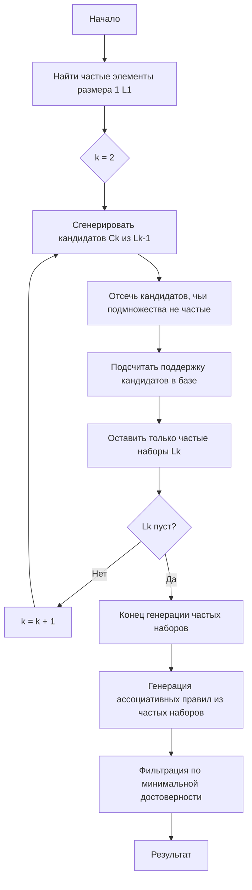

# Алгоритм Apriori

**Алгоритм Apriori** — это фундаментальный алгоритм интеллектуального анализа данных для поиска частых наборов элементов (itemsets) и выявления ассоциативных правил. Разработанный в 1994 году Рамакришнаном Агравалем и Риккардо Срикантом, он основан на принципе априорного знания: если набор элементов является частым, то все его подмножества также должны быть частыми.

## Подробное описание

Алгоритм решает задачу поиска ассоциативных правил вида $X \rightarrow Y$, где $X$ и $Y$ — непересекающиеся наборы товаров или событий. Основная цель — найти такие комбинации, которые часто встречаются вместе в базе транзакций, что позволяет выявлять скрытые закономерности поведения.

**Постановка задачи:**
Дана база транзакций $D$ и пороговые значения минимальной поддержки ($min\_sup$) и минимальной достоверности ($min\_conf$). Необходимо найти все правила $X \rightarrow Y$, такие что $Support(X \cup Y) \ge min\_sup$ и $Confidence(X \rightarrow Y) \ge min\_conf$.

**Ключевая идея:**
Свойство антимонотонности поддержки: поддержка набора элементов никогда не превышает поддержку его подмножеств. Это позволяет эффективно отсеивать заведомо неподходящие кандидаты на ранних этапах, значительно сокращая пространство поиска.

## Основные принципы

Для оценки значимости найденных правил используются три ключевые метрики.

### Математическая формулировка

1. **Поддержка (Support)** — доля транзакций, содержащих данный набор элементов $X$:

   $$
   Support(X) = \frac{\text{Количество транзакций, содержащих } X}{\text{Общее количество транзакций}}
   $$

2. **Достоверность (Confidence)** — условная вероятность того, что товар $Y$ будет куплен при условии покупки товара $X$:

   $$
   Confidence(X \rightarrow Y) = \frac{Support(X \cup Y)}{Support(X)}
   $$

3. **Лифт (Lift)** — показатель того, насколько чаще встречается $Y$ вместе с $X$, чем если бы они были независимы:
   $$
   Lift(X \rightarrow Y) = \frac{Confidence(X \rightarrow Y)}{Support(Y)} = \frac{Support(X \cup Y)}{Support(X) \cdot Support(Y)}
   $$

Где:

- $X \cup Y$ — объединение наборов элементов.
- Значение $Lift > 1$ указывает на положительную корреляцию между товарами.

### Блок-схема алгоритма



## Пример реализации на Python

Ниже представлена реализация алгоритма Apriori с использованием только стандартной библиотеки Python. Для демонстрации используется небольшой набор транзакций.

```python
from itertools import combinations
from collections import defaultdict

def get_support(itemset, transactions):
    """Вычисляет поддержку для данного набора элементов."""
    count = 0
    for transaction in transactions:
        if itemset.issubset(transaction):
            count += 1
    return count / len(transactions)

def generate_candidates(prev_frequent_itemsets, k):
    """Генерирует кандидатов размера k из частых наборов размера k-1."""
    candidates = set()
    prev_items = list(prev_frequent_itemsets.keys())

    for i in range(len(prev_items)):
        for j in range(i + 1, len(prev_items)):
            # Объединяем два набора
            union = prev_items[i].union(prev_items[j])
            if len(union) == k:
                # Проверяем свойство антимонотонности:
                # все подмножества размера k-1 должны быть частыми
                is_valid = True
                for subset in combinations(union, k - 1):
                    if frozenset(subset) not in prev_frequent_itemsets:
                        is_valid = False
                        break
                if is_valid:
                    candidates.add(frozenset(union))
    return candidates

def apriori(transactions, min_support=0.5):
    """
    Основная функция алгоритма Apriori.
    Возвращает словарь частых наборов и их поддержку.
    """
    # Преобразуем транзакции в множества для быстрого поиска
    trans_sets = [set(t) for t in transactions]

    # Шаг 1: Находим частые элементы размера 1
    item_counts = defaultdict(int)
    all_items = set()
    for t in trans_sets:
        all_items.update(t)

    for item in all_items:
        item_counts[frozenset([item])] = sum(1 for t in trans_sets if {item}.issubset(t))

    num_transactions = len(transactions)
    frequent_itemsets = {}

    # Фильтруем по минимальной поддержке
    for item, count in item_counts.items():
        support = count / num_transactions
        if support >= min_support:
            frequent_itemsets[item] = support

    k = 2
    current_frequent = {k: v for k, v in frequent_itemsets.items() if len(k) == 1}

    # Итеративный поиск больших наборов
    while current_frequent:
        candidates = generate_candidates(current_frequent, k)
        next_frequent = {}

        for candidate in candidates:
            support = get_support(candidate, trans_sets)
            if support >= min_support:
                next_frequent[candidate] = support

        if not next_frequent:
            break

        frequent_itemsets.update(next_frequent)
        current_frequent = next_frequent
        k += 1

    return frequent_itemsets

def generate_rules(frequent_itemsets, min_confidence=0.7):
    """Генерирует ассоциативные правила из частых наборов."""
    rules = []
    for itemset, support_xy in frequent_itemsets.items():
        if len(itemset) < 2:
            continue

        items = list(itemset)
        # Перебираем все возможные непустые подмножества для левой части правила
        for i in range(1, len(items)):
            for antecedent in combinations(items, i):
                antecedent_set = frozenset(antecedent)
                consequent_set = itemset - antecedent_set

                if not consequent_set:
                    continue

                # Поддержка антецедента уже вычислена и хранится в frequent_itemsets
                support_x = frequent_itemsets.get(antecedent_set)
                if support_x is None or support_x == 0:
                    continue

                confidence = support_xy / support_x

                if confidence >= min_confidence:
                    lift = support_xy / (support_x * frequent_itemsets.get(consequent_set, 1e-9))
                    rules.append({
                        'antecedents': tuple(sorted(antecedent)),
                        'consequents': tuple(sorted(consequent_set)),
                        'support': support_xy,
                        'confidence': confidence,
                        'lift': lift
                    })
    return rules

if __name__ == "__main__":
    # Пример данных: транзакции магазина
    transactions = [
        ['молоко', 'хлеб', 'печенье'],
        ['молоко', 'печенье'],
        ['хлеб', 'печенье', 'кола'],
        ['хлеб', 'кола'],
        ['молоко', 'хлеб', 'печенье', 'кола'],
        ['молоко', 'хлеб', 'печенье']
    ]

    print("Запуск алгоритма Apriori...")
    min_sup = 0.5
    frequent_sets = apriori(transactions, min_support=min_sup)

    print(f"\nЧастые наборы (поддержка >= {min_sup}):")
    for itemset, sup in sorted(frequent_sets.items(), key=lambda x: len(x[0])):
        print(f"{tuple(itemset)}: {sup:.2f}")

    print("\nГенерация правил...")
    rules = generate_rules(frequent_sets, min_confidence=0.7)

    print(f"\nАссоциативные правила (достоверность >= 0.7):")
    print(f"{'Правило':<30} | {'Поддержка':<10} | {'Достоверность':<12} | {'Лифт':<10}")
    print("-" * 70)
    for rule in rules:
        ant = ", ".join(rule['antecedents'])
        cons = ", ".join(rule['consequents'])
        print(f"{ant} -> {cons:<15} | {rule['support']:<10.2f} | {rule['confidence']:<12.2f} | {rule['lift']:<10.2f}")
```

## Достоинства и недостатки

**Достоинства:**

1. **Простота понимания и реализации.** Алгоритм интуитивно понятен и легко кодируется даже без сложных библиотек.
2. **Эффективное отсечение.** Использование свойства антимонотонности позволяет значительно сократить количество проверяемых кандидатов по сравнению с полным перебором.
3. **Интерпретируемость результатов.** Получаемые ассоциативные правила легко объяснимы бизнесу (например, "если покупают хлеб, то часто берут молоко").

**Недостатки:**

1. **Высокие вычислительные затраты.** Требуется многократное сканирование всей базы данных для подсчета поддержки на каждом этапе.
2. **Генерация большого числа кандидатов.** При низком пороге поддержки или большом количестве уникальных товаров число кандидатов растет экспоненциально.
3. **Чувствительность к параметрам.** Неправильный выбор `min_support` может привести либо к отсутствию результатов, либо к информационному шуму.

## Области применения

1. Торговля и коммерция (анализ рыночных корзин, планирование размещения товаров на полках, cross-selling)
2. Аналитика данных и базы данных (поиск паттернов в логах, очистка данных, выявление частых ошибок)
3. Машинное обучение и рекомендательные системы (генерация правил для рекомендательных движков, предобработка признаков)
