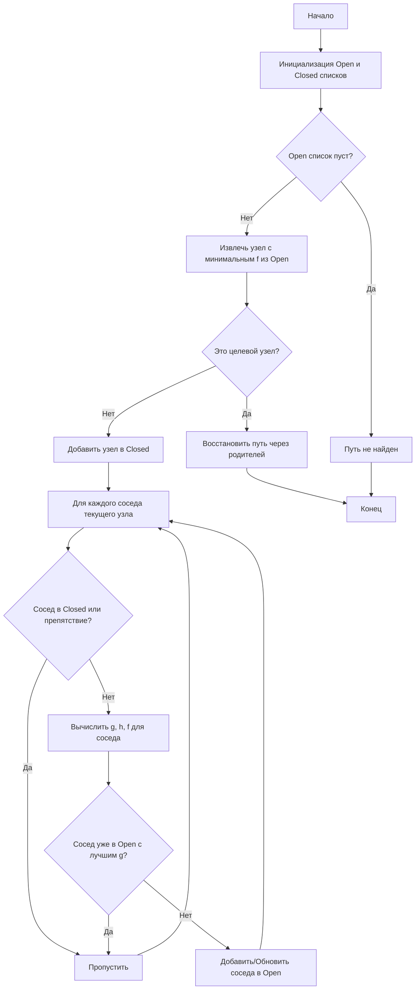

# A\* (A-star)

Алгоритм A\* (произносится как "А-звезда") — это алгоритм поиска по первому наилучшему совпадению на взвешенном графе, который находит путь с наименьшей стоимостью от начальной вершины к целевой. Он сочетает в себе полноту алгоритма Дейкстры (гарантия нахождения оптимального пути) и эффективность жадного поиска за счет использования эвристической функции.

## Подробное описание

**Постановка задачи:** Дано множество вершин (узлов) графа, соединенных ребрами с определенными весами (стоимостью перехода). Необходимо найти последовательность вершин, соединяющих стартовую точку $S$ с конечной точкой $G$, такую что сумма весов ребер минимальна.

**Входные данные:**

- Граф или сетка (grid), где указаны проходимые и непроходимые участки.
- Начальная координата ($start$).
- Конечная координата ($end$).
- Эвристическая функция $h(n)$, оценивающая расстояние от узла $n$ до цели.

**Выходные данные:**

- Список координат, образующих кратчайший путь, или сообщение о том, что путь не существует.

**Ключевая идея:**
Алгоритм поддерживает два списка узлов:

1. **Open List (Открытый список):** Узлы, которые были обнаружены, но еще не исследованы окончательно.
2. **Closed List (Закрытый список):** Узлы, которые уже были исследованы.

На каждом шаге алгоритм выбирает из Open List узел с наименьшим значением функции оценки $f(n)$, исследует его соседей и обновляет их стоимости. Процесс продолжается до тех пор, пока не будет достигнута цель или не исчерпаются все возможные пути.

## Принцип работы

### Математическая формулировка

Основой алгоритма является оценочная функция $f(n)$ для каждой вершины $n$:

$$
f(n) = g(n) + h(n)
$$

Где:

- $g(n)$ — фактическая стоимость пути от начальной точки до вершины $n$.
- $h(n)$ — эвристическая оценка стоимости пути от вершины $n$ до цели (предсказание).

Для гарантии нахождения оптимального пути эвристика $h(n)$ должна быть **допустимой** (admissible), то есть никогда не переоценивать реальную стоимость достижения цели ($h(n) \le h^*(n)$).

### Блок-схема алгоритма



## Пример реализации на Python

Ниже представлена реализация алгоритма A\* для поиска пути на двумерной сетке. Используется только стандартная библиотека Python.

```python
import heapq
from typing import List, Tuple, Optional

class Node:
    """Представление узла в алгоритме A*"""
    def __init__(self, position: Tuple[int, int], parent: Optional['Node'] = None):
        self.position = position
        self.parent = parent
        self.g = 0  # Стоимость от старта до текущего узла
        self.h = 0  # Эвристическая оценка до цели
        self.f = 0  # Общая стоимость: f = g + h

    def __eq__(self, other):
        return self.position == other.position

    def __lt__(self, other):
        # Сравнение необходимо для работы heapq (приоритетная очередь)
        return self.f < other.f

def heuristic(a: Tuple[int, int], b: Tuple[int, int]) -> float:
    """
    Манхэттенское расстояние. Подходит для сеток с движением
    только по вертикали и горизонтали.
    """
    return abs(a[0] - b[0]) + abs(a[1] - b[1])

def a_star(grid: List[List[int]], start: Tuple[int, int], end: Tuple[int, int]) -> List[Tuple[int, int]]:
    """
    Поиск кратчайшего пути алгоритмом A*.

    Args:
        grid: 2D список (0 - свободно, 1 - препятствие).
        start: Кортеж (row, col) начальной позиции.
        end: Кортеж (row, col) конечной позиции.

    Returns:
        Список кортежей координат пути от start до end.
    """
    # Создаем начальный и конечный узлы
    start_node = Node(start)
    end_node = Node(end)

    # Инициализируем открытую очередь (min-heap) и множество закрытых узлов
    open_list = []
    closed_set = set()

    # Добавляем стартовый узел
    heapq.heappush(open_list, start_node)

    # Возможные направления движения (вверх, вниз, влево, вправо)
    movements = [(0, -1), (0, 1), (-1, 0), (1, 0)]

    while open_list:
        # Извлекаем узел с наименьшей f
        current_node = heapq.heappop(open_list)

        # Если достигли цели, восстанавливаем путь
        if current_node == end_node:
            path = []
            current = current_node
            while current is not None:
                path.append(current.position)
                current = current.parent
            return path[::-1]  # Возвращаем путь в обратном порядке (от старта к финишу)

        # Добавляем текущий узел в закрытый список
        closed_set.add(current_node.position)

        # Проверяем соседей
        for movement in movements:
            node_position = (
                current_node.position[0] + movement[0],
                current_node.position[1] + movement[1]
            )

            # Проверка границ сетки
            if (node_position[0] < 0 or node_position[0] >= len(grid) or
                node_position[1] < 0 or node_position[1] >= len(grid[0])):
                continue

            # Проверка на препятствие
            if grid[node_position[0]][node_position[1]] != 0:
                continue

            # Если узел уже обработан, пропускаем
            if node_position in closed_set:
                continue

            # Создаем новый узел-сосед
            new_node = Node(node_position, current_node)

            # Вычисляем стоимости
            new_node.g = current_node.g + 1
            new_node.h = heuristic(new_node.position, end_node.position)
            new_node.f = new_node.g + new_node.h

            # Проверка: если такой узел уже есть в open_list с меньшей g, пропускаем
            # Для упрощения в этой реализации мы просто добавляем узел,
            # так как heapq обработает порядок, а closed_set предотвратит повторную обработку.
            # В более строгих реализациях здесь нужна проверка наличия в open_list.

            heapq.heappush(open_list, new_node)

    # Если цикл завершился, а путь не найден
    return []

def print_grid_with_path(grid: List[List[int]], path: List[Tuple[int, int]]):
    """Вспомогательная функция для визуализации пути в консоли"""
    if not path:
        print("Путь не найден.")
        return

    path_set = set(path)
    for i in range(len(grid)):
        row_str = ""
        for j in range(len(grid[0])):
            if (i, j) == path[0]:
                row_str += "S "  # Start
            elif (i, j) == path[-1]:
                row_str += "E "  # End
            elif (i, j) in path_set:
                row_str += "* "  # Path
            else:
                row_str += f"{grid[i][j]} "
        print(row_str)

if __name__ == "__main__":
    # 0 - проходимая клетка, 1 - препятствие
    grid_map = [
        [0, 0, 0, 0, 1, 0, 0, 0, 0, 0],
        [0, 0, 0, 0, 1, 0, 0, 0, 0, 0],
        [0, 0, 0, 0, 1, 0, 0, 0, 0, 0],
        [0, 0, 0, 0, 1, 0, 0, 0, 0, 0],
        [0, 0, 0, 0, 1, 0, 0, 0, 0, 0],
        [0, 0, 0, 0, 0, 0, 0, 0, 0, 0],
        [0, 0, 0, 0, 1, 0, 0, 0, 0, 0],
        [0, 0, 0, 0, 1, 0, 0, 0, 0, 0],
        [0, 0, 0, 0, 1, 0, 0, 0, 0, 0],
        [0, 0, 0, 0, 0, 0, 0, 0, 0, 0]
    ]

    start_pos = (0, 0)
    end_pos = (7, 6)

    result_path = a_star(grid_map, start_pos, end_pos)

    print("Координаты пути:")
    print(result_path)
    print("\nВизуализация:")
    print_grid_with_path(grid_map, result_path)
```

## Достоинства и недостатки

**Достоинства:**

1. **Оптимальность:** При использовании допустимой эвристики алгоритм всегда находит кратчайший путь.
2. **Эффективность:** Благодаря эвристике $h(n)$ алгоритм исследует значительно меньше узлов, чем алгоритм Дейкстры, направляя поиск в сторону цели.
3. **Гибкость:** Легко адаптируется под разные типы графов и метрики расстояния (Евклидово, Манхэттенское и др.).

**Недостатки:**

1. **Зависимость от эвристики:** Плохо подобранная эвристика может привести к деградации производительности или потере оптимальности.
2. **Потребление памяти:** В худшем случае алгоритм может хранить в памяти большое количество узлов (Open и Closed списки), что критично для очень больших карт.
3. **Сложность реализации динамических изменений:** При изменении карты требуется полный перезапуск или использование специализированных вариантов (например, D\* Lite).

## Области применения

1. Робототехника и автономные системы (планирование траектории движения мобильных роботов и дронов, обход препятствий).
2. Игровая разработка (поиск пути для NPC в стратегических играх, RPG и шутерах, генерация маршрутов патрулирования).
3. Логистика и управление цепочками (оптимизация маршрутов доставки внутри складов, расчет путей для погрузчиков).
4. Оптимизация и планирование (решение задач коммивояжера на небольших подграфах, планирование движений манипуляторов).
