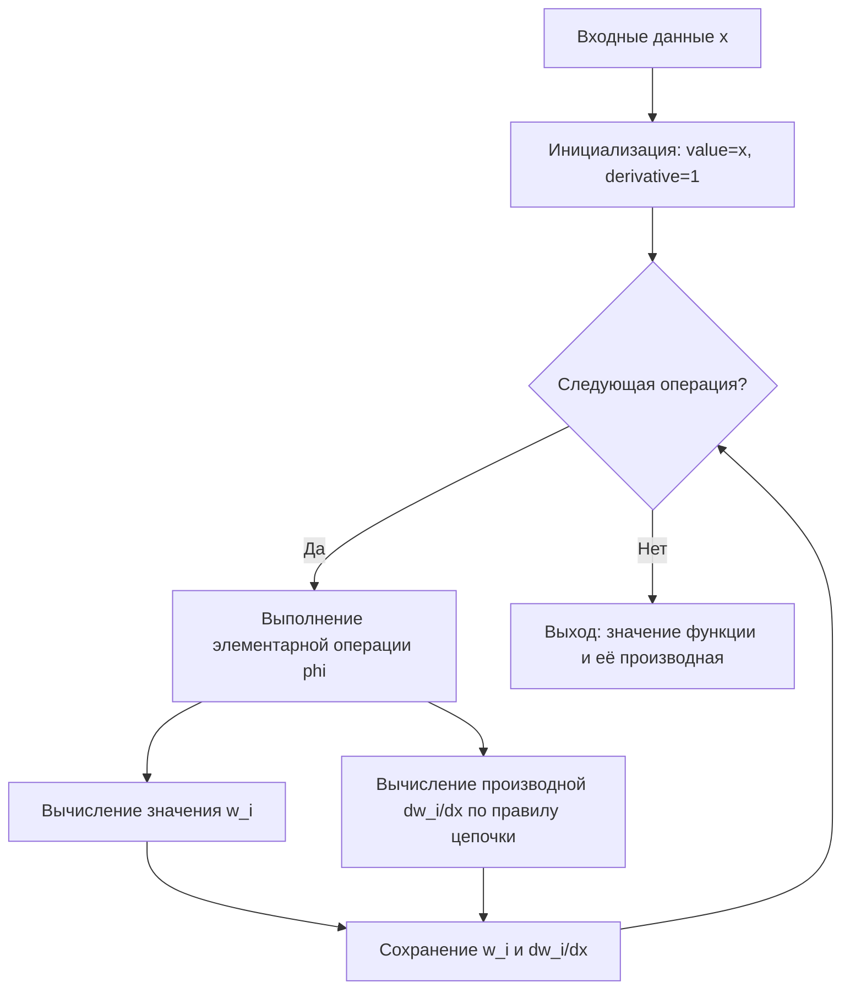

# Автоматическое дифференцирование (Automatic Differentiation)

Автоматическое дифференцирование (AD), также известное как алгоритмическое или вычислительное дифференцирование, — это набор методов для точного и эффективного вычисления производных функций, заданных компьютерной программой.

В отличие от символьного дифференцирования, AD не строит аналитическое выражение производной, а вычисляет её численное значение, применяя правило цепочки к последовательности элементарных арифметических операций. Это позволяет достигать машинной точности без ошибок усечения, характерных для метода конечных разностей.

## Подробное описание

**Постановка задачи:**
Дана функция $f: \mathbb{R}^n \to \mathbb{R}^m$, реализованная в виде компьютерной программы. Требуется вычислить значения частных производных $\frac{\partial f}{\partial x_i}$ в конкретной точке $x_0$.

**Входные данные:**

- Исходный код функции или её вычислительный граф.
- Точка $x_0$, в которой необходимо вычислить производные.

**Выходные данные:**

- Численные значения производных (градиента, якобиана или гессиана) в точке $x_0$.

**Ключевая идея:**
Любое сложное вычисление можно представить как композицию элементарных операций (сложение, умножение, $\sin$, $\exp$ и т.д.), для которых производные известны заранее. Применяя правило цепочки (chain rule) к этим элементарным шагам, можно автоматически получить производную всей функции с точностью до ошибок округления floating-point арифметики.

## Принцип работы

### Математическая формулировка

Основой AD является правило дифференцирования сложной функции. Если функция $y = f(g(x))$, то её производная вычисляется как:

$$
\frac{dy}{dx} = \frac{df}{dg} \cdot \frac{dg}{dx}
$$

В контексте AD программа представляется как последовательность элементарных операций $w_i = \phi_i(w_{j}, w_{k})$, где $w$ — промежуточные переменные.

Для **прямого режима (Forward Mode)** вычисление производной $\dot{w}_i = \frac{dw_i}{dx}$ происходит одновременно со вычислением значения $w_i$:

$$
\dot{w}_i = \frac{\partial \phi_i}{\partial w_j} \dot{w}_j + \frac{\partial \phi_i}{\partial w_k} \dot{w}_k
$$

Где:

- $w_i$ — значение промежуточной переменной.
- $\dot{w}_i$ — её производная по входному параметру.
- $\frac{\partial \phi_i}{\partial w_j}$ — локальная частная производная элементарной операции.

### Блок-схема процесса

Ниже представлена упрощённая схема прямого режима автоматического дифференцирования:



## Пример реализации на Python

Ниже приведена реализация простого механизма автоматического дифференцирования в прямом режиме (Forward Mode) с использованием только стандартной библиотеки Python. Мы создадим класс `Var`, который хранит как значение переменной, так и её производную.

```python
import math

class Var:
    """
    Класс для представления переменной в системе автоматического дифференцирования.
    Хранит значение (value) и производную (derivative) по некоторому базовому параметру.
    """
    def __init__(self, value, derivative=0.0):
        self.value = float(value)
        self.derivative = float(derivative)

    def __add__(self, other):
        """Правило дифференцирования суммы: (u+v)' = u' + v'"""
        if not isinstance(other, Var):
            other = Var(other, 0.0)
        return Var(self.value + other.value,
                   self.derivative + other.derivative)

    def __radd__(self, other):
        return self.__add__(other)

    def __sub__(self, other):
        """Правило дифференцирования разности: (u-v)' = u' - v'"""
        if not isinstance(other, Var):
            other = Var(other, 0.0)
        return Var(self.value - other.value,
                   self.derivative - other.derivative)

    def __rsub__(self, other):
        if not isinstance(other, Var):
            other = Var(other, 0.0)
        return Var(other.value - self.value,
                   other.derivative - self.derivative)

    def __mul__(self, other):
        """Правило дифференцирования произведения: (uv)' = u'v + uv'"""
        if not isinstance(other, Var):
            other = Var(other, 0.0)
        new_value = self.value * other.value
        new_derivative = self.derivative * other.value + self.value * other.derivative
        return Var(new_value, new_derivative)

    def __rmul__(self, other):
        return self.__mul__(other)

    def __truediv__(self, other):
        """Правило дифференцирования частного: (u/v)' = (u'v - uv') / v^2"""
        if not isinstance(other, Var):
            other = Var(other, 0.0)
        new_value = self.value / other.value
        new_derivative = (self.derivative * other.value - self.value * other.derivative) / (other.value ** 2)
        return Var(new_value, new_derivative)

    def __pow__(self, power):
        """Правило дифференцирования степени: (u^n)' = n * u^(n-1) * u'"""
        new_value = self.value ** power
        new_derivative = power * (self.value ** (power - 1)) * self.derivative
        return Var(new_value, new_derivative)

    def sin(self):
        """Производная синуса: (sin(u))' = cos(u) * u'"""
        return Var(math.sin(self.value), math.cos(self.value) * self.derivative)

    def exp(self):
        """Производная экспоненты: (exp(u))' = exp(u) * u'"""
        val = math.exp(self.value)
        return Var(val, val * self.derivative)

    def __repr__(self):
        return f"Var(value={self.value:.4f}, derivative={self.derivative:.4f})"


if __name__ == "__main__":
    # Пример 1: Простая полиномиальная функция f(x) = x^2 + 3x + 5
    print("--- Пример 1: Полином ---")
    x = Var(2.0, derivative=1.0)  # dx/dx = 1
    y = x ** 2 + 3 * x + 5

    print(f"x = {x.value}")
    print(f"f(x) = {y.value}")      # Ожидаем: 4 + 6 + 5 = 15
    print(f"f'(x) = {y.derivative}") # Ожидаем: 2*2 + 3 = 7

    # Пример 2: Более сложная функция f(x) = sin(x) * exp(x)
    print("\n--- Пример 2: Трансцендентные функции ---")
    x = Var(1.0, derivative=1.0)
    # f(x) = sin(x) * exp(x)
    sin_x = x.sin()
    exp_x = x.exp()
    z = sin_x * exp_x

    print(f"x = {x.value}")
    print(f"f(x) = {z.value:.4f}")
    # Аналитическая производная: cos(x)*exp(x) + sin(x)*exp(x) = exp(x)*(cos(x)+sin(x))
    # При x=1: e^1 * (cos(1) + sin(1)) ≈ 2.718 * (0.540 + 0.841) ≈ 3.756
    print(f"f'(x) = {z.derivative:.4f}")
```

## Достоинства и недостатки

**Достоинства:**

1. **Точность**: Выдает производные с точностью машинной арифметики, в отличие от метода конечных разностей, который подвержен ошибкам усечения и вычитания близких чисел.
2. **Эффективность**: Вычислительная сложность вычисления градиента сопоставима со сложностью вычисления самой функции (обычно в 2–5 раз дороже), что намного быстрее символьного дифференцирования для сложных выражений.
3. **Универсальность**: Работает с любыми функциями, которые можно реализовать в коде, включая ветвления и циклы, если они дифференцируемы в точке вычисления.

**Недостатки:**

1. **Сложность реализации обратного режима**: Reverse mode (необходимый для эффективного обучения нейросетей) требует сохранения всего вычислительного графа или использования checkpointing, что увеличивает потребление памяти.
2. **Проблемы с недифференцируемыми точками**: Если функция содержит разрывы или точки излома (например, `abs(x)` в нуле, `max`), AD может выдать неверный результат или ошибку, если не обработать эти случаи явно.
3. **Накладные расходы**: Обертывание каждой переменной в объект (как в примере выше) замедляет выполнение кода по сравнению с нативными числами.

## Области применения

1. Машинное обучение и рекомендательные системы (обучение нейронных сетей методом обратного распространения ошибки в фреймворках PyTorch и TensorFlow)
2. Научные вычисления и физическое моделирование (решение дифференциальных уравнений, оптимизация параметров физических моделей, расчет чувствительности)
3. Оптимизация и планирование (градиентные методы оптимизации для поиска минимумов сложных функций затрат или ресурсов)
