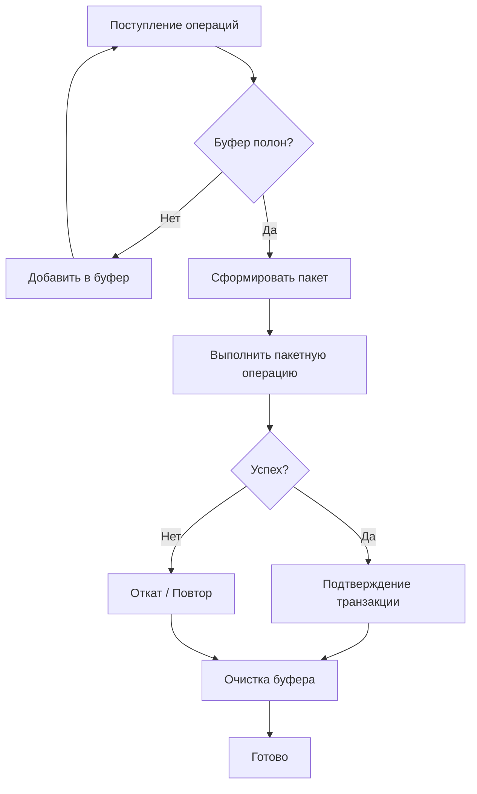

# Batch Updates (Пакетные обновления)

**Batch Updates** (произносится как «бэтч апдейтс») — это метод обработки данных, при котором множество отдельных операций объединяются в одну группу (пакет) и выполняются за один проход или транзакцию, вместо последовательной обработки каждой операции по отдельности. Этот подход критически важен для снижения накладных расходов ввода-вывода (I/O) и повышения пропускной способности систем.

## Подробное описание

В традиционных системах каждая операция (запись в базу, отправка сетевого запроса, обновление веса модели) сопровождается определенными фиксированными издержками: установкой соединения, проверкой прав доступа, аллокацией памяти или синхронизацией потоков. Если выполнять тысячи мелких операций по одной, эти издержки могут многократно превысить время полезной работы.

Пакетная обработка решает эту проблему путем накопления задач в буфере и их массового исполнения. Это позволяет:

1. Минимизировать количество обращений к медленным ресурсам (диску, сети).
2. Эффективнее использовать кэш процессора и память.
3. Гарантировать атомарность изменений (в контексте баз данных).

Исторически этот подход стал стандартом де-факто в СУБД еще в 1980-х годах, а с развитием Big Data и глубокого обучения распространился на все уровни стека технологий, от IoT-датчиков до тренировки нейросетей.

## Основные принципы

### 1. Группировка и буферизация

Операции не выполняются мгновенно, а помещаются в очередь или буфер. Выполнение происходит либо по достижении определенного размера пакета ($N$), либо по истечении таймаута ($T$).

### 2. Снижение накладных расходов (Overhead Reduction)

Основная математическая идея заключается в уменьшении константы $C$, отвечающей за стоимость одной транзакции/запроса.
Если стоимость одной операции $t_{op} = C + t_{work}$, то стоимость пакетной обработки $N$ операций:

$$
t_{batch} \approx C + N \cdot t_{work}
$$

Вместо:

$$
t_{sequential} = N \cdot (C + t_{work})
$$

Где:

- $C$ — фиксированные накладные расходы (сетевой рукопожатие, commit в БД).
- $t_{work}$ — время полезной вычислительной работы.
- $N$ — размер пакета.

### 3. Атомарность и целостность

В базах данных пакет часто выполняется внутри одной транзакции. Это гарантирует принцип ACID: либо применяются все изменения пакета, ни одно из них не применяется в случае ошибки.



## Пример реализации на Python

Ниже представлены примеры пакетной обработки в разных контекстах: работа с SQLite, имитация мини-батчей в ML и асинхронные HTTP-запросы.

### Пример 1: Пакетные вставки в SQLite

Этот пример демонстрирует разницу в производительности между построчной вставкой и использованием `executemany`.

```python
import sqlite3
import time
import random

def benchmark_sqlite_batching(n_records=1000):
    """Сравнение скорости построчной и пакетной вставки в SQLite."""

    # Создаем временную базу в памяти
    conn = sqlite3.connect(':memory:')
    cursor = conn.cursor()
    cursor.execute('CREATE TABLE data (id INTEGER PRIMARY KEY, value REAL)')

    # Генерируем тестовые данные
    data = [(i, random.random()) for i in range(n_records)]

    # --- Способ 1: По одной записи (медленно) ---
    start_time = time.time()
    for item in data:
        cursor.execute("INSERT INTO data (id, value) VALUES (?, ?)", item)
    conn.commit()
    time_single = time.time() - start_time

    # Очищаем таблицу для следующего теста
    cursor.execute('DELETE FROM data')

    # --- Способ 2: Пакетная вставка (быстро) ---
    start_time = time.time()
    # executemany оптимизирует выполнение под капотом
    cursor.executemany("INSERT INTO data (id, value) VALUES (?, ?)", data)
    conn.commit()
    time_batch = time.time() - start_time

    conn.close()

    return time_single, time_batch

if __name__ == "__main__":
    t_single, t_batch = benchmark_sqlite_batching(1000)
    print(f"Построчная вставка: {t_single:.4f} сек")
    print(f"Пакетная вставка:   {t_batch:.4f} сек")
    print(f"Ускорение:          {t_single / t_batch:.1f}x")
```

### Пример 2: Имитация Mini-Batch Gradient Descent

В машинном обучении пакетные обновления весов происходят после обработки группы примеров (mini-batch). Здесь показана логика накопления градиентов.

```python
import numpy as np

class SimpleLinearModel:
    """Простая модель для демонстрации пакетного обновления весов."""

    def __init__(self, learning_rate=0.01):
        self.weight = 0.0
        self.bias = 0.0
        self.lr = learning_rate

    def predict(self, x):
        return self.weight * x + self.bias

    def train_batch(self, X_batch, y_batch):
        """
        Вычисляет средний градиент по всему пакету и обновляет веса один раз.
        """
        n = len(X_batch)
        if n == 0:
            return

        # Вычисляем предсказания для всего пакета сразу (векторизация)
        predictions = self.predict(X_batch)

        # Ошибка
        errors = predictions - y_batch

        # Градиенты (средние по пакету)
        grad_w = np.mean(errors * X_batch)
        grad_b = np.mean(errors)

        # Пакетное обновление весов
        self.weight -= self.lr * grad_w
        self.bias -= self.lr * grad_b

    def train_online(self, X, y):
        """Для сравнения: обновление после каждого примера (online)."""
        for x, y_true in zip(X, y):
            pred = self.predict(x)
            error = pred - y_true
            self.weight -= self.lr * error * x
            self.bias -= self.lr * error

if __name__ == "__main__":
    # Тестовые данные
    X = np.array([1.0, 2.0, 3.0, 4.0, 5.0])
    y = np.array([2.1, 3.9, 6.2, 7.8, 10.1]) # y ≈ 2x

    model_batch = SimpleLinearModel()
    model_online = SimpleLinearModel()

    # Обучение пакетом (все данные сразу)
    model_batch.train_batch(X, y)

    # Обучение онлайн (по одному)
    model_online.train_online(X, y)

    print(f"Batch Weights: w={model_batch.weight:.2f}, b={model_batch.bias:.2f}")
    print(f"Online Weights: w={model_online.weight:.2f}, b={model_online.bias:.2f}")
```

### Пример 3: Асинхронная пакетная обработка HTTP-запросов

Использование `asyncio` для одновременной отправки множества запросов, что является аналогом пакетной обработки в сетевом взаимодействии.

```python
import asyncio
import aiohttp
import time

async def fetch_url(session, url):
    """Асинхронное получение содержимого URL."""
    try:
        async with session.get(url) as response:
            return await response.status
    except Exception as e:
        return f"Error: {e}"

async def batch_fetch(urls, batch_size=10):
    """
    Обрабатывает список URL пакетами заданного размера.
    Это ограничивает нагрузку на сеть и сервер.
    """
    results = []
    # Разбиваем список URL на чанки (пакеты)
    for i in range(0, len(urls), batch_size):
        batch = urls[i:i + batch_size]

        # Создаем задачи для текущего пакета
        tasks = []
        async with aiohttp.ClientSession() as session:
            for url in batch:
                tasks.append(fetch_url(session, url))

            # Выполняем пакет параллельно
            batch_results = await asyncio.gather(*tasks)
            results.extend(batch_results)

            # Опционально: небольшая пауза между пакетами для вежливости
            await asyncio.sleep(0.1)

    return results

if __name__ == "__main__":
    # Используем httpbin для тестирования
    test_urls = [f'https://httpbin.org/status/200' for _ in range(20)]

    start = time.time()
    # Запуск асинхронного цикла
    statuses = asyncio.run(batch_fetch(test_urls, batch_size=5))
    elapsed = time.time() - start

    print(f"Обработано {len(statuses)} запросов за {elapsed:.2f} сек")
    print(f"Статусы: {statuses[:5]}...")
```

## Достоинства и недостатки

**Достоинства:**

1. **Высокая производительность**: Значительное снижение времени выполнения за счет минимизации накладных расходов на ввод-вывод и сетевые взаимодействия.
2. **Снижение нагрузки на ресурсы**: Меньшее количество контекстных переключений процессора и операций с диском.
3. **Целостность данных**: Возможность выполнить группу изменений как единую транзакцию, что упрощает обработку ошибок и откат.
4. **Предсказуемость**: Пакетная обработка позволяет лучше планировать загрузку системы (например, ночные батч-джобы).

**Недостатки:**

1. **Задержка (Latency)**: Данные не обрабатываются мгновенно, а ждут накопления пакета. Это неприемлемо для систем реального времени (real-time).
2. **Потребление памяти**: Для формирования большого пакета необходимо хранить данные в оперативной памяти, что может привести к OutOfMemory ошибкам.
3. **Сложность отладки**: Ошибка в одном элементе пакета может привести к откату всей транзакции, затрудняя выявление проблемной записи.
4. **Риск потери данных**: Если система упадет до сброса буфера на диск, все накопленные в памяти данные будут потеряны.

## Области применения

1. Аналитика данных и базы данных (массовый импорт логов, ETL-процессы, обновление индексов)
2. Машинное обучение и рекомендательные системы (mini-batch gradient descent, пакетная инференция моделей)
3. IoT и сетевые технологии (агрегация телеметрии с датчиков перед отправкой на сервер для экономии энергии и трафика)
4. Оптимизация и планирование (пакетная обработка заказов в логистике для оптимизации маршрутов доставки)
