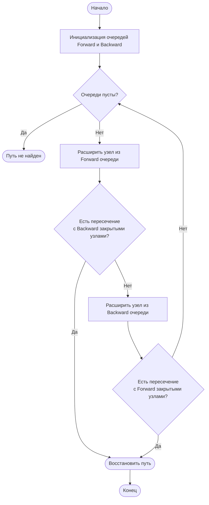

# Двунаправленный поиск (Bidirectional Search)

Двунаправленный поиск — это алгоритм нахождения кратчайшего пути в графе, который одновременно запускает два процесса поиска: один от начальной вершины (прямой поиск) и другой от целевой вершины (обратный поиск). Алгоритм завершает работу, когда фронт волн обоих поисков пересекается.

## Подробное описание

Задача поиска пути часто возникает в ситуациях, где пространство состояний велико. Классический однонаправленный поиск (например, BFS или A\*) расширяет фронт поиска во всех направлениях от старта, пока не достигнет цели. В худшем случае количество исследованных узлов растёт экспоненциально с глубиной $d$.

Двунаправленный подход сокращает область поиска. Вместо одного дерева глубины $d$, строятся два дерева глубины примерно $d/2$. Поскольку объём поиска зависит от коэффициента ветвления $b$ в степени глубины, суммарная сложность двух половинных поисков значительно меньше полного поиска.

Этот метод особенно эффективен, когда известны и начальная, и конечная точки, а граф допускает обратный обход рёбер (или является неориентированным).

## Основные принципы

### Математическая формулировка

Если коэффициент ветвления графа равен $b$, а расстояние между стартом и целью равно $d$, то сложность однонаправленного поиска составляет:

$$
O(b^d)
$$

При двунаправленном поиске каждый из двух процессов проходит примерно половину расстояния ($d/2$). Сложность каждого направления:

$$
O(b^{d/2})
$$

Общая сложность алгоритма:

$$
O(2 \cdot b^{d/2}) = O(b^{d/2})
$$

Это обеспечивает существенное выигрыш в производительности по сравнению с однонаправленным поиском, особенно при больших значениях $d$.

### Блок-схема алгоритма



## Пример реализации на Python

Ниже представлена реализация двунаправленного варианта алгоритма A\* (эвристический поиск) на сетке. Алгоритм использует две очереди приоритетов: одну для движения от старта к цели, другую — от цели к старту.

```python
import heapq
from math import sqrt
from typing import List, Tuple, Optional

# Типы данных для координат
Position = Tuple[int, int]

# Карта: 0 - свободно, 1 - препятствие
GRID = [
    [0, 0, 0, 0, 0, 0, 0],
    [0, 1, 0, 0, 0, 0, 0],
    [0, 0, 0, 0, 0, 0, 0],
    [0, 0, 1, 0, 0, 0, 0],
    [1, 0, 1, 0, 0, 0, 0],
    [0, 0, 0, 0, 0, 0, 0],
    [0, 0, 0, 0, 1, 0, 0],
]

# Возможные направления движения: вверх, влево, вниз, вправо
DIRECTIONS = [(-1, 0), (0, -1), (1, 0), (0, 1)]


class Node:
    """Узел графа для хранения состояния поиска."""
    def __init__(self, x: int, y: int, g_cost: float, parent: Optional['Node'] = None):
        self.x = x
        self.y = y
        self.g_cost = g_cost  # Стоимость пути от старта до текущего узла
        self.parent = parent
        self.h_cost = 0       # Эвристическая оценка (заполняется позже)
        self.f_cost = 0       # Общая стоимость f = g + h

    def calculate_heuristic(self, goal_x: int, goal_y: int, heuristic_type: int = 0) -> float:
        """Вычисляет эвристическое расстояние до цели."""
        dx = abs(self.x - goal_x)
        dy = abs(self.y - goal_y)

        if heuristic_type == 1:
            # Манхэттенское расстояние (для сеток без диагоналей)
            return dx + dy
        else:
            # Евклидово расстояние
            return sqrt(dx**2 + dy**2)

    def update_f(self, goal_x: int, goal_y: int, heuristic_type: int = 0):
        """Пересчитывает f_cost на основе текущей позиции и цели."""
        self.h_cost = self.calculate_heuristic(goal_x, goal_y, heuristic_type)
        self.f_cost = self.g_cost + self.h_cost

    def __lt__(self, other: 'Node'):
        """Сравнение узлов для работы с кучей (heapq)."""
        return self.f_cost < other.f_cost

    def __eq__(self, other: object):
        if not isinstance(other, Node):
            return NotImplemented
        return self.x == other.x and self.y == other.y

    def __hash__(self):
        return hash((self.x, self.y))


def get_neighbors(node: Node, grid: List[List[int]]) -> List[Node]:
    """Возвращает список доступных соседних узлов."""
    neighbors = []
    height = len(grid)
    width = len(grid[0]) if height > 0 else 0

    for dx, dy in DIRECTIONS:
        new_x = node.x + dx
        new_y = node.y + dy

        # Проверка границ сетки
        if 0 <= new_x < width and 0 <= new_y < height:
            # Проверка на препятствия
            if grid[new_y][new_x] == 0:
                neighbor = Node(new_x, new_y, node.g_cost + 1, node)
                neighbors.append(neighbor)

    return neighbors


def reconstruct_path(start_node: Node, end_node: Node, meeting_node_fwd: Node, meeting_node_bwd: Node) -> List[Position]:
    """Восстанавливает полный путь из двух частей: прямой и обратной."""
    path_fwd = []
    current = meeting_node_fwd
    while current:
        path_fwd.append((current.x, current.y))
        current = current.parent
    path_fwd.reverse()

    path_bwd = []
    current = meeting_node_bwd
    while current:
        # Исключаем узел встречи из обратной части, чтобы не дублировать
        if current != meeting_node_fwd:
             path_bwd.append((current.x, current.y))
        current = current.parent

    # Обратный путь нужно развернуть, так как мы шли от цели к встрече
    path_bwd.reverse()

    return path_fwd + path_bwd


def bidirectional_a_star(start: Position, goal: Position, grid: List[List[int]]) -> Optional[List[Position]]:
    """
    Выполняет двунаправленный поиск A*.

    Args:
        start: Кортеж (x, y) начальной точки.
        goal: Кортеж (x, y) конечной точки.
        grid: Двумерный список, представляющий карту.

    Returns:
        Список координат пути или None, если путь не найден.
    """
    if grid[start[1]][start[0]] == 1 or grid[goal[1]][goal[0]] == 1:
        return None

    # Инициализация прямого поиска (от старта)
    start_node_fwd = Node(start[0], start[1], 0)
    start_node_fwd.update_f(goal[0], goal[1])
    open_set_fwd = [start_node_fwd]
    closed_set_fwd = set()
    # Словарь для быстрого доступа к лучшим узлам в открытом множестве
    best_g_fwd = {start_node_fwd: 0}

    # Инициализация обратного поиска (от цели)
    start_node_bwd = Node(goal[0], goal[1], 0)
    start_node_bwd.update_f(start[0], start[1]) # Цель обратного поиска - старт
    open_set_bwd = [start_node_bwd]
    closed_set_bwd = set()
    best_g_bwd = {start_node_bwd: 0}

    while open_set_fwd and open_set_bwd:
        # --- Шаг 1: Расширение прямого поиска ---
        current_fwd = heapq.heappop(open_set_fwd)

        # Если узел уже обработан с лучшей стоимостью, пропускаем
        if current_fwd in closed_set_fwd:
            continue

        closed_set_fwd.add(current_fwd)

        # Проверка пересечения с закрытым множеством обратного поиска
        if current_fwd in closed_set_bwd:
            # Нашли встречу! Нужно найти соответствующий узел в backward пути
            # Для простоты в этой реализации мы считаем, что встреча произошла в current_fwd
            # В более сложных реализациях нужно аккуратно стыковать родителей
            return reconstruct_path(start_node_fwd, start_node_bwd, current_fwd, current_fwd)

        for neighbor in get_neighbors(current_fwd, grid):
            if neighbor in closed_set_fwd:
                continue

            # Обновляем эвристику относительно цели (для fwd поиска цель - goal)
            neighbor.update_f(goal[0], goal[1])

            if neighbor not in best_g_fwd or neighbor.g_cost < best_g_fwd[neighbor]:
                best_g_fwd[neighbor] = neighbor.g_cost
                neighbor.parent = current_fwd
                heapq.heappush(open_set_fwd, neighbor)

        # --- Шаг 2: Расширение обратного поиска ---
        current_bwd = heapq.heappop(open_set_bwd)

        if current_bwd in closed_set_bwd:
            continue

        closed_set_bwd.add(current_bwd)

        # Проверка пересечения с закрытым множеством прямого поиска
        if current_bwd in closed_set_fwd:
            return reconstruct_path(start_node_fwd, start_node_bwd, current_bwd, current_bwd)

        for neighbor in get_neighbors(current_bwd, grid):
            if neighbor in closed_set_bwd:
                continue

            # Обновляем эвристику относительно старта (для bwd поиска цель - start)
            neighbor.update_f(start[0], start[1])

            if neighbor not in best_g_bwd or neighbor.g_cost < best_g_bwd[neighbor]:
                best_g_bwd[neighbor] = neighbor.g_cost
                neighbor.parent = current_bwd
                heapq.heappush(open_set_bwd, neighbor)

    return None


if __name__ == "__main__":
    start_pos = (0, 0)
    goal_pos = (6, 6)

    print("Поиск пути...")
    path = bidirectional_a_star(start_pos, goal_pos, GRID)

    if path:
        print(f"Путь найден! Длина: {len(path)} шагов.")
        print("Координаты:", path)

        # Визуализация пути на карте
        display_grid = [row[:] for row in GRID]
        for x, y in path:
            if display_grid[y][x] == 0:
                display_grid[y][x] = '*'

        print("\nКарта маршрута:")
        for row in display_grid:
            print(" ".join(str(cell) for cell in row))
    else:
        print("Путь не найден.")
```

## Достоинства и недостатки

**Достоинства:**

1. **Высокая скорость работы**. Сложность снижается с $O(b^d)$ до $O(b^{d/2})$, что критично для больших графов.
2. **Эффективность памяти**. Хотя требуется хранить два фронта поиска, каждый из них значительно меньше, чем фронт полного однонаправленного поиска на той же глубине.
3. **Гибкость**. Может быть применён к любым алгоритмам поиска в ширину или A\*, если граф позволяет обратный ход.

**Недостатки:**

1. **Сложность реализации**. Требуется аккуратная синхронизация двух поисковых процессов и корректное условие остановки (встреча фронтов).
2. **Требование обратимости**. Граф должен быть неориентированным или иметь чётко определённые обратные рёбра. В ориентированных графах обратный поиск может быть невозможен или требовать построения обратного графа.
3. **Проблема встречи**. В эвристических алгоритмах (как A\*) сложно гарантировать оптимальность пути при простой встрече фронтов без дополнительных проверок (условия Голдберга).

## Области применения

1. Робототехника и автономные системы (планирование траектории движения мобильных роботов в известной среде).
2. Логистика и управление цепочками (построение маршрутов доставки между двумя конкретными точками на карте города).
3. Графовые модели и социальные сети (поиск кратчайшей цепи связей между двумя пользователями в социальной сети).
4. Игровая разработка (поиск пути для NPC в стратегических играх с большими картами).
