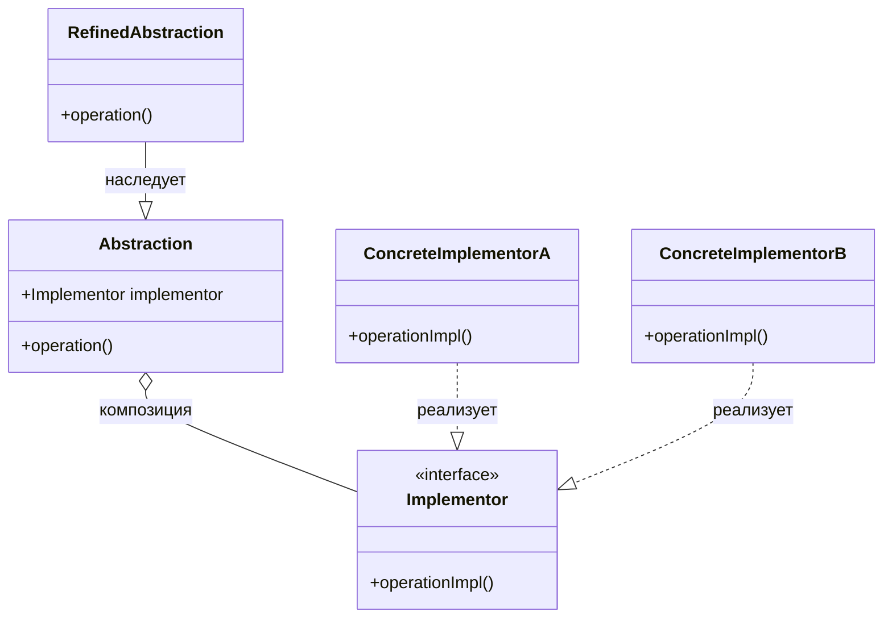

# Паттерн Bridge (Мост)

Паттерн Bridge (Мост) — это структурный паттерн проектирования, который разделяет один или несколько классов на две отдельные иерархии: абстракцию и реализацию, позволяя изменять их независимо друг от друга.

## Подробное описание

**Постановка задачи:**
Часто возникает ситуация, когда класс должен поддерживать несколько вариантов реализации одной и той же функциональности (например, отрисовка фигуры может выполняться через векторную графику или растровую). Если использовать наследование, количество классов растет экспоненциально (Комбинация N абстракций и M реализаций дает N\*M классов).

**Ключевая идея:**
Заменить наследование композицией. Реализация выносится в отдельную иерархию классов, а абстракция хранит ссылку на объект реализации. Это позволяет менять реализацию во время выполнения программы и расширять обе иерархии независимо.

**Исторический контекст:**
Паттерн описан в книге «Банды четырех» (Gang of Four) как один из фундаментальных структурных паттернов. Он решает проблему жесткой связи между интерфейсом и его реализацией.

## Принцип работы

Паттерн состоит из четырех основных участников:

1. **Abstraction (Абстракция):** определяет интерфейс управления. Хранит ссылку на объект реализации.
2. **Refined Abstraction (Уточненная абстракция):** расширяет интерфейс абстракции.
3. **Implementor (Реализация):** определяет интерфейс реализации. Этот интерфейс не обязательно должен точно соответствовать интерфейсу Abstraction; часто он более низкоуровневый.
4. **Concrete Implementor (Конкретная реализация):** содержит конкретную логику реализации.

### Блок-схема структуры



## Пример реализации на Python

В данном примере мы реализуем систему отрисовки фигур. Абстракция — это сама фигура (Круг), а реализация — способ отрисовки (Векторный или Растровый рендерер).

```python
from abc import ABC, abstractmethod

# --- Иерархия Реализации (Implementation) ---

class Renderer(ABC):
    """Интерфейс реализации (Implementor)."""
    @abstractmethod
    def render_circle(self, radius: float) -> None:
        pass

class VectorRenderer(Renderer):
    """Конкретная реализация: векторная графика."""
    def render_circle(self, radius: float) -> None:
        print(f"Drawing a circle of radius {radius} using vector graphics")

class RasterRenderer(Renderer):
    """Конкретная реализация: растровая графика (пиксели)."""
    def render_circle(self, radius: float) -> None:
        print(f"Drawing a circle of radius {radius} using pixels")

# --- Иерархия Абстракции (Abstraction) ---

class Shape:
    """Базовая абстракция. Хранит ссылку на реализацию."""
    def __init__(self, renderer: Renderer):
        self.renderer = renderer

    def draw(self) -> None:
        raise NotImplementedError

    def resize(self, factor: float) -> None:
        raise NotImplementedError

class Circle(Shape):
    """Уточненная абстракция: Круг."""
    def __init__(self, renderer: Renderer, radius: float):
        super().__init__(renderer)
        self.radius = radius

    def draw(self) -> None:
        # Делегируем работу реализации
        self.renderer.render_circle(self.radius)

    def resize(self, factor: float) -> None:
        self.radius *= factor

if __name__ == "__main__":
    # Создаем реализации
    raster_renderer = RasterRenderer()
    vector_renderer = VectorRenderer()

    # Создаем абстракции с разными реализациями
    circle_raster = Circle(raster_renderer, 5)
    circle_vector = Circle(vector_renderer, 10)

    # Используем абстракции
    print("Raster Circle:")
    circle_raster.draw()

    print("\nVector Circle:")
    circle_vector.draw()

    # Меняем состояние абстракции
    circle_raster.resize(2)
    print("\nResized Raster Circle:")
    circle_raster.draw()
```

**Вывод программы:**

```text
Raster Circle:
Drawing a circle of radius 5 using pixels

Vector Circle:
Drawing a circle of radius 10 using vector graphics

Resized Raster Circle:
Drawing a circle of radius 10 using pixels
```

## Достоинства и недостатки

**Достоинства:**

1. **Разделение ответственности:** Абстракция и реализация развиваются независимо. Можно добавлять новые фигуры, не трогая код рендереров, и наоборот.
2. **Снижение количества классов:** Вместо создания комбинаторного взрыва подклассов (КругВекторный, КругРастровый, КвадратВекторный...), мы создаем две линейные иерархии.
3. **Гибкость во время выполнения:** Реализацию можно подменять на лету (например, переключить рендеринг с высокого качества на низкое для экономии ресурсов).

**Недостатки:**

1. **Усложнение кода:** Появляются дополнительные уровни косвенности. Код становится сложнее для понимания новичками.
2. **Требует правильного проектирования:** Нужно заранее выявить оси независимых изменений, иначе применение паттерна может быть избыточным.
