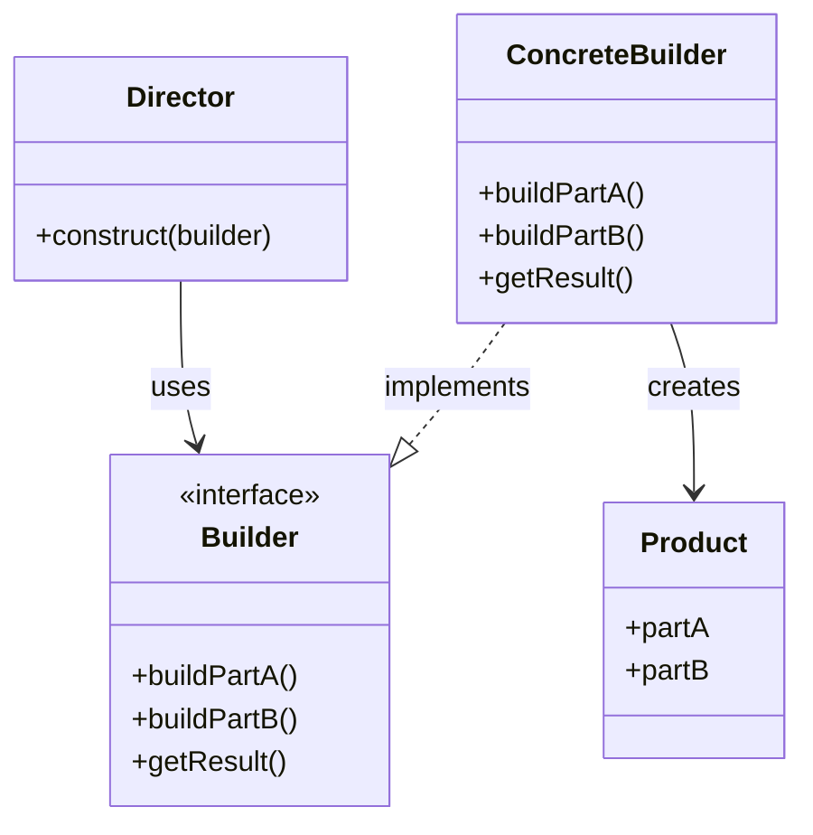

# Паттерн Builder (Строитель)

Паттерн Builder (Строитель) — это порождающий паттерн проектирования, который позволяет создавать сложные объекты пошагово. Он отделяет конструирование сложного объекта от его представления, так что в результате одного и того же процесса конструирования могут получаться разные представления.

## Подробное описание

Паттерн Builder решает проблему «телескопического конструктора» (telescoping constructor anti-pattern), когда класс имеет множество параметров, часть из которых необязательна. Вместо передачи всех аргументов в один конструктор или использования множества перегруженных конструкторов, Builder предоставляет интерфейс для поэтапной настройки объекта.

**Ключевая идея:** разбить процесс создания объекта на последовательность шагов. Клиентский код вызывает методы строителя в нужном порядке, а затем запрашивает готовый объект. Это позволяет использовать один и тот же процесс строительства для создания разных представлений продукта.

## Принцип работы

### Структура паттерна

Паттерн состоит из следующих участников:

1. **Product** — создаваемый сложный объект.
2. **Builder** — абстрактный интерфейс, объявляющий шаги построения Product.
3. **ConcreteBuilder** — конкретная реализация, которая собирает части продукта и предоставляет метод для получения результата.
4. **Director** (опционально) — управляет порядком выполнения шагов построения. В современных реализациях на Python часто опускается в пользу Fluent Interface.



### Математическая/Логическая формулировка

Процесс построения можно описать как последовательность функций $f_i$, применяемых к промежуточному состоянию объекта $S$:

$$
S_{final} = f_n(f_{n-1}(...f_1(S_{initial})...))
$$

Где:

- $S_{initial}$ — начальное состояние (пустой объект или прототип).
- $f_i$ — метод строителя, устанавливающий конкретный параметр или часть объекта.
- $S_{final}$ — полностью сконфигурированный объект.

## Пример реализации на Python

Ниже представлен пример реализации паттерна Builder для создания конфигурации сервера. Используется подход Fluent Interface (возврат `self`), позволяющий выстраивать цепочки вызовов, что является идиоматичным для Python.

```python
import json
from typing import Optional

class ServerConfig:
    """Product: Сложный объект конфигурации сервера."""
    def __init__(self):
        self.host: str = "localhost"
        self.port: int = 8080
        self.ssl_enabled: bool = False
        self.max_connections: int = 100
        self.database_url: Optional[str] = None
        self.cache_ttl: int = 300

    def __str__(self):
        config_dict = {
            "host": self.host,
            "port": self.port,
            "ssl_enabled": self.ssl_enabled,
            "max_connections": self.max_connections,
            "database_url": self.database_url,
            "cache_ttl": self.cache_ttl
        }
        return json.dumps(config_dict, indent=4)

class ServerConfigBuilder:
    """ConcreteBuilder: Пошаговое создание конфигурации."""

    def __init__(self):
        # Инициализируем новый продукт для каждого билдера
        self._config = ServerConfig()

    def set_host(self, host: str) -> 'ServerConfigBuilder':
        """Устанавливает хост."""
        self._config.host = host
        return self

    def set_port(self, port: int) -> 'ServerConfigBuilder':
        """Устанавливает порт."""
        if not (1 <= port <= 65535):
            raise ValueError("Port must be between 1 and 65535")
        self._config.port = port
        return self

    def enable_ssl(self) -> 'ServerConfigBuilder':
        """Включает SSL шифрование."""
        self._config.ssl_enabled = True
        return self

    def set_max_connections(self, count: int) -> 'ServerConfigBuilder':
        """Устанавливает максимальное количество соединений."""
        if count < 1:
            raise ValueError("Max connections must be positive")
        self._config.max_connections = count
        return self

    def set_database(self, url: str) -> 'ServerConfigBuilder':
        """Подключает базу данных."""
        self._config.database_url = url
        return self

    def set_cache_ttl(self, seconds: int) -> 'ServerConfigBuilder':
        """Настраивает время жизни кэша."""
        self._config.cache_ttl = seconds
        return self

    def build(self) -> ServerConfig:
        """Возвращает финальный объект конфигурации."""
        # Здесь можно добавить валидацию всего объекта перед отдачей
        if self._config.ssl_enabled and self._config.port == 80:
            # Пример логики валидации: обычно SSL не используют на 80 порту
            pass
        return self._config

if __name__ == "__main__":
    # Пример 1: Базовая конфигурация
    basic_config = ServerConfigBuilder().build()
    print("Базовая конфигурация:")
    print(basic_config)
    print("-" * 20)

    # Пример 2: Продвинутая конфигурация с цепочкой вызовов
    prod_config = (ServerConfigBuilder()
                   .set_host("0.0.0.0")
                   .set_port(443)
                   .enable_ssl()
                   .set_max_connections(1000)
                   .set_database("postgres://user:pass@db/prod")
                   .set_cache_ttl(600)
                   .build())

    print("Продакшн конфигурация:")
    print(prod_config)
```

## Достоинства и недостатки

**Достоинства:**

1. **Пошаговое создание.** Позволяет конструировать объект поэтапно, откладывая некоторые шаги или выполняя их рекурсивно.
2. **Инкапсуляция сложности.** Клиентский код изолирован от деталей создания сложного объекта.
3. **Принцип единственной ответственности.** Логика создания отделена от логики использования объекта.
4. **Читаемость кода.** Использование Fluent Interface делает код создания объектов понятным и похожим на естественный язык.

**Недостатки:**

1. **Усложнение структуры.** Требует создания дополнительных классов (Builder), что может быть избыточно для простых объектов.
2. **Зависимость от конкретного билдера.** Для создания разных вариантов объекта часто требуются разные конкретные билдеры.
