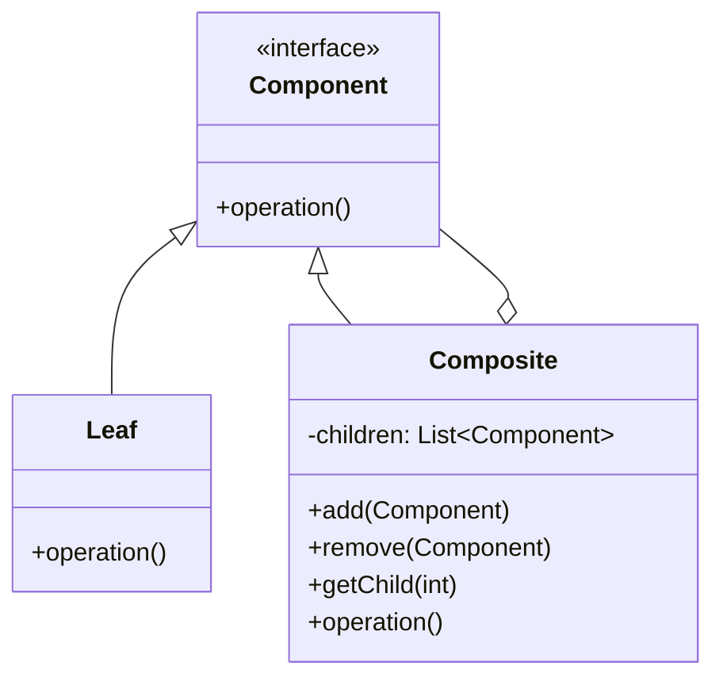

# Паттерн Composite (Компоновщик)

Composite (Компоновщик) — это структурный паттерн проектирования, который позволяет компоновать объекты в древовидные структуры для представления иерархий «часть-целое». Паттерн позволяет клиентам единообразно обрабатывать как отдельные объекты, так и группы объектов.

## Подробное описание

Паттерн решает задачу, когда клиентскому коду не нужно различать простые элементы (листья) и сложные контейнеры (композиции). Это упрощает архитектуру приложения, избавляя от необходимости писать условные проверки типов объектов перед выполнением операций.

**Постановка задачи:**
Необходимо реализовать систему, где отдельные объекты и их композиции могут использоваться взаимозаменяемо. Например, в графическом редакторе команда «переместить» должна работать одинаково для одной фигуры и для группы фигур.

**Входные и выходные данные:**

- Вход: Клиентский запрос к компоненту интерфейса.
- Выход: Выполнение операции либо самим объектом (если это лист), либо рекурсивный обход всех дочерних элементов (если это композиция).

**Ключевая идея:**
Определить общий интерфейс для простых и составных объектов. Составной объект хранит коллекцию дочерних компонентов и делегирует им выполнение операций, предварительно или дополнительно выполняя свои действия.

## Основные принципы

### Структура паттерна

Паттерн состоит из трех основных участников:

1. **Component (Компонент)** — объявляет общий интерфейс для всех объектов в композиции.
2. **Leaf (Лист)** — представляет конечные объекты композиции. Лист не имеет потомков.
3. **Composite (Композиция)** — хранит коллекцию дочерних компонентов и реализует операции управления ими.



### Математическая модель рекурсии

Операция над композицией часто выражается через рекурсивную сумму операций над её элементами. Если $O(C)$ — операция над компонентом $C$, то для композиции $K$ с дочерними элементами $c_1, c_2, ..., c_n$:

$$
O(K) = f(O(c_1), O(c_2), ..., O(c_n))
$$

Где:

- $O(K)$ — результат выполнения операции над композитом.
- $f$ — функция агрегации результатов (например, сумма, конкатенация или последовательное выполнение).
- $c_i$ — дочерние компоненты (которые могут быть как листьями, так другими композитами).

Для листа $L$ операция является базовым случаем:

$$
O(L) = \text{primitive\_action}
$$

## Пример реализации на Python

В данном примере реализована файловая система, где файлы являются листьями, а папки — композициями.

```python
from abc import ABC, abstractmethod
from typing import List

# 1. Компонент: объявляет общий интерфейс
class FileSystemComponent(ABC):
    def __init__(self, name: str):
        self.name = name

    @abstractmethod
    def show_info(self, indent: int = 0):
        """Отображает информацию о компоненте"""
        pass

    def add(self, component: 'FileSystemComponent'):
        """По умолчанию не поддерживается для листьев"""
        raise NotImplementedError(f"Нельзя добавить элемент в {self.__class__.__name__}")

    def remove(self, component: 'FileSystemComponent'):
        """По умолчанию не поддерживается для листьев"""
        raise NotImplementedError(f"Нельзя удалить элемент из {self.__class__.__name__}")

# 2. Лист: конечный элемент (Файл)
class File(FileSystemComponent):
    def __init__(self, name: str, size: int):
        super().__init__(name)
        self.size = size

    def show_info(self, indent: int = 0):
        prefix = "  " * indent
        print(f"{prefix}📄 Файл: {self.name}, Размер: {self.size} KB")

# 3. Композиция: контейнер (Папка)
class Directory(FileSystemComponent):
    def __init__(self, name: str):
        super().__init__(name)
        self.children: List[FileSystemComponent] = []

    def add(self, component: FileSystemComponent):
        self.children.append(component)

    def remove(self, component: FileSystemComponent):
        self.children.remove(component)

    def show_info(self, indent: int = 0):
        prefix = "  " * indent
        print(f"{prefix}📁 Папка: {self.name}")

        # Рекурсивный вызов для всех дочерних элементов
        for child in self.children:
            child.show_info(indent + 1)

if __name__ == "__main__":
    # Создаем структуру файловой системы
    root = Directory("ProjectRoot")

    src_dir = Directory("src")
    src_dir.add(File("main.py", 5))
    src_dir.add(File("utils.py", 2))

    docs_dir = Directory("docs")
    docs_dir.add(File("readme.md", 10))

    # Вкладываем папки друг в друга
    root.add(src_dir)
    root.add(docs_dir)
    root.add(File("config.yaml", 1))

    # Клиентский код работает единообразно
    print("Структура проекта:")
    root.show_info()
```

## Достоинства и недостатки

**Достоинства:**

1. **Упрощение клиентского кода.** Клиенту не нужно знать, работает ли он с простым объектом или сложной структурой. Интерфейс един.
2. **Открытость для расширения.** Легко добавлять новые типы компонентов (листьев или композиций), не меняя существующий код, благодаря полиморфизму.
3. **Гибкость структуры.** Позволяет создавать сложные древовидные структуры любой глубины.

**Недостатки:**

1. **Избыточность дизайна.** Если иерархия не нужна, использование паттерна может усложнить код без пользы.
2. **Сложность ограничения типов.** В общем интерфейсе компонента часто приходится объявлять методы управления детьми (`add`, `remove`), которые не имеют смысла для листьев. Это может привести к ошибкам времени выполнения, если не использовать исключения или пустые реализации (как в примере выше).
