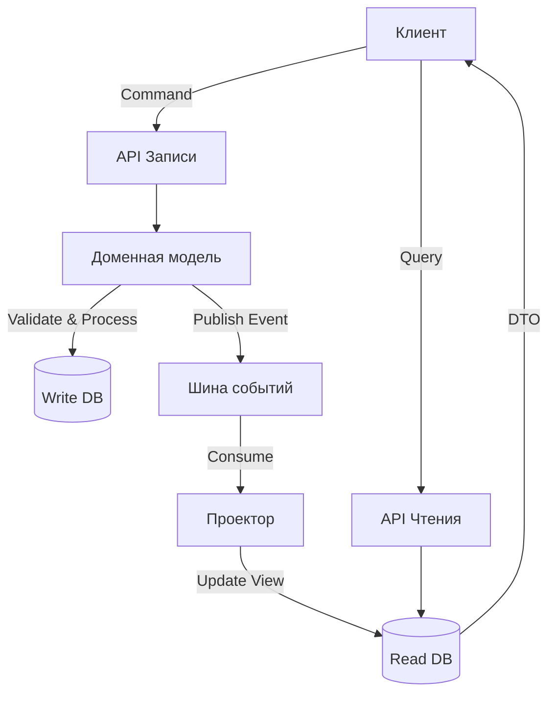

# CQRS (Command Query Responsibility Segregation)

CQRS (произносится как «Си-Кью-Эр-Эс», от англ. _Command Query Responsibility Segregation_ — разделение ответственности команд и запросов) — это архитектурный шаблон, который разделяет операции изменения состояния системы (команды) и операции получения данных (запросы) на независимые модели. Основная идея заключается в том, что модель для записи может отличаться от модели для чтения, что позволяет оптимизировать каждую из них под конкретные требования производительности, безопасности и сложности бизнес-логики.

## Подробное описание

Традиционные CRUD-приложения используют одну и ту же модель данных (часто соответствующую структуре таблиц базы данных) как для записи, так и для чтения. Это создает конфликт интересов: структура, удобная для транзакционной целостности при записи, часто неэффективна для сложных аналитических запросов или быстрого отображения интерфейса.

**Постановка задачи:**
Необходимо построить систему, где:

1. Операции записи гарантируют строгую согласованность данных и соблюдение инвариантов бизнес-правил.
2. Операции чтения обеспечивают максимальную скорость отклика и гибкость форматов вывода, не нагружая основную транзакционную базу сложными JOIN-ами или агрегациями.

**Входные данные:**

- Для команд: DTO (Data Transfer Objects) с данными для изменения состояния.
- Для запросов: Параметры фильтрации, пагинации и сортировки.

**Выходные данные:**

- Для команд: Подтверждение выполнения или ошибка валидации.
- Для запросов: DTO, оптимизированные для конкретного представления (UI, API, отчета).

**Ключевая идея:**
Разделение одной модели домена на две:

1. **Write Model (Модель записи):** Фокусируется на поведении, валидации и сохранении состояния. Часто использует нормализованные схемы.
2. **Read Model (Модель чтения):** Фокусируется на представлении данных. Может быть денормализована, кэширована или храниться в специализированных СУБД (например, Elasticsearch, MongoDB).

Синхронизация между моделями обычно происходит асинхронно через шину событий (Event Bus), что приводит к eventual consistency (согласованности в конечном счете).

## Основные принципы

### Математическая/Логическая формулировка

В основе CQRS лежит принцип разделения функций $f$ и $g$:

$$
\text{System} = \{ M_{write}, M_{read} \}
$$

Где:

- $M_{write}$ обрабатывает множество команд $C$: $M_{write}(c) \rightarrow \Delta State$
- $M_{read}$ обрабатывает множество запросов $Q$: $M_{read}(q) \rightarrow Data$

Связь между моделями описывается функцией проекции $\Pi$, которая применяется к потоку событий $E$:

$$
M_{read} = \Pi(E), \quad \text{где } E = \{ e_1, e_2, ..., e_n \}
$$

Это означает, что модель чтения является производной от истории изменений, а не прямым отражением текущего состояния базы записи.

### Блок-схема взаимодействия



## Пример реализации на Python

Ниже представлен пример реализации CQRS с использованием событийной синхронизации. Для простоты используются встроенные структуры данных, но логика легко переносится на реальные СУБД.

```python
import json
from typing import Dict, List, Any, Callable
from datetime import datetime

class EventStore:
    """Хранилище событий, обеспечивающее связь между Write и Read моделями."""
    def __init__(self):
        self.events: List[Dict[str, Any]] = []
        self.subscribers: List[Callable] = []

    def publish(self, event: Dict[str, Any]):
        """Сохраняет событие и уведомляет подписчиков."""
        self.events.append(event)
        for subscriber in self.subscribers:
            # В реальной системе это происходило бы асинхронно
            subscriber(event)

    def subscribe(self, handler: Callable):
        """Регистрирует обработчик событий (проектор)."""
        self.subscribers.append(handler)
        # Опционально: можно воспроизвести историю для нового подписчика

class UserWriteModel:
    """Модель записи: отвечает за валидацию и бизнес-правила."""
    def __init__(self, event_store: EventStore):
        self.event_store = event_store
        # В реальном приложении здесь был бы доступ к Write DB
        self._existing_ids = set()

    def create_user(self, user_id: int, name: str, email: str):
        if user_id in self._existing_ids:
            raise ValueError(f"User with id {user_id} already exists")

        if not email or "@" not in email:
            raise ValueError("Invalid email format")

        # Бизнес-логика выполнена, генерируем событие
        event = {
            "type": "UserCreated",
            "timestamp": datetime.now().isoformat(),
            "data": {
                "user_id": user_id,
                "name": name,
                "email": email
            }
        }
        self.event_store.publish(event)
        self._existing_ids.add(user_id)

    def update_email(self, user_id: int, new_email: str):
        if user_id not in self._existing_ids:
            raise ValueError("User not found")

        if not new_email or "@" not in new_email:
            raise ValueError("Invalid email format")

        event = {
            "type": "UserEmailUpdated",
            "timestamp": datetime.now().isoformat(),
            "data": {
                "user_id": user_id,
                "new_email": new_email
            }
        }
        self.event_store.publish(event)

class UserReadModel:
    """Модель чтения: оптимизирована для быстрых выборок и специфичных форматов."""
    def __init__(self):
        # Денормализованное хранилище, готовое к выдаче
        self.users_cache: Dict[int, Dict[str, Any]] = {}
        self.stats: Dict[str, int] = {}

    def handle_event(self, event: Dict[str, Any]):
        """Проецирует событие из Write модели в Read модель."""
        event_type = event["type"]
        data = event["data"]

        if event_type == "UserCreated":
            uid = data["user_id"]
            provider = data["email"].split("@")[-1]

            self.users_cache[uid] = {
                "id": uid,
                "display_name": data["name"].upper(), # Пример трансформации для UI
                "email": data["email"],
                "provider": provider
            }
            self.stats[provider] = self.stats.get(provider, 0) + 1

        elif event_type == "UserEmailUpdated":
            uid = data["user_id"]
            if uid in self.users_cache:
                old_provider = self.users_cache[uid]["provider"]
                new_provider = data["new_email"].split("@")[-1]

                # Обновление кэша
                self.users_cache[uid]["email"] = data["new_email"]
                self.users_cache[uid]["provider"] = new_provider

                # Обновление статистики
                self.stats[old_provider] -= 1
                if self.stats[old_provider] == 0:
                    del self.stats[old_provider]
                self.stats[new_provider] = self.stats.get(new_provider, 0) + 1

    def get_user_profile(self, user_id: int) -> Dict[str, Any]:
        """Быстрый доступ к профилю без JOIN-ов."""
        return self.users_cache.get(user_id)

    def get_provider_statistics(self) -> Dict[str, int]:
        """Готовая агрегация, которая в SQL требовала бы GROUP BY."""
        return self.stats.copy()

if __name__ == "__main__":
    # Инициализация инфраструктуры
    event_bus = EventStore()
    write_model = UserWriteModel(event_bus)
    read_model = UserReadModel()

    # Подписка Read модели на события
    event_bus.subscribe(read_model.handle_event)

    # --- Выполнение Команд (Write) ---
    try:
        write_model.create_user(1, "Alice", "alice@corp.com")
        write_model.create_user(2, "Bob", "bob@startup.io")
        write_model.update_email(1, "alice@new-corp.com")
    except ValueError as e:
        print(f"Error: {e}")

    # --- Выполнение Запросов (Read) ---
    # Данные уже актуальны в Read модели благодаря синхронной обработке в примере
    print("Profile:", read_model.get_user_profile(1))
    # Output: {'id': 1, 'display_name': 'ALICE', 'email': 'alice@new-corp.com', 'provider': 'new-corp.com'}

    print("Stats:", read_model.get_provider_statistics())
    # Output: {'startup.io': 1, 'new-corp.com': 1}
```

## Достоинства и недостатки

**Достоинства:**

1. **Оптимизация производительности.** Модель чтения может быть денормализована и индексирована специально под нужные запросы, что ускоряет отклик UI.
2. **Масштабируемость.** Нагрузки на чтение и запись можно масштабировать независимо друг от друга (например, добавляя больше реплик для Read DB).
3. **Безопасность.** Можно строго разграничить права доступа: одни сервисы пишут, другие только читают.
4. **Упрощение сложных запросов.** Агрегации и сложные отчеты вычисляются заранее при обновлении Read модели, а не в момент запроса.

**Недостатки:**

1. **Сложность архитектуры.** Требуется поддержка двух моделей, механизма синхронизации и обработки ошибок рассинхронизации.
2. **Eventual Consistency.** Данные в модели чтения могут быть устаревшими на короткий промежуток времени после записи. Это неприемлемо для систем, требующих строгой консистентности в реальном времени.
3. **Накладные расходы.** Необходимость поддержки шины событий и проекторов увеличивает объем кода и инфраструктурные требования.

## Области применения

1. Паттерны проектирования (реализация масштабируемой архитектуры микросервисов, снижение связанности модулей чтения и записи).
2. Аналитика данных и базы данных (построение быстрых дашбордов и отчетов на основе денормализованных Read моделей, подготовка данных для OLAP-кубов).
3. Торговля и коммерция (оптимизация каталогов товаров на маркетплейсах, где частота просмотров значительно превышает частоту обновления цен или описаний).
