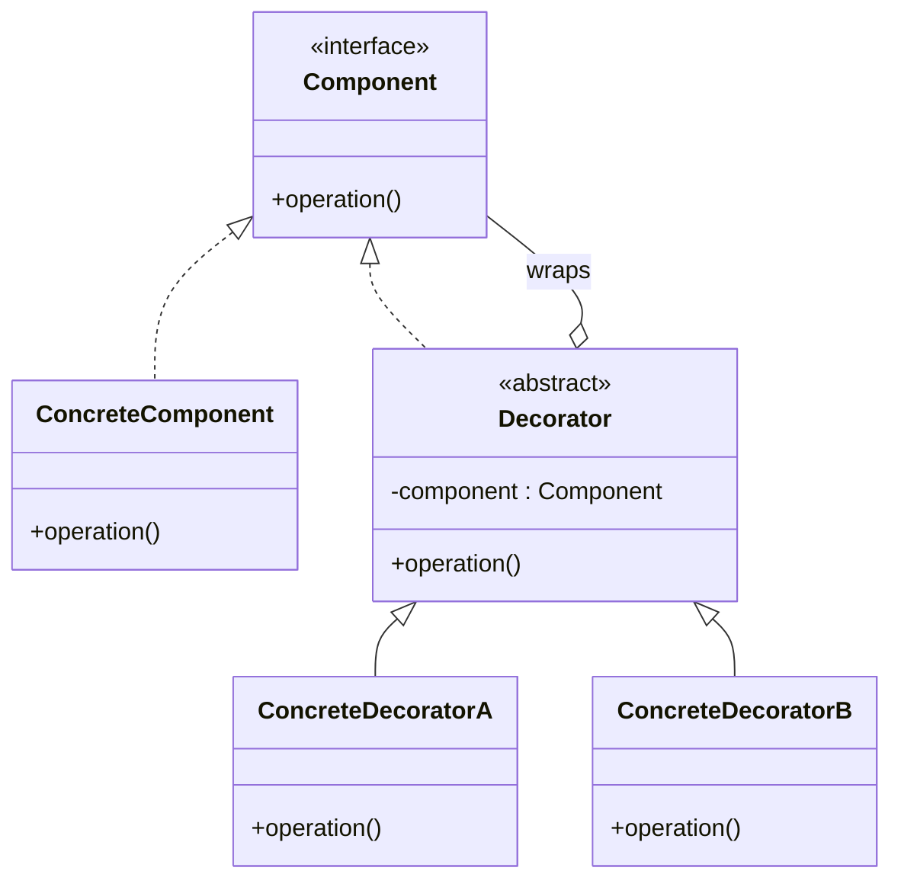

# Паттерн Decorator (Декоратор)

Паттерн Decorator (Декоратор) — это структурный паттерн проектирования, который позволяет динамически добавлять объектам новую функциональность, оборачивая их в специальные классы-обёртки.

## Подробное описание

Паттерн решает задачу расширения поведения объектов без использования наследования. В отличие от подклассов, которые фиксируют поведение на этапе компиляции, декораторы позволяют комбинировать различные обязанности во время выполнения программы.

**Постановка задачи:**
Необходимо добавить новые возможности существующим объектам, не изменяя их исходный код и не создавая экспоненциально растущее количество подклассов для каждой возможной комбинации свойств.

**Входные данные:**

- Базовый объект, реализующий общий интерфейс.
- Набор дополнительных поведений (декораторов).

**Выходные данные:**

- Объект, обладающий суммой функциональностей базового компонента и всех применённых декораторов.

**Ключевая идея:**
Создать иерархию классов-декораторов, которые реализуют тот же интерфейс, что и базовый объект. Каждый декоратор хранит ссылку на оборачиваемый объект и делегирует ему основные операции, добавляя своё поведение до или после делегирования.

## Основные принципы

### Структура паттерна

Для понимания взаимодействия элементов используется следующая схема:



Где:

- **Component (Компонент)**: Определяет общий интерфейс для объектов, к которым можно динамически добавлять обязанности.
- **ConcreteComponent (Конкретный компонент)**: Класс, объекты которого мы хотим дополнительно оснащать ответственностью.
- **Decorator (Декоратор)**: Хранит ссылку на объект компонента и реализует интерфейс компонента.
- **ConcreteDecorator (Конкретный декоратор)**: Добавляет компоненту дополнительную функциональность.

### Математическая логика композиции

Если рассматривать стоимость или сложность операции как функцию $C$, то применение декораторов можно описать рекурсивно:

$$
C_{total}(obj) = C_{decorator_n}(... C_{decorator_1}(C_{base}(obj))...)
$$

Где:

- $C_{base}$ — стоимость операции базового объекта.
- $C_{decorator_i}$ — дополнительная стоимость, вносимая $i$-м декоратором.

## Пример реализации на Python

Ниже представлен классический пример оформления текста HTML-тегами. Мы создаем базовый текст и динамически добавляем ему жирность, курсив и подчеркивание.

```python
from abc import ABC, abstractmethod

# 1. Интерфейс компонента
class TextComponent(ABC):
    @abstractmethod
    def render(self) -> str:
        """Возвращает отображаемый текст."""
        pass

# 2. Конкретный компонент
class PlainText(TextComponent):
    def __init__(self, text: str):
        self._text = text

    def render(self) -> str:
        return self._text

# 3. Базовый декоратор
# Наследуется от TextComponent, чтобы сохранить тип интерфейса
class TextDecorator(TextComponent):
    def __init__(self, component: TextComponent):
        self._component = component

    def render(self) -> str:
        # Делегируем основную работу обернутому объекту
        return self._component.render()

# 4. Конкретные декораторы
class BoldDecorator(TextDecorator):
    def render(self) -> str:
        # Добавляем поведение до/после делегирования
        return f"<b>{self._component.render()}</b>"

class ItalicDecorator(TextDecorator):
    def render(self) -> str:
        return f"<i>{self._component.render()}</i>"

class UnderlineDecorator(TextDecorator):
    def render(self) -> str:
        return f"<u>{self._component.render()}</u>"


if __name__ == "__main__":
    # Создаем базовый объект
    simple_text = PlainText("Hello, Algobook!")

    # Оборачиваем его в декораторы
    # Порядок важен: последний вызванный декоратор будет внешним
    decorated_text = BoldDecorator(
                        ItalicDecorator(
                            UnderlineDecorator(simple_text)
                        )
                     )

    print(f"Результат: {decorated_text.render()}")
    # Вывод: <b><i><u>Hello, Algobook!</u></i></b>

    # Можно легко менять комбинации
    another_text = BoldDecorator(PlainText("Just Bold"))
    print(f"Результат 2: {another_text.render()}")
    # Вывод: <b>Just Bold</b>
```

## Достоинства и недостатки

**Достоинства:**

1. **Гибкость расширения**: Позволяет добавлять новое поведение объектам динамически, во время выполнения, а не на этапе компиляции.
2. **Принцип единственной ответственности**: Каждый декоратор отвечает только за одну конкретную дополнительную функцию, что упрощает поддержку кода.
3. **Комбинируемость**: Можно создавать сложные конфигурации поведения, вкладывая декораторы друг в друга, без создания новых классов для каждой комбинации.

**Недостатки:**

1. **Сложность удаления обёртки**: Если нужно удалить конкретный слой функциональности из стека декораторов, это может быть нетривиальной задачей.
2. **Усложнение идентификации типа**: Объект, обернутый в несколько декораторов, сложнее идентифицировать через `isinstance` или при сравнении типов, так как фактический класс меняется.
3. **Множество мелких классов**: Паттерн приводит к увеличению количества классов в системе, что может затруднить навигацию по кодовой базе для новичков.
