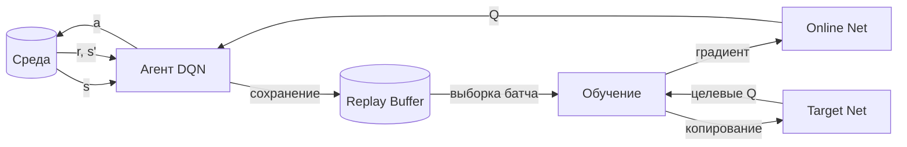

# Deep Q-Networks (DQN)

**Deep Q-Networks (DQN)** — это алгоритм обучения с подкреплением (Reinforcement Learning), который объединяет метод Q-learning с глубокими нейронными сетями для аппроксимации функции ценности действий в пространствах высокой размерности.

## Подробное описание

Классический Q-learning использует таблицу (Q-table) для хранения значений полезности каждого действия в каждом состоянии. Этот подход становится невозможным, когда количество состояний огромно или непрерывно (например, пиксели экрана игры или векторные представления пользователей).

DQN решает эту проблему, заменяя таблицу нейронной сетью, которая принимает на вход состояние $s$ и предсказывает Q-значения для всех возможных действий. Алгоритм стал прорывом в 2015 году, когда агент на базе DQN научился играть в игры Atari на уровне человека, используя только сырые пиксели экрана.

В контексте рекомендательных систем DQN позволяет учитывать долгосрочную удовлетворенность пользователя, а не только мгновенный клик, моделируя взаимодействие как последовательный процесс принятия решений.

## Основные принципы

### Математическая формулировка

Цель алгоритма — найти оптимальную политику $\pi$, максимизирующую ожидаемую сумму дисконтированных наград. Функция ценности действия $Q(s, a)$ оценивает, насколько выгодно выполнить действие $a$ в состоянии $s$.

Обновление весов сети происходит путем минимизации ошибки между предсказанным Q-значением и целевым значением (Target):

$$
L(\theta) = \mathbb{E}_{(s,a,r,s') \sim U(D)} \left[ \left( r + \gamma \max_{a'} Q(s', a'; \theta^-) - Q(s, a; \theta) \right)^2 \right]
$$

Где:

- $\theta$ — параметры основной нейронной сети (Online Network).
- $\theta^-$ — параметры целевой сети (Target Network), которые обновляются реже.
- $r$ — немедленная награда за действие.
- $\gamma$ — коэффициент дисконтирования будущих наград ($0 < \gamma \le 1$).
- $U(D)$ — равномерная выборка из буфера воспроизведения опыта (Experience Replay Buffer).

### Ключевые механизмы стабилизации

1.  **Experience Replay (Буфер воспроизведения опыта)**: Агент сохраняет переходы $(s, a, r, s')$ в буфер. При обучении выбираются случайные батчи из этого буфера. Это разрывает корреляцию между последовательными наблюдениями и делает распределение данных более стационарным.
2.  **Target Network (Целевая сеть)**: Используется отдельная копия нейронной сети для расчета целевых значений. Её веса обновляются периодически (или плавно), что предотвращает нестабильность обучения, вызванную движущейся целью.

### Архитектура взаимодействия



## Пример реализации на Python

Ниже представлена упрощенная реализация агента DQN с использованием `numpy`. Для сохранения самодостаточности кода вместо сложных фреймворков глубокого обучения используется простая линейная модель с ручным расчетом градиентов (метод наименьших квадратов для демонстрации принципа обновления весов).

```python
import numpy as np
from collections import deque
import random

class SimpleLinearNetwork:
    """Упрощенная нейронная сеть (линейный слой) для демонстрации."""
    def __init__(self, input_dim, output_dim):
        # Инициализация весов случайными значениями
        self.weights = np.random.randn(input_dim, output_dim) * 0.1
        self.bias = np.zeros(output_dim)

    def predict(self, x):
        """Прямой проход: x @ W + b"""
        return np.dot(x, self.weights) + self.bias

    def update(self, x, target_q, lr=0.01):
        """Обновление весов методом градиентного спуска (MSE loss)."""
        # Предсказание
        q_values = self.predict(x)
        # Ошибка
        error = target_q - q_values
        # Градиент по весам: dL/dW = -2 * x^T * error (упрощенно)
        # Для одного состояния x и вектора target_q
        gradient_w = -2 * np.outer(x, error)
        gradient_b = -2 * error

        self.weights -= lr * gradient_w
        self.bias -= lr * gradient_b

class DQNAgent:
    def __init__(self, state_dim, action_dim, gamma=0.95, epsilon=1.0):
        self.state_dim = state_dim
        self.action_dim = action_dim
        self.gamma = gamma  # Коэффициент дисконтирования
        self.epsilon = epsilon  # Вероятность случайного действия (Exploration)
        self.epsilon_min = 0.01
        self.epsilon_decay = 0.995

        # Основная сеть и целевая сеть
        self.model = SimpleLinearNetwork(state_dim, action_dim)
        self.target_model = SimpleLinearNetwork(state_dim, action_dim)

        # Буфер воспроизведения опыта
        self.memory = deque(maxlen=2000)
        self.batch_size = 32

    def act(self, state):
        """Выбор действия: Exploration vs Exploitation"""
        if np.random.rand() <= self.epsilon:
            return np.random.randint(self.action_dim)

        state = np.array(state).reshape(1, -1)
        q_values = self.model.predict(state)
        return np.argmax(q_values[0])

    def remember(self, state, action, reward, next_state, done):
        """Сохранение перехода в буфер"""
        self.memory.append((state, action, reward, next_state, done))

    def replay(self):
        """Обучение на случайном батче из буфера"""
        if len(self.memory) < self.batch_size:
            return

        batch = random.sample(self.memory, self.batch_size)

        for state, action, reward, next_state, done in batch:
            state = np.array(state).reshape(1, -1)
            next_state = np.array(next_state).reshape(1, -1)

            # Текущее предсказание
            target_f = self.model.predict(state)

            # Расчет целевого значения с использованием Target Network
            next_q_values = self.target_model.predict(next_state)
            max_next_q = np.max(next_q_values)

            target_q = reward
            if not done:
                target_q = reward + self.gamma * max_next_q

            # Обновляем только Q-значение для выбранного действия
            target_f[0][action] = target_q

            # Обновляем веса основной сети
            self.model.update(state[0], target_f[0])

        # Уменьшение epsilon (greedy strategy)
        if self.epsilon > self.epsilon_min:
            self.epsilon *= self.epsilon_decay

    def update_target_model(self):
        """Копирование весов из основной сети в целевую"""
        self.target_model.weights = np.copy(self.model.weights)
        self.target_model.bias = np.copy(self.model.bias)

if __name__ == "__main__":
    # Параметры среды
    STATE_DIM = 10  # Например, размер эмбеддинга пользователя
    ACTION_DIM = 5  # Количество рекомендуемых товаров

    agent = DQNAgent(STATE_DIM, ACTION_DIM)

    print("Начало обучения агента DQN...")

    # Симуляция эпизодов
    for episode in range(100):
        state = np.random.randn(STATE_DIM)
        total_reward = 0

        for step in range(20):
            action = agent.act(state)

            # Симуляция среды: случайное следующее состояние и награда
            next_state = np.random.randn(STATE_DIM)
            reward = np.random.choice([-1, 0, 1, 5]) # Клик, игнор, покупка
            done = False

            agent.remember(state, action, reward, next_state, done)
            state = next_state
            total_reward += reward

            # Обучение
            agent.replay()

        # Периодическое обновление целевой сети
        if episode % 10 == 0:
            agent.update_target_model()

        if episode % 20 == 0:
            print(f"Episode {episode}, Total Reward: {total_reward}, Epsilon: {agent.epsilon:.2f}")

    print("Обучение завершено.")
```

## Достоинства и недостатки

**Достоинства:**

1. **Работа с высокоразмерными данными**: Способность обрабатывать сырые сенсорные данные (изображения, сложные векторы признаков) без ручного инжиниринга признаков.
2. **Учет долгосрочных последствий**: В отличие от жадных алгоритмов, DQN оптимизирует суммарную награду на длинной дистанции, что критично для удержания пользователей.
3. **Универсальность**: Одна и та же архитектура может применяться в играх, робототехнике и финансах.

**Недостатки:**

1. **Вычислительная сложность**: Требует значительных ресурсов для обучения и большого объема данных для сходимости.
2. **Нестабильность обучения**: Чувствителен к гиперпараметрам (скорость обучения, размер буфера), может расходиться без тщательной настройки.
3. **Проблема переоценки (Overestimation Bias)**: Стандартный DQN склонен завышать Q-значения, что решается модификациями вроде Double DQN.

## Области применения

1. Машинное обучение и рекомендательные системы (персонализация контента с учетом долгосрочного интереса, динамические рекомендации)
2. Игровая разработка (создание интеллектуальных NPC, тестирование баланса игр, агенты для стратегических игр)
3. Торговля и коммерция (динамическое ценообразование, управление рекламными кампаниями в реальном времени, оптимизация корзины покупок)
4. Робототехника и автономные системы (навигация мобильных роботов, управление манипуляторами в изменяющейся среде)
5. Экономика и финансы (алгоритмический трейдинг, управление портфелем активов с учетом рыночных рисков)
