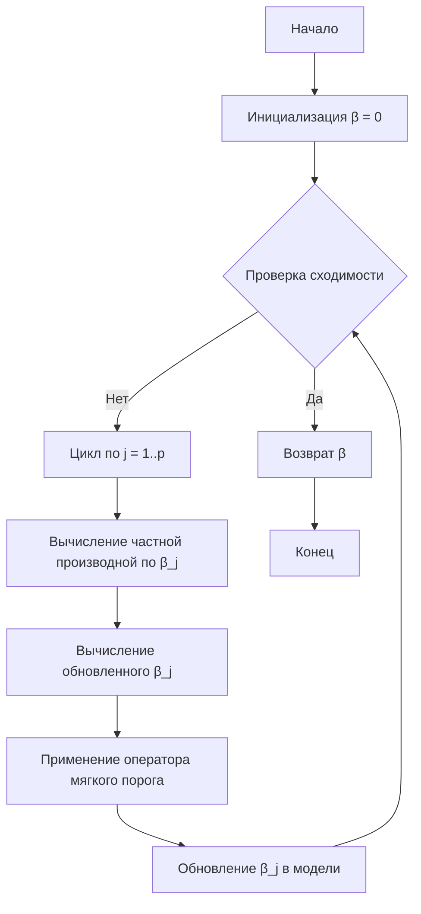

# ElasticNet — комбинация Ridge и Lasso

Алгоритм **ElasticNet** (произносится как "Иластик Нет") — это метод регуляризации линейной регрессии, который сочетает в себе штрафы L1 (Lasso) и L2 (Ridge). Он применяется для построения устойчивых моделей машинного обучения, особенно в случаях, когда количество признаков значительно превышает количество наблюдений или когда признаки сильно коррелированы между собой.

## Подробное описание

**Постановка задачи:** В задачах линейной регрессии мы ищем коэффициенты $\beta$, минимизирующие сумму квадратов ошибок. Однако при большом количестве признаков или мультиколлинеарности модель становится нестабильной и склонной к переобучению. ElasticNet решает эту проблему, добавляя к функции потерь комбинированный регуляризационный штраф.

**Входные данные:**
- Матрица признаков $X$ размера $n \times p$ (где $n$ — количество наблюдений, $p$ — количество признаков)
- Вектор целевой переменной $y$ размера $n$
- Гиперпараметры: $\alpha$ (коэффициент регуляризации) и $l_1\_ratio$ (коэффициент смешивания)

**Выходные данные:**
- Вектор коэффициентов $\beta$ размера $p$
- Значение функции потерь на обучающей выборке

**Ключевая идея:** ElasticNet комбинирует два подхода:
- Штраф L1 (Lasso) обеспечивает разреженность модели, обнуляя незначимые коэффициенты
- Штраф L2 (Ridge) стабилизирует решение, сглаживая коэффициенты коррелированных признаков

Такая комбинация позволяет получить преимущества обоих методов: Lasso для отбора признаков и Ridge для работы с мультиколлинеарностью.

**Исторический контекст:** Метод был предложен Хуэй Цзоу и Тревором Хасти в 2005 году в статье "Regularization and variable selection via the elastic net". Его разработка была вызвана ограничениями Lasso в ситуациях, когда:
- $p > n$ (признаков больше, чем наблюдений)
- Признаки сильно коррелированы (Lasso выбирает только один из группы коррелированных признаков)

## Принцип работы

ElasticNet минимизирует следующую функцию потерь:

$$
\mathcal{L}(\beta) = \frac{1}{2n} \sum_{i=1}^{n} (y_i - X_i\beta)^2 + \alpha \left( l_1\_ratio \cdot \sum_{j=1}^{p} |\beta_j| + \frac{1 - l_1\_ratio}{2} \cdot \sum_{j=1}^{p} \beta_j^2 \right)
$$

Где:
- $\frac{1}{2n} \sum_{i=1}^{n} (y_i - X_i\beta)^2$ — стандартная ошибка MSE (среднеквадратичная ошибка)
- $\alpha$ — общий коэффициент регуляризации (чем больше $\alpha$, тем сильнее регуляризация)
- $l_1\_ratio$ — доля L1-штрафа в регуляризации (от 0 до 1)
- $\sum_{j=1}^{p} |\beta_j|$ — L1-штраф (Lasso)
- $\frac{1}{2} \sum_{j=1}^{p} \beta_j^2$ — L2-штраф (Ridge) с коэффициентом 0.5 для удобства дифференцирования

Особые случаи:
- При $l_1\_ratio = 1$: ElasticNet превращается в Lasso
- При $l_1\_ratio = 0$: ElasticNet превращается в Ridge

### Математическая формулировка

В эквивалентной форме задачу можно записать как ограниченную оптимизацию:

$$
\hat{\beta} = \arg\min_{\beta} \left( \sum_{i=1}^{n} (y_i - X_i\beta)^2 \right) \quad \text{при условии} \quad (1 - l_1\_ratio)\sum_{j=1}^{p} \beta_j^2 + l_1\_ratio \sum_{j=1}^{p} |\beta_j| \leq t
$$

Где $t$ — параметр, обратно пропорциональный $\alpha$.

**Решение задачи:** Оптимизация выполняется с помощью алгоритмов координатного спуска (coordinate descent), которые последовательно обновляют каждый коэффициент, фиксируя остальные.

### Блок-схема алгоритма



## Пример реализации на Python

```python
import numpy as np
from typing import Tuple, Optional

class ElasticNet:
    """
    Реализация алгоритма ElasticNet с использованием координатного спуска.
    """
    
    def __init__(self, alpha: float = 1.0, l1_ratio: float = 0.5, 
                 max_iter: int = 1000, tol: float = 1e-4):
        """
        Инициализация модели ElasticNet.
        
        Параметры:
        - alpha: коэффициент регуляризации (чем больше, тем сильнее регуляризация)
        - l1_ratio: доля L1-штрафа (0 - Ridge, 1 - Lasso, 0.5 - смесь)
        - max_iter: максимальное число итераций
        - tol: порог сходимости
        """
        self.alpha = alpha
        self.l1_ratio = l1_ratio
        self.max_iter = max_iter
        self.tol = tol
        self.coef_ = None
        self.intercept_ = None
    
    def _soft_threshold(self, z: float, gamma: float) -> float:
        """
        Оператор мягкого порога для L1-регуляризации.
        """
        if z > gamma:
            return z - gamma
        elif z < -gamma:
            return z + gamma
        else:
            return 0.0
    
    def fit(self, X: np.ndarray, y: np.ndarray) -> 'ElasticNet':
        """
        Обучение модели ElasticNet.
        
        Параметры:
        - X: матрица признаков (n_samples, n_features)
        - y: вектор целевой переменной (n_samples,)
        """
        # Нормализация данных (стандартизация)
        X = (X - np.mean(X, axis=0)) / np.std(X, axis=0)
        y = y - np.mean(y)
        
        n_samples, n_features = X.shape
        
        # Инициализация коэффициентов
        beta = np.zeros(n_features)
        
        # Вычисление констант для координатного спуска
        # L1-штраф с учётом l1_ratio
        l1_penalty = self.alpha * self.l1_ratio
        # L2-штраф с учётом l1_ratio
        l2_penalty = self.alpha * (1 - self.l1_ratio)
        
        # Координатный спуск
        for iteration in range(self.max_iter):
            beta_old = beta.copy()
            
            for j in range(n_features):
                # Вычисление частной производной
                # residual = y - X @ beta (обновляем на каждой итерации)
                residual = y - X @ beta
                # Добавляем обратно вклад j-го признака
                residual += X[:, j] * beta[j]
                
                # Градиент без регуляризации
                gradient = -np.dot(X[:, j], residual)
                
                # Обновление с учётом L2-штрафа
                z = beta[j] - gradient / (n_samples + l2_penalty)
                
                # Применение мягкого порога для L1-штрафа
                beta[j] = self._soft_threshold(
                    z, 
                    l1_penalty / (n_samples + l2_penalty)
                )
            
            # Проверка сходимости
            if np.linalg.norm(beta - beta_old, ord=2) < self.tol:
                break
        
        self.coef_ = beta
        self.intercept_ = 0.0  # так как данные центрированы
        
        return self
    
    def predict(self, X: np.ndarray) -> np.ndarray:
        """
        Предсказание значений целевой переменной.
        """
        return X @ self.coef_ + self.intercept_
    
    def score(self, X: np.ndarray, y: np.ndarray) -> float:
        """
        Вычисление R² коэффициента детерминации.
        """
        y_pred = self.predict(X)
        ss_res = np.sum((y - y_pred) ** 2)
        ss_tot = np.sum((y - np.mean(y)) ** 2)
        return 1 - ss_res / ss_tot


# Пример использования
if __name__ == "__main__":
    # Генерация синтетических данных
    np.random.seed(42)
    n_samples, n_features = 100, 20
    X = np.random.randn(n_samples, n_features)
    
    # Истинные коэффициенты (только 5 признаков важны)
    true_beta = np.zeros(n_features)
    true_beta[:5] = [3.0, 1.5, -2.0, 0.5, 1.0]
    
    # Добавление шума
    y = X @ true_beta + np.random.randn(n_samples) * 0.5
    
    # Создание и обучение модели ElasticNet
    model = ElasticNet(alpha=0.1, l1_ratio=0.5)
    model.fit(X, y)
    
    print(f"Истинные коэффициенты: {true_beta}")
    print(f"Предсказанные коэффициенты: {model.coef_}")
    print(f"R² на обучающей выборке: {model.score(X, y):.4f}")
    
    # Сравнение с Lasso (l1_ratio=1)
    model_lasso = ElasticNet(alpha=0.1, l1_ratio=1.0)
    model_lasso.fit(X, y)
    print(f"Коэффициенты Lasso: {model_lasso.coef_}")
    
    # Сравнение с Ridge (l1_ratio=0)
    model_ridge = ElasticNet(alpha=0.1, l1_ratio=0.0)
    model_ridge.fit(X, y)
    print(f"Коэффициенты Ridge: {model_ridge.coef_}")
```

## Достоинства и недостатки

**Достоинства:**

1. **Комбинация преимуществ Lasso и Ridge** — позволяет как отбирать признаки (через L1-штраф), так и работать с коррелированными признаками (через L2-штраф), что делает модель более гибкой.

2. **Устойчивость к мультиколлинеарности** — в отличие от Lasso, который выбирает только один признак из группы коррелированных, ElasticNet сохраняет все коррелированные признаки, распределяя между ними вес.

3. **Эффективность при p > n** — хорошо работает когда признаков больше, чем наблюдений, обеспечивая стабильные и интерпретируемые решения.

4. **Разреженность модели** — благодаря L1-компоненте многие коэффициенты обнуляются, что упрощает интерпретацию и снижает вычислительные затраты при предсказаниях.

5. **Гибкая настройка** — параметр l1_ratio позволяет контролировать баланс между разреженностью и группировкой коррелированных признаков.

**Недостатки:**

1. **Вычислительная сложность** — требует больше вычислительных ресурсов по сравнению с Ridge или Lasso из-за необходимости оптимизации двух штрафов одновременно.

2. **Сложность выбора гиперпараметров** — необходимо подбирать два параметра (α и l1_ratio), что требует дополнительных вычислительных затрат на кросс-валидацию.

3. **Меньшая разреженность по сравнению с Lasso** — при наличии сильно коррелированных признаков, ElasticNet может не обнулять некоторые из них, в отличие от Lasso.

4. **Чувствительность к масштабированию признаков** — как и другие методы регуляризации, требует предварительной стандартизации данных для корректной работы.

5. **Интерпретируемость** — комбинированный штраф усложняет интерпретацию влияния отдельных признаков по сравнению с Lasso или Ridge по отдельности.

## Области применения

1. **Биотехнологии и медицина** (анализ геномных данных, где количество генов значительно превышает число образцов; поиск биомаркеров, коррелированных с заболеваниями)

2. **Экономика и финансы** (построение моделей кредитного скоринга; прогнозирование финансовых временных рядов с учётом множества макроэкономических факторов)

3. **Обработка текста** (классификация документов по тематикам с разреженными признаками — bag-of-words; построение рейтинговых моделей для поисковых систем)

4. **Компьютерное зрение** (анализ изображений с извлечением большого количества признаков; распознавание лиц и объектов в условиях ограниченной выборки)

5. **Логистика** (прогнозирование спроса с учётом множества факторов, включая сезонность, промо-акции и погодные условия; оптимизация маршрутов доставки на основе множества географических признаков)