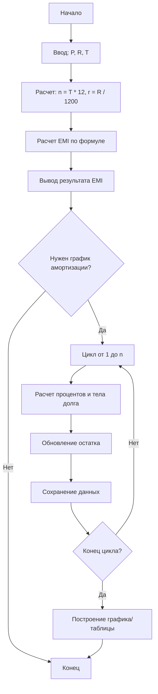

# Алгоритм расчета равноценного ежемесячного взноса (EMI)

Равноценный ежемесячный взнос (**EMI**, от англ. _Equated Monthly Installment_) — это фиксированная сумма платежа, которую заёмщик выплачивает кредитору в установленную дату каждого месяца до полного погашения долга.

Алгоритм основан на аннуитетной схеме погашения, при которой структура платежа меняется со временем: доля процентов уменьшается, а доля погашения основного долга увеличивается, при этом общая сумма платежа остается неизменной.

## Подробное описание

Алгоритм EMI решает задачу равномерного распределения финансовой нагрузки на заёмщика в течение всего срока кредита. В отличие от дифференцированных платежей, где сумма выплат постепенно снижается, EMI обеспечивает предсказуемость расходов.

**Постановка задачи:**
Даны основная сумма кредита ($P$), годовая процентная ставка ($R$) и срок кредита в годах ($T$). Необходимо рассчитать фиксированную ежемесячную сумму ($E$), которая позволит полностью погасить долг и начисленные проценты за указанный срок.

**Ключевая идея:**
Использование формулы суммы геометрической прогрессии для дисконтирования будущих платежей к текущей стоимости кредита.

## Принцип работы

### Математическая формулировка

Расчет EMI производится по следующей формуле:

$$
E = P \times \frac{r \times (1 + r)^n}{(1 + r)^n - 1}
$$

Где:

- $E$ — размер ежемесячного платежа (EMI)
- $P$ — основная сумма кредита (Principal)
- $r$ — месячная процентная ставка (годовая ставка / 12 / 100)
- $n$ — общее количество месяцев выплаты (срок в годах $\times$ 12)

Для расчета структуры платежа (амортизации) в конкретном месяце $k$:

1. Проценты за месяц: $I_k = B_{k-1} \times r$, где $B_{k-1}$ — остаток долга на начало месяца.
2. Погашение основного долга: $Pr_k = E - I_k$.
3. Новый остаток долга: $B_k = B_{k-1} - Pr_k$.

### Блок-схема алгоритма



## Пример реализации на Python

Ниже представлен полный код для расчета EMI, генерации графика амортизации и визуализации зависимости платежа от срока кредита.

```python
import matplotlib.pyplot as plt
from typing import List, Tuple

def calculate_emi(principal: float, annual_rate: float, years: int) -> float:
    """
    Рассчитывает ежемесячный аннуитетный платеж (EMI).

    Args:
        principal: Основная сумма кредита.
        annual_rate: Годовая процентная ставка (в процентах, например, 12 для 12%).
        years: Срок кредита в годах.

    Returns:
        Размер ежемесячного платежа.
    """
    n = years * 12  # Общее количество месяцев
    if n == 0:
        return 0
    r = annual_rate / 12 / 100  # Месячная процентная ставка

    if r == 0:
        return principal / n

    emi = principal * (r * (1 + r)**n) / ((1 + r)**n - 1)
    return emi

def generate_amortization_schedule(principal: float, annual_rate: float, years: int) -> List[Tuple[int, float, float, float]]:
    """
    Генерирует график погашения кредита (амортизацию).

    Returns:
        Список кортежей: (месяц, платеж_по_телу, платеж_процентов, остаток_долга)
    """
    n = years * 12
    r = annual_rate / 12 / 100
    emi = calculate_emi(principal, annual_rate, years)

    schedule = []
    balance = principal

    for month in range(1, n + 1):
        interest_payment = balance * r
        principal_payment = emi - interest_payment
        balance -= principal_payment

        # Корректировка последнего платежа из-за ошибок округления
        if balance < 0:
            principal_payment += balance
            balance = 0

        schedule.append((month, principal_payment, interest_payment, balance))

    return schedule

def plot_emi_dependency(principal: float, annual_rate: float, max_years: int = 10):
    """
    Строит график зависимости размера EMI от срока кредита.
    """
    years_range = list(range(1, max_years + 1))
    emis = [calculate_emi(principal, annual_rate, y) for y in years_range]

    plt.figure(figsize=(10, 6))
    plt.plot(years_range, emis, marker='o', linestyle='-', color='#2c3e50')
    plt.title(f"Зависимость EMI от срока кредита\n(Сумма: {principal:,.0f}, Ставка: {annual_rate}%)")
    plt.xlabel("Срок кредита (лет)")
    plt.ylabel("Ежемесячный платеж (руб.)")
    plt.grid(True, linestyle='--', alpha=0.7)
    plt.xticks(years_range)
    plt.tight_layout()
    plt.show()

if __name__ == "__main__":
    # Входные данные
    loan_amount = 1_000_000  # 1 млн руб.
    interest_rate = 12       # 12% годовых
    loan_term_years = 5      # 5 лет

    # 1. Расчет базового EMI
    monthly_payment = calculate_emi(loan_amount, interest_rate, loan_term_years)
    print(f"Ежемесячный платёж (EMI): {monthly_payment:.2f} руб.")
    print("-" * 30)

    # 2. Вывод первых 3 месяцев амортизации
    schedule = generate_amortization_schedule(loan_amount, interest_rate, loan_term_years)
    print(f"{'Месяц':<6} | {'Тело долга':>10} | {'Проценты':>10} | {'Остаток':>12}")
    print("-" * 45)
    for month, pr_part, int_part, balance in schedule[:3]:
        print(f"{month:<6} | {pr_part:>10.2f} | {int_part:>10.2f} | {balance:>12.2f}")
    print("...")

    # 3. Визуализация зависимости платежа от срока
    plot_emi_dependency(loan_amount, interest_rate)
```

## Достоинства и недостатки

**Достоинства:**

1. **Предсказуемость бюджета**: Заёмщик точно знает сумму платежа на весь срок кредита, что упрощает финансовое планирование.
2. **Простота расчета**: Формула универсальна и легко реализуется в любых программных системах.
3. **Равномерная нагрузка**: Позволяет избежать пиковых нагрузок на бюджет в начале срока (в отличие от некоторых схем с большими первоначальными выплатами).

**Недостатки:**

1. **Высокая переплата в начале срока**: В первые годы большая часть платежа уходит на погашение процентов, а не основного долга.
2. **Меньшая выгода при досрочном погашении**: Если гасить кредит досрочно в первой половине срока, экономия на процентах будет меньше, чем могла бы быть при дифференцированной схеме (где тело долга гасится быстрее).

## Области применения

1. Экономика и финансы (расчет потребительских кредитов, ипотеки, автокредитов)
2. Торговля и коммерция (предоставление рассрочки покупателям в интернет-магазинах и маркетплейсах)
3. Банковский сектор (формирование кредитных продуктов и скоринг платежеспособности)
