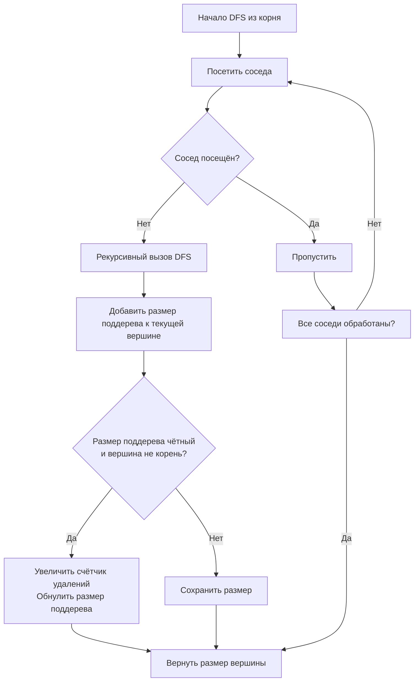

# Even Tree (Чётное дерево)

Алгоритм Even Tree (Чётное дерево) — это метод обхода графа, позволяющий найти максимальное количество рёбер, которые можно удалить из дерева так, чтобы каждая образовавшаяся компонента связности содержала чётное число вершин.

## Подробное описание

Задача заключается в разбиении исходного дерева на непересекающиеся поддеревья с чётной мощностью. На вход подаётся неориентированное дерево с $N$ вершинами (где $N$ гарантированно чётно). Требуется определить максимальное число удаляемых рёбер.

Ключевая идея алгоритма основана на свойствах деревьев и чётности: если в некотором поддереве содержится чётное количество вершин, то ребро, соединяющее это поддерево с остальной частью графа, можно безопасно удалить. После удаления обе полученные компоненты будут иметь чётное число вершин (так как разность двух чётных чисел также чётна). Для решения используется модифицированный поиск в глубину (DFS), который рекурсивно вычисляет размер каждого поддерева. Если размер поддерева (исключая корень всего дерева) чётен, счётчик удаляемых рёбер увеличивается, а размер этого поддерева для родительской вершины считается равным нулю (оно «отрезается»).

Исторически задача стала известна благодаря платформе HackerRank и часто встречается в олимпиадном программировании как классический пример применения DFS для анализа структурных свойств графов.

## Основные принципы

### Математическая формулировка

Пусть $size(v)$ — количество вершин в поддереве с корнем в вершине $v$. Условие возможности удаления ребра $(parent(v), v)$:

$$
size(v) \equiv 0 \pmod 2 \quad \text{и} \quad v \neq root
$$

Где:

- $size(v)$ — суммарное число вершин в поддереве $v$, включая саму вершину $v$.
- $root$ — корневая вершина исходного дерева (для неё удаление родительского ребра невозможно).
- Операция $\equiv 0 \pmod 2$ означает чётность значения.

При выполнении условия $size(parent)$ пересчитывается как $size(parent) - size(v)$, что эквивалентно обнулению вклада отрезанного поддерева.

### Блок-схемы и диаграммы



## Пример реализации на Python

```python
from collections import defaultdict
from typing import Dict, List


def even_tree(graph: Dict[int, List[int]], n: int) -> int:
    """
    Вычисляет максимальное число рёбер, которые можно удалить,
    чтобы все компоненты имели чётное число вершин.

    :param graph: Список смежности дерева
    :param n: Количество вершин в дереве
    :return: Число удаляемых рёбер
    """
    visited = [False] * (n + 1)
    removable_edges = 0

    def dfs(node: int) -> int:
        nonlocal removable_edges
        visited[node] = True
        # Инициализируем размер поддерева единицей (сама вершина)
        subtree_size = 1

        for neighbor in graph[node]:
            if not visited[neighbor]:
                # Рекурсивно получаем размер поддерева потомка
                child_size = dfs(neighbor)

                # Если поддерево потомка имеет чётный размер,
                # ребро до него можно удалить
                if child_size % 2 == 0:
                    removable_edges += 1
                else:
                    # Иначе включаем потомка в текущее поддерево
                    subtree_size += child_size

        return subtree_size

    # Запускаем обход из произвольной вершины (например, 1)
    dfs(1)
    return removable_edges


if __name__ == "__main__":
    # Пример дерева из условия задачи
    edges = [(1, 2), (1, 3), (1, 4), (3, 5), (3, 6)]
    num_vertices = 6

    # Построение списка смежности
    adj_list = defaultdict(list)
    for u, v in edges:
        adj_list[u].append(v)
        adj_list[v].append(u)

    result = even_tree(adj_list, num_vertices)
    print(f"Максимальное число удаляемых рёбер: {result}")
```

## Достоинства и недостатки

**Достоинства:**

1.  **Линейная сложность.** Алгоритм выполняет один проход по всем вершинам и рёбрам, работая за $O(N)$, что оптимально для деревьев.
2.  **Простота реализации.** Не требует сложных структур данных или дополнительных библиотек, достаточно стандартного стека рекурсии или итеративного DFS.
3.  **Детерминированность.** Результат не зависит от выбора корня или порядка обхода соседей, что гарантирует корректность при любых входных данных.

**Недостатки:**

1.  **Ограничение типом графа.** Применим исключительно к деревьям; для графов с циклами задача становится NP-трудной.
2.  **Зависимость от чётности N.** Если общее число вершин нечётно, решение не существует, но алгоритм не проверяет это явно и может вернуть некорректный результат без предварительной валидации.
3.  **Риск переполнения стека.** При глубоких деревьях (глубина > 1000–5000) рекурсивная реализация может вызвать `RecursionError` в Python, требуя переписывания на итеративный вариант.

## Области применения

1.  Графовые модели и социальные сети (разбиение социальных графов на сбалансированные сообщества для параллельной обработки, кластеризация пользователей по парным взаимодействиям)
2.  Оптимизация и планирование (распределение вычислительных задач между серверами с чётным числом ядер, балансировка нагрузки в распределённых системах)
3.  Сетевые технологии (сегментация телекоммуникационных сетей на изолированные домены с чётным числом узлов, оптимизация топологии IoT-сетей)
