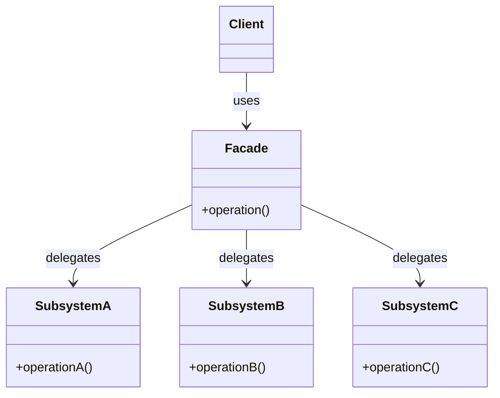

# Паттерн проектирования Facade (Фасад)

Facade (Фасад) — это структурный паттерн проектирования, который предоставляет простой интерфейс к сложной системе классов, библиотеке или фреймворку. Фасад скрывает детали реализации внутренней подсистемы, позволяя клиентскому коду взаимодействовать с ней через единый упрощенный вход.

## Подробное описание

Паттерн Facade решает проблему высокой связанности (coupling) между клиентским кодом и сложными внутренними компонентами системы. В больших приложениях прямое использование множества классов подсистемы требует от клиента знания их внутренних взаимодействий, порядка вызовов и зависимостей.

**Постановка задачи:**
Необходимо предоставить клиенту удобный способ использования функционала сложной подсистемы, не раскрывая всей её внутренней сложности и не заставляя клиента управлять множеством объектов.

**Ключевая идея:**
Создать класс-обертку (Фасад), который инкапсулирует логику взаимодействия с объектами подсистемы. Клиент обращается только к методам фасада, а фасад уже делегирует вызовы нужным компонентам внутренней системы.

**Исторический контекст:**
Паттерн описан в классической книге «Приёмы объектно-ориентированного проектирования» (Gang of Four, 1994) как один из фундаментальных структурных паттернов.

## Основные принципы

### Структура паттерна

Фасад не заменяет подсистему, а лишь предоставляет к ней доступ. Подсистема остается работоспособной и может использоваться напрямую, если это необходимо, но для большинства задач достаточно интерфейса фасада.



### Алгоритм работы

1.  Клиент вызывает метод фасада.
2.  Фасад определяет, какие компоненты подсистемы необходимы для выполнения задачи.
3.  Фасад вызывает методы этих компонентов в правильном порядке.
4.  Результат возвращается клиенту в упрощенном виде.

## Пример реализации на Python

В данном примере реализована упрощенная банковская система. Подсистема состоит из нескольких сложных классов (`AccountManager`, `SecurityManager`, `TransactionProcessor`), которые проверяют счета, PIN-коды и проводят транзакции. Класс `BankFacade` скрывает эту сложность, предоставляя простые методы `deposit` и `withdraw`.

```python
import sys
from typing import Optional

# --- Сложная подсистема (Internal Subsystem) ---

class AccountManager:
    """Управление счетами: проверка существования."""
    def check_account_exists(self, account_id: str) -> bool:
        # Имитация проверки в базе данных
        print(f"[Subsystem] AccountManager: Checking if account '{account_id}' exists...")
        return True  # Предположим, что счет всегда существует для примера

class SecurityManager:
    """Безопасность: проверка PIN-кода."""
    def verify_pin(self, account_id: str, pin: str) -> bool:
        print(f"[Subsystem] SecurityManager: Verifying PIN for account '{account_id}'...")
        # В реальном приложении здесь было бы хеширование и сравнение
        return pin == "1234"

class BalanceChecker:
    """Проверка баланса."""
    def get_balance(self, account_id: str) -> float:
        print(f"[Subsystem] BalanceChecker: Fetching balance for '{account_id}'...")
        return 1000.0  # Заглушка баланса

class TransactionProcessor:
    """Обработка транзакций: депозит и снятие."""
    def deposit(self, account_id: str, amount: float) -> bool:
        print(f"[Subsystem] TransactionProcessor: Depositing {amount} to '{account_id}'.")
        return True

    def withdraw(self, account_id: str, amount: float) -> bool:
        print(f"[Subsystem] TransactionProcessor: Withdrawing {amount} from '{account_id}'.")
        return True

# --- Фасад (Facade) ---

class BankFacade:
    """
    Фасад для банковской системы.
    Предоставляет простой интерфейс для клиентов, скрывая сложность
    взаимодействия с AccountManager, SecurityManager и др.
    """
    def __init__(self):
        self.account_manager = AccountManager()
        self.security_manager = SecurityManager()
        self.balance_checker = BalanceChecker()
        self.transaction_processor = TransactionProcessor()

    def deposit_money(self, account_id: str, pin: str, amount: float) -> bool:
        """
        Внесение денег на счет.
        Логика: Проверка PIN -> Проверка счета -> Депозит.
        """
        print(f"\n>>> Facade: Starting deposit of {amount} for account {account_id}")

        if not self.security_manager.verify_pin(account_id, pin):
            print("<<< Facade: Error - Invalid PIN")
            return False

        if not self.account_manager.check_account_exists(account_id):
            print("<<< Facade: Error - Account not found")
            return False

        success = self.transaction_processor.deposit(account_id, amount)
        if success:
            print(f"<<< Facade: Success - Deposited {amount}")
        return success

    def withdraw_money(self, account_id: str, pin: str, amount: float) -> bool:
        """
        Снятие денег со счета.
        Логика: Проверка PIN -> Проверка счета -> Проверка баланса -> Снятие.
        """
        print(f"\n>>> Facade: Starting withdrawal of {amount} for account {account_id}")

        if not self.security_manager.verify_pin(account_id, pin):
            print("<<< Facade: Error - Invalid PIN")
            return False

        if not self.account_manager.check_account_exists(account_id):
            print("<<< Facade: Error - Account not found")
            return False

        balance = self.balance_checker.get_balance(account_id)
        if balance < amount:
            print(f"<<< Facade: Error - Insufficient funds (Balance: {balance})")
            return False

        success = self.transaction_processor.withdraw(account_id, amount)
        if success:
            print(f"<<< Facade: Success - Withdrew {amount}")
        return success

# --- Клиентский код ---

if __name__ == "__main__":
    # Клиент не знает о существовании AccountManager, SecurityManager и т.д.
    # Он работает только с фасадом.
    bank = BankFacade()

    print("--- Тест 1: Успешное снятие средств ---")
    bank.withdraw_money("acc_123", "1234", 500.0)

    print("\n--- Тест 2: Неверный PIN ---")
    bank.deposit_money("acc_123", "0000", 200.0)

    print("\n--- Тест 3: Попытка снять больше, чем есть на счете ---")
    # Баланс 1000, пытаемся снять 1500
    bank.withdraw_money("acc_123", "1234", 1500.0)
```

## Достоинства и недостатки

**Достоинства:**

1. **Изоляция клиента от сложности.** Клиентскому коду не нужно знать о внутренних зависимостях подсистемы.
2. **Снижение связанности (Coupling).** Изменения во внутренней структуре подсистемы меньше влияют на клиентский код, если интерфейс фасада остается стабильным.
3. **Удобство использования.** Предоставляет простой и понятный интерфейс для наиболее частых сценариев использования.

**Недостатки:**

1. **Риск создания «Божественного объекта».** Фасад может превратиться в огромный класс, зависящий от всех классов программы, что нарушает принцип единственной ответственности.
2. **Ограничение функциональности.** Фасад предоставляет только часть возможностей подсистемы. Если клиенту нужен специфический функционал, недоступный через фасад, ему придется обращаться к подсистеме напрямую, что усложняет архитектуру.

## Области применения

1. Паттерны проектирования (упрощение взаимодействия со сложными библиотеками или фреймворками).
2. Торговля и коммерция (интеграция платежных шлюзов, где фасад скрывает сложные API банков и процессинговых центров).
3. Аналитика данных и базы данных (предоставление единого интерфейса для ETL-процессов, скрывающего детали подключения к разным источникам данных и форматирования).
