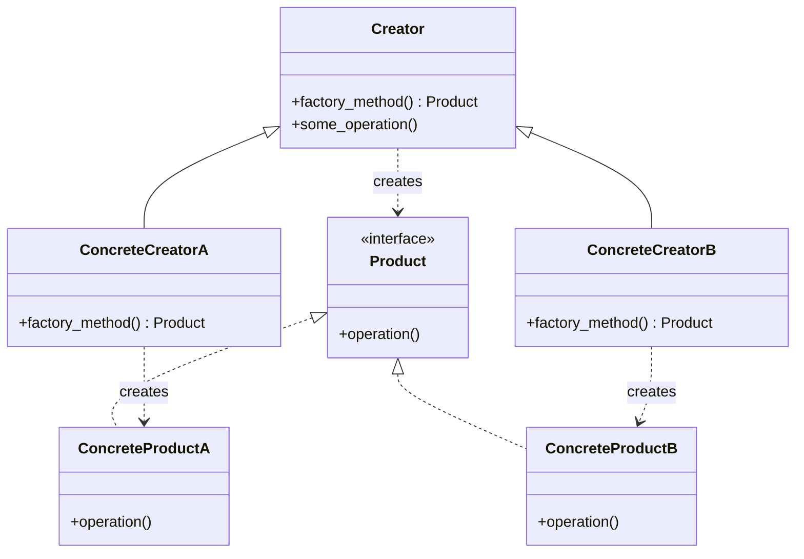

# Паттерн проектирования Factory Method (Фабричный метод)

**Factory Method** (Фабричный метод) — это порождающий паттерн проектирования, который определяет общий интерфейс для создания объектов в суперклассе, позволяя подклассам изменять тип создаваемых объектов.

## Подробное описание

Паттерн решает проблему жесткой привязки клиентского кода к конкретным классам продуктов. Вместо прямого вызова конструктора (`new Class()`), код обращается к специальному фабричному методу. Этот метод может быть переопределен в подклассах, что позволяет создавать разные типы объектов, не меняя код, который их использует.

**Постановка задачи:** Необходимо создать систему, которая должна работать с различными типами объектов (например, разными форматами документов или видами транспорта), но при этом не должна зависеть от конкретных реализаций этих объектов на этапе компиляции.

**Ключевая идея:** Делегирование ответственности за инстанцирование объектов от основного класса к его подклассам через переопределение специального метода.

## Принцип работы

### Структура паттерна

1. **Продукт (`Product`)** — объявляет интерфейс, который является общим для всех объектов, создаваемых фабричным методом.
2. **Конкретные продукты (`ConcreteProduct`)** — различные реализации интерфейса продукта.
3. **Создатель (`Creator`)** — объявляет фабричный метод, возвращающий объекты типа `Product`. Может содержать базовую логику, зависящую от продукта.
4. **Конкретные создатели (`ConcreteCreator`)** — переопределают фабричный метод так, чтобы он возвращал конкретный тип продукта.

### Блок-схема взаимодействия



## Пример реализации на Python

Рассмотрим пример с логистической компанией, которая может использовать разные виды транспорта.

```python
from abc import ABC, abstractmethod

# 1. Абстрактный продукт
class Transport(ABC):
    """Интерфейс для всех видов транспорта."""

    @abstractmethod
    def deliver(self) -> str:
        pass

# 2. Конкретные продукты
class Truck(Transport):
    def deliver(self) -> str:
        return "Доставка груза грузовиком по земле"

class Ship(Transport):
    def deliver(self) -> str:
        return "Доставка груза кораблем по морю"

# 3. Абстрактный создатель
class Logistics(ABC):
    """Базовый класс логистики. Содержит бизнес-логику,
    использующую фабричный метод для создания транспорта."""

    @abstractmethod
    def create_transport(self) -> Transport:
        """Фабричный метод, который должны реализовать подклассы."""
        pass

    def plan_delivery(self) -> str:
        # Бизнес-логика не знает, какой именно транспорт будет создан
        transport = self.create_transport()
        return f"План доставки: {transport.deliver()}"

# 4. Конкретные создатели
class RoadLogistics(Logistics):
    def create_transport(self) -> Transport:
        return Truck()

class SeaLogistics(Logistics):
    def create_transport(self) -> Transport:
        return Ship()

# Клиентский код
def client_code(logistics: Logistics):
    """Клиент работает только с абстракцией Logistics."""
    print(logistics.plan_delivery())

if __name__ == "__main__":
    print("Наземная логистика:")
    client_code(RoadLogistics())

    print("\nМорская логистика:")
    client_code(SeaLogistics())
```

## Достоинства и недостатки

**Достоинства:**

1. **Избавляет от привязки к конкретным классам.** Клиентский код работает с абстрактными типами, что упрощает замену реализаций.
2. **Принцип открытости/закрытости.** Можно добавлять новые типы продуктов, создавая новые подклассы создателей, не изменяя существующий клиентский код.
3. **Инкапсуляция создания объектов.** Логика создания сложного объекта скрыта внутри фабричного метода.

**Недостатки:**

1. **Усложнение кода.** Требует введения множества новых подклассов для каждой вариации продукта.
2. **Может быть избыточным.** Если нет необходимости в расширении типов продуктов, использование паттерна может привести к ненужному усложнению архитектуры по сравнению с простой функцией-фабрикой.
