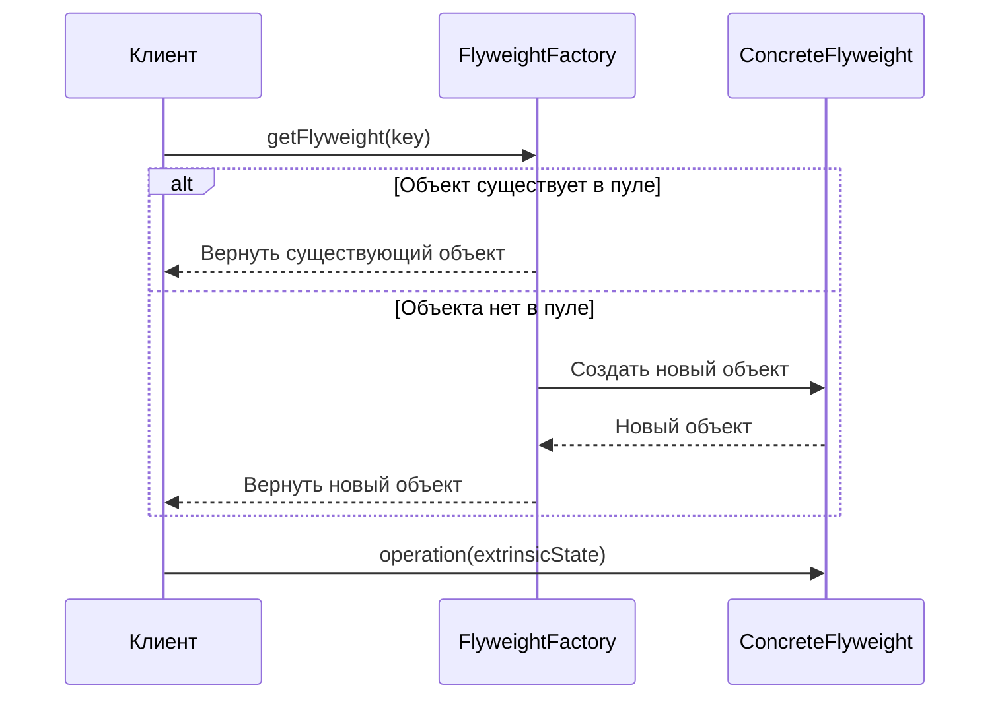

# Паттерн Flyweight (Приспособленец)

Паттерн Flyweight (англ. _Flyweight_, произносится как «флайвейт») — это структурный паттерн проектирования, который позволяет вмещать больше объектов в отведенную оперативную память за счет разделения общего состояния между несколькими объектами, вместо хранения одинаковых данных в каждом из них.

## Подробное описание

Паттерн применяется, когда в приложении необходимо создать огромное количество однотипных объектов, что приводит к исчерпанию доступной памяти. Ключевая идея заключается в разделении состояния объекта на две части:

1.  **Внутреннее состояние (intrinsic)** — данные, которые не зависят от контекста и могут быть разделены между множеством объектов (например, тип символа, текстура дерева, цвет кнопки).
2.  **Внешнее состояние (extrinsic)** — данные, которые уникальны для каждого конкретного экземпляра и передаются объекту извне при использовании (например, координаты символа на экране, позиция дерева в мире, состояние нажатия кнопки).

Flyweight-фабрика управляет пулом уже созданных объектов. Если запрашивается объект с определенным внутренним состоянием, фабрика либо возвращает существующий экземпляр, либо создает новый. Это гарантирует, что объекты с одинаковым внутренним состоянием будут представлены единственным экземпляром в памяти.

## Основные принципы

### Математическая оценка эффективности

Эффективность паттерна можно оценить через соотношение потребляемой памяти до и после применения оптимизации.

Пусть $N$ — общее количество объектов, $K$ — количество уникальных комбинаций внутреннего состояния ($K \ll N$).

Память без паттерна:

$$
M_{naive} = N \times (S_{intrinsic} + S_{extrinsic})
$$

Память с паттерном Flyweight:

$$
M_{flyweight} = K \times S_{intrinsic} + N \times S_{extrinsic} + S_{factory}
$$

Где:

- $S_{intrinsic}$ — размер внутреннего состояния (разделяемого).
- $S_{extrinsic}$ — размер внешнего состояния (уникального).
- $S_{factory}$ — накладные расходы на хранение фабрики и ссылок.

Выгода достигается, когда $N \times S_{intrinsic} \gg K \times S_{intrinsic} + S_{factory}$.

### Блок-схема взаимодействия



## Пример реализации на Python

Рассмотрим реализацию текстового редактора. Вместо создания отдельного объекта для каждой буквы «а» в документе (которых могут быть тысячи), мы создаем один разделяемый объект для символа «а», хранящий его шрифт и начертание (внутреннее состояние). Координаты и цвет конкретной буквы передаются при отрисовке (внешнее состояние).

```python
import weakref
from typing import Dict, Tuple

class CharacterFlyweight:
    """
    Легковесный объект, хранящий внутреннее состояние символа.
    """
    def __init__(self, char: str, font: str, size: int):
        self.char = char      # Внутреннее состояние
        self.font = font      # Внутреннее состояние
        self.size = size      # Внутреннее состояние

    def render(self, x: int, y: int, color: str):
        """
        Отрисовка символа. Координаты и цвет - внешнее состояние.
        """
        print(f"Отрисовка '{self.char}' [Шрифт: {self.font}, Размер: {self.size}] "
              f"в позиции ({x}, {y}) цветом {color}")

class CharacterFactory:
    """
    Фабрика для управления пулом flyweight-объектов.
    Использует WeakValueDictionary, чтобы объекты удалялись сборщиком мусора,
    если на них больше нет ссылок вне фабрики (опционально для долгосрочных приложений).
    """
    _pool: Dict[Tuple[str, str, int], CharacterFlyweight] = {}

    @classmethod
    def get_character(cls, char: str, font: str, size: int) -> CharacterFlyweight:
        key = (char, font, size)

        if key not in cls._pool:
            cls._pool[key] = CharacterFlyweight(char, font, size)

        return cls._pool[key]

    @classmethod
    def get_pool_size(cls) -> int:
        return len(cls._pool)

class TextEditor:
    """
    Клиентский код, хранящий внешний контекст (позиции символов).
    """
    def __init__(self):
        self.characters: list[Tuple[CharacterFlyweight, int, int, str]] = []

    def add_character(self, char: str, font: str, size: int, x: int, y: int, color: str):
        # Получаем разделяемый объект из фабрики
        flyweight = CharacterFactory.get_character(char, font, size)
        # Сохраняем ссылку на flyweight вместе с внешним состоянием
        self.characters.append((flyweight, x, y, color))

    def render(self):
        for flyweight, x, y, color in self.characters:
            flyweight.render(x, y, color)

if __name__ == "__main__":
    editor = TextEditor()

    # Добавляем много текста с повторяющимися стилями
    text_content = "Hello World! Hello Python!"
    x_pos = 0

    for char in text_content:
        if char.isupper():
            font, size, color = "Arial Bold", 14, "red"
        elif char == ' ':
            font, size, color = "Arial", 12, "white" # Пробел тоже объект, но невидимый
        else:
            font, size, color = "Arial", 12, "black"

        editor.add_character(char, font, size, x_pos, 10, color)
        x_pos += 10

    print(f"Всего символов в тексте: {len(text_content)}")
    print(f"Уникальных объектов Flyweight в памяти: {CharacterFactory.get_pool_size()}")
    print("-" * 30)

    editor.render()
```

## Достоинства и недостатки

**Достоинства:**

1.  **Экономия памяти.** Значительное снижение потребления RAM при работе с большими наборами однотипных данных.
2.  **Производительность.** Ускорение инициализации, так как объекты не создаются каждый раз заново, а берутся из кэша.
3.  **Централизованное управление.** Изменение внутреннего состояния (например, глобальная замена шрифта) происходит в одном месте для всех связанных объектов.

**Недостатки:**

1.  **Усложнение кода.** Необходимо четко разделять внутреннее и внешнее состояние, что увеличивает сложность архитектуры.
2.  **Накладные расходы на вычисление хэшей.** Поиск объектов в фабрике требует времени, хотя обычно оно компенсируется экономией на создании объектов.
3.  **Проблемы с многопоточностью.** Если разделяемые объекты изменяемы, требуется синхронизация доступа, что может снизить производительность. Рекомендуется делать Flyweight-объекты неизменяемыми (immutable).

## Области применения

1.  Паттерны проектирования (реализация эффективных структур данных, кэширование)
2.  Игровая разработка (отрисовка тысяч деревьев, травы, камней с одинаковыми текстурами но разными координатами)
3.  Обработка естественного языка (хранение словаря слов в текстовых процессорах, где каждое слово — объект с общим форматированием)
