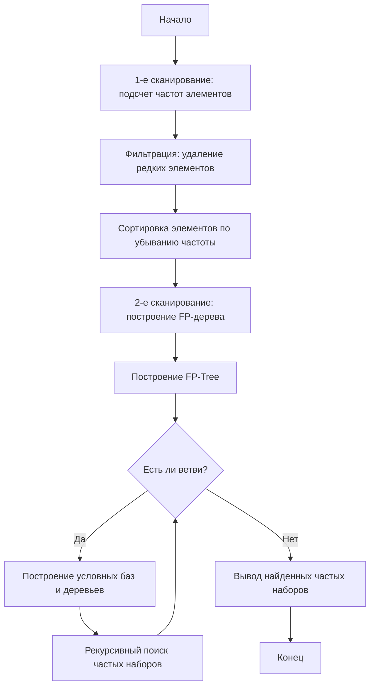

# FP-Growth (Frequent Pattern Growth)

**FP-Growth** (Frequent Pattern Growth) — это алгоритм интеллектуального анализа данных, предназначенный для поиска частых наборов элементов (frequent itemsets) в больших транзакционных базах данных. В отличие от алгоритма Apriori, FP-Growth не генерирует кандидатов, а использует сжатую структуру данных — FP-дерево (Frequent Pattern Tree), что значительно ускоряет процесс обработки.

## Подробное описание

Алгоритм решает задачу поиска ассоциативных правил: выявления закономерностей вида «если в корзине есть товар A, то с высокой вероятностью там будет товар B».

**Постановка задачи:**
Дана база транзакций $D$ и минимальный порог поддержки $min\_sup$. Необходимо найти все наборы элементов, частота встречаемости которых в $D$ не меньше $min\_sup$.

**Входные данные:**

- Список транзакций (например, списки покупок).
- Минимальный порог поддержки (число от 0 до 1 или абсолютное значение).

**Выходные данные:**

- Список частых наборов элементов с указанием их поддержки.

**Ключевая идея:**
Вместо многократного сканирования базы данных для проверки всех возможных комбинаций (как в Apriori), FP-Growth сканирует базу всего два раза:

1. Первый раз — для подсчета частоты отдельных элементов и отбора частых.
2. Второй раз — для построения компактного префиксного дерева (FP-Tree), которое сохраняет информацию о совместной встречаемости элементов.

Далее алгоритм рекурсивно разбирает это дерево, строя «условные базы» для каждого элемента, что позволяет находить частые наборы методом «разделяй и властвуй».

## Принцип работы

### Математическая формулировка

Основной метрикой является **поддержка (Support)** набора элементов $X$:

$$
Support(X) = \frac{\text{Количество транзакций, содержащих } X}{\text{Общее количество транзакций}}
$$

Набор $X$ считается частым, если:

$$
Support(X) \ge min\_sup
$$

Для ассоциативных правил $A \rightarrow B$ также используется **доверие (Confidence)**:

$$
Confidence(A \rightarrow B) = \frac{Support(A \cup B)}{Support(A)}
$$

### Структура FP-дерева

FP-дерево состоит из:

1. Корня (пустой узел).
2. Префиксных путей, где каждый узел содержит:
   - Название элемента.
   - Счетчик (сколько раз этот путь встречался).
   - Ссылку на родительский узел.
   - Ссылку на следующий узел с тем же именем (для быстрого доступа).

### Блок-схема алгоритма



## Пример реализации на Python

Полная реализация FP-дерева требует значительного объема кода. Ниже приведен пример использования алгоритма через библиотеку `mlxtend`, которая является стандартом де-факто для таких задач в Python, а также упрощенная реализация логики поиска частых пар на чистом Python для понимания сути.

### Вариант 1: Профессиональное использование (mlxtend)

Для работы требуется установка библиотеки:

```bash
pip install mlxtend pandas
```

```python
import pandas as pd
from mlxtend.preprocessing import TransactionEncoder
from mlxtend.frequent_patterns import fpgrowth, association_rules

def run_fpgrowth_example():
    # Пример данных: транзакции покупателей
    transactions = [
        ['хлеб', 'молоко', 'яйца'],
        ['хлеб', 'печенье', 'кола'],
        ['молоко', 'печенье', 'кола'],
        ['хлеб', 'молоко', 'печенье', 'кола'],
        ['хлеб', 'молоко', 'печенье']
    ]

    # Шаг 1: Преобразование данных в бинарную матрицу (One-Hot Encoding)
    te = TransactionEncoder()
    te_ary = te.fit(transactions).transform(transactions)
    df = pd.DataFrame(te_ary, columns=te.columns_)

    # Шаг 2: Поиск частых наборов с помощью FP-Growth
    # min_support=0.4 означает, что набор должен встречаться в 40% транзакций
    frequent_itemsets = fpgrowth(df, min_support=0.4, use_colnames=True)

    print("Частые наборы:")
    print(frequent_itemsets)
    print("-" * 30)

    # Шаг 3: Генерация ассоциативных правил
    # Отбираем правила с доверием (confidence) не менее 0.7
    rules = association_rules(frequent_itemsets, metric="confidence", min_threshold=0.7)

    # Выводим только интересные колонки
    cols = ['antecedents', 'consequents', 'support', 'confidence']
    print("Ассоциативные правила (confidence >= 0.7):")
    print(rules[cols])

if __name__ == "__main__":
    run_fpgrowth_example()
```

### Вариант 2: Упрощенная логика на чистом Python (поиск частых пар)

Этот код демонстрирует базовый принцип подсчета поддержки без использования внешних библиотек.

```python
from itertools import combinations
from collections import Counter

def find_frequent_itemsets(transactions, min_support_count):
    """
    Находит частые наборы (размера 1 и 2) для демонстрации логики.
    :param transactions: список списков (транзакции)
    :param min_support_count: минимальное количество появлений
    :return: словарь частых наборов и их счетчиков
    """
    # Подсчет частоты одиночных элементов
    item_counts = Counter()
    for transaction in transactions:
        for item in transaction:
            item_counts[item] += 1

    # Фильтрация одиночных частых элементов
    frequent_items = {item: count for item, count in item_counts.items()
                      if count >= min_support_count}

    frequent_pairs = {}

    # Поиск частых пар среди частых одиночных элементов
    # Это упрощение, полный FP-Growth делает это эффективнее через дерево
    frequent_item_list = list(frequent_items.keys())

    for pair in combinations(frequent_item_list, 2):
        count = 0
        for transaction in transactions:
            # Проверяем, содержатся ли оба элемента пары в транзакции
            if pair[0] in transaction and pair[1] in transaction:
                count += 1
        if count >= min_support_count:
            frequent_pairs[pair] = count

    return frequent_items, frequent_pairs

if __name__ == "__main__":
    transactions = [
        ['хлеб', 'молоко', 'яйца'],
        ['хлеб', 'печенье', 'кола'],
        ['молоко', 'печенье', 'кола'],
        ['хлеб', 'молоко', 'печенье', 'кола'],
        ['хлеб', 'молоко', 'печенье']
    ]

    # Минимальная поддержка: 2 транзакции (40% от 5)
    min_sup = 2

    singles, pairs = find_frequent_itemsets(transactions, min_sup)

    print("Частые одиночные элементы:", singles)
    print("Частые пары:", pairs)
```

## Достоинства и недостатки

**Достоинства:**

1. **Высокая скорость:** Сканирует базу данных всего два раза, в отличие от Apriori, который делает это многократно.
2. **Отсутствие генерации кандидатов:** Не создает огромное количество промежуточных наборов-кандидатов, что экономит память и время.
3. **Компактность хранения:** FP-дерево сжимает данные, сохраняя только частые паттерны.

**Недостатки:**

1. **Сложность реализации:** Построение и обход FP-дерева алгоритмически сложнее, чем простые переборы.
2. **Затраты памяти:** В худшем случае (если мало повторяющихся префиксов) дерево может занимать много оперативной памяти.
3. **Чувствительность к порогу:** При очень низком `min_support` дерево становится огромным и неэффективным.

## Области применения

1. Торговля и коммерция (анализ корзин покупок, выявление ассоциативных правил типа "если покупают хлеб и масло, то часто берут молоко")
2. Машинное обучение и рекомендательные системы (персонализация предложений, cross-selling на маркетплейсах)
3. Аналитика данных и базы данных (подготовка данных для ML, выявление скрытых зависимостей в больших логах)
4. Биотехнологии и медицина (поиск частых сочетаний симптомов или генетических маркеров)
