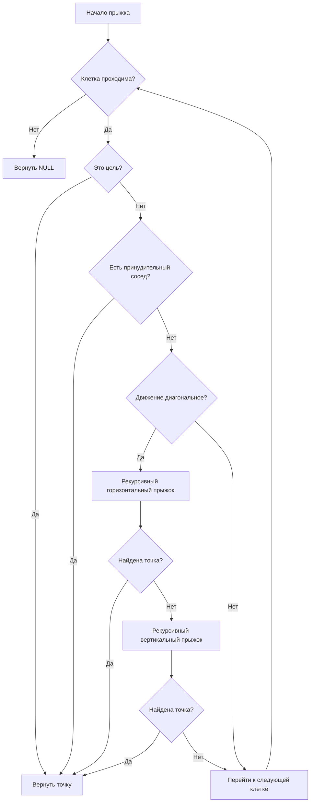

# Jump Point Search (JPS)

**Jump Point Search** (произносится как «Джамп Поинт Сёрч», часто сокращается до **JPS**) — это алгоритм поиска пути на равномерных сетках (uniform-cost grids), который является оптимизацией алгоритма A\*. Он позволяет значительно ускорить поиск, пропуская множество промежуточных узлов, которые не влияют на оптимальность пути.

## Подробное описание

Алгоритм JPS был предложен Дэниелом Харбором (Daniel Harabor) и Патриком Стуртевантом (Patrick Sturtevant) в 2011 году. Основная проблема классического A* на больших открытых пространствах заключается в том, что он исследует огромное количество симметричных путей, ведущих к одной и той же точке с одинаковой стоимостью. Например, чтобы добраться из точки A в точку B по диагонали открытого поля, A* рассмотрит десятки вариантов зигзагообразных движений, хотя все они эквивалентны.

JPS решает эту проблему, вводя понятие **«точек перехода» (jump points)**. Вместо того чтобы добавлять каждого соседа в открытый список, алгоритм «прыгает» вдоль направления движения, пока не встретит препятствие или ситуацию, требующую изменения направления (принудительного соседа). Это позволяет сократить количество обрабатываемых узлов на порядки.

**Входные данные:**

- Сетка (grid), где каждая ячейка имеет статус «проходима» или «непроходима».
- Начальная и конечная координаты.

**Выходные данные:**

- Кратчайший путь в виде последовательности координат.

## Основные принципы

### 1. Исключение симметрии

В равномерной сетке стоимость перемещения в соседнюю клетку постоянна (обычно 1 для ортогональных ходов и $\sqrt{2}$ для диагональных). JPS игнорирует узлы, которые могут быть достигнуты с той же стоимостью через другие узлы, находящиеся на прямой линии.

### 2. Прыжки (Jumping)

Алгоритм рекурсивно проверяет клетки в направлении движения. Если текущая клетка не является точкой перехода и не является целью, алгоритм переходит к следующей клетке в том же направлении. Этот процесс продолжается до тех пор, пока не будет найдена точка перехода или препятствие.

### 3. Принудительные соседи (Forced Neighbors)

Точка перехода определяется наличием «принудительного соседа». Это ситуация, когда из-за препятствия единственный оптимальный путь к некоторым соседним клеткам проходит через текущий узел. Если такой сосед существует, текущий узел становится точкой перехода и добавляется в открытый список.

### Математическая формулировка

Оценка стоимости пути в JPS базируется на функции $f(n)$, аналогичной A\*:

$$
f(n) = g(n) + h(n)
$$

Где:

- $g(n)$ — фактическая стоимость пути от начальной точки до узла $n$.
- $h(n)$ — эвристическая оценка расстояния от узла $n$ до цели (обычно используется расстояние Чебышева или октадное расстояние для сеток с диагональными ходами).

Для диагонального движения расстояние Чебышева вычисляется как:

$$
h(n) = \max(|dx|, |dy|)
$$

Или более точная октадная метрика:

$$
h(n) = D \cdot \min(dx, dy) + D_2 \cdot (dx + dy - 2 \cdot \min(dx, dy))
$$

Где $D=1$ (ортогональный шаг), $D_2=\sqrt{2}$ (диагональный шаг).

### Блок-схема логики прыжка



## Пример реализации на Python

Ниже представлена полная реализация алгоритма JPS. Код использует только стандартную библиотеку Python.

```python
import heapq
from typing import List, Tuple, Optional, Set

# Константы для стоимости перемещения
COST_STRAIGHT = 1
COST_DIAGONAL = 1.41421356  # sqrt(2)

def heuristic(a: Tuple[int, int], b: Tuple[int, int]) -> float:
    """
    Эвристическая функция (октадное расстояние).
    Подходит для сеток с разрешенными диагональными ходами.
    """
    dx = abs(a[0] - b[0])
    dy = abs(a[1] - b[1])
    return COST_STRAIGHT * max(dx, dy) + (COST_DIAGONAL - COST_STRAIGHT) * min(dx, dy)

class Node:
    """Узел для хранения состояния в открытом списке."""
    def __init__(self, position: Tuple[int, int], parent: Optional['Node'] = None):
        self.position = position
        self.parent = parent
        self.g = 0.0  # Стоимость от старта
        self.h = 0.0  # Эвристика до цели
        self.f = 0.0  # Общая стоимость f = g + h

    def __eq__(self, other):
        if not isinstance(other, Node):
            return False
        return self.position == other.position

    def __lt__(self, other):
        return self.f < other.f

    def __hash__(self):
        return hash(self.position)

def is_valid(grid: List[List[int]], pos: Tuple[int, int]) -> bool:
    """Проверяет, находится ли позиция в пределах сетки и является ли она проходимой (0)."""
    x, y = pos
    rows = len(grid)
    if rows == 0:
        return False
    cols = len(grid[0])
    return 0 <= x < rows and 0 <= y < cols and grid[x][y] == 0

def has_forced_neighbor(grid: List[List[int]], x: int, y: int, dx: int, dy: int) -> bool:
    """
    Проверяет наличие принудительных соседей.
    Если сосед заблокирован препятствием так, что текущий узел становится единственным путем,
    то текущий узел является точкой перехода.
    """
    # Проверка для диагонального движения
    if dx != 0 and dy != 0:
        # Проверяем горизонтальные и вертикальные компоненты
        # Если мы идем по диагонали (dx, dy), проверяем перпендикулярные направления
        if (is_valid(grid, (x - dx, y)) and not is_valid(grid, (x - dx, y + dy))) or \
           (is_valid(grid, (x, y - dy)) and not is_valid(grid, (x + dx, y - dy))):
            return True
        # Дополнительная проверка для угловых случаев (зависит от конкретной реализации правил)
        # Стандартные правила JPS для диагонали:
        if (is_valid(grid, (x - dx, y)) and not is_valid(grid, (x - dx, y + dy))) or \
           (is_valid(grid, (x, y - dy)) and not is_valid(grid, (x + dx, y - dy))):
             return True
        # Упрощенная проверка для примера: если есть препятствие сбоку от диагонали
        if (not is_valid(grid, (x - dx, y)) and is_valid(grid, (x - dx, y + dy))) or \
           (not is_valid(grid, (x, y - dy)) and is_valid(grid, (x + dx, y - dy))):
            return True

    else:
        # Ортогональное движение
        if dx != 0: # Горизонтальное
            if (is_valid(grid, (x + dx, y + 1)) and not is_valid(grid, (x, y + 1))) or \
               (is_valid(grid, (x + dx, y - 1)) and not is_valid(grid, (x, y - 1))):
                return True
        else: # Вертикальное (dy != 0)
            if (is_valid(grid, (x + 1, y + dy)) and not is_valid(grid, (x + 1, y))) or \
               (is_valid(grid, (x - 1, y + dy)) and not is_valid(grid, (x - 1, y))):
                return True

    return False

def jump(grid: List[List[int]], current: Tuple[int, int], direction: Tuple[int, int],
         goal: Tuple[int, int]) -> Optional[Tuple[int, int]]:
    """
    Рекурсивная функция прыжка. Ищет следующую точку перехода в заданном направлении.
    """
    dx, dy = direction
    x, y = current

    # Вычисляем следующую позицию
    next_x = x + dx
    next_y = y + dy
    next_pos = (next_x, next_y)

    # Если вышли за границы или упали в препятствие
    if not is_valid(grid, next_pos):
        return None

    # Если достигли цели
    if next_pos == goal:
        return next_pos

    # Если нашли принудительного соседа, то это точка перехода
    if has_forced_neighbor(grid, next_x, next_y, dx, dy):
        return next_pos

    # Если движение диагональное, нужно проверить также горизонтальное и вертикальное направления
    if dx != 0 and dy != 0:
        # Прыгаем по горизонтали
        if jump(grid, next_pos, (dx, 0), goal) is not None:
            return next_pos
        # Прыгаем по вертикали
        if jump(grid, next_pos, (0, dy), goal) is not None:
            return next_pos

    # Продолжаем прыжок в том же направлении
    return jump(grid, next_pos, direction, goal)

def get_neighbors_jps(grid: List[List[int]], node: Node, goal: Tuple[int, int]) -> List[Tuple[int, int]]:
    """
    Получает список точек перехода (successors) для текущего узла.
    """
    neighbors = []
    x, y = node.position

    # Определяем направление движения от родителя
    if node.parent is None:
        # Для стартового узла проверяем все 8 направлений
        directions = [(-1, -1), (-1, 0), (-1, 1),
                      (0, -1),           (0, 1),
                      (1, -1),  (1, 0),  (1, 1)]
    else:
        px, py = node.parent.position
        dx = x - px
        dy = y - py

        # Нормализуем направление (-1, 0, 1)
        dx = max(-1, min(1, dx))
        dy = max(-1, min(1, dy))

        directions = []

        if dx != 0 and dy != 0: # Диагональное движение
            directions.append((dx, dy)) # Продолжаем диагональ
            if is_valid(grid, (x - dx, y)): # Если слева свободно, проверяем влево
                 directions.append((-dx, 0))
            if is_valid(grid, (x, y - dy)): # Если сверху свободно, проверяем вверх
                 directions.append((0, -dy))
        elif dx != 0: # Горизонтальное
            directions.append((dx, 0))
            if is_valid(grid, (x, y + 1)): directions.append((dx, 1))
            if is_valid(grid, (x, y - 1)): directions.append((dx, -1))
        else: # Вертикальное
            directions.append((0, dy))
            if is_valid(grid, (x + 1, y)): directions.append((1, dy))
            if is_valid(grid, (x - 1, y)): directions.append((-1, dy))

    for direction in directions:
        jump_point = jump(grid, (x, y), direction, goal)
        if jump_point:
            neighbors.append(jump_point)

    return neighbors

def jps_search(grid: List[List[int]], start: Tuple[int, int], goal: Tuple[int, int]) -> List[Tuple[int, int]]:
    """
    Основная функция поиска пути алгоритмом Jump Point Search.
    """
    start_node = Node(start)
    start_node.h = heuristic(start, goal)
    start_node.f = start_node.h

    open_list = []
    heapq.heappush(open_list, start_node)

    closed_set: Set[Tuple[int, int]] = set()

    # Словарь для быстрого доступа к узлам в открытом списке по координатам
    # Чтобы обновлять g-стоимость, если найден лучший путь
    open_dict = {start: start_node}

    while open_list:
        current_node = heapq.heappop(open_list)

        # Если узел уже обработан (могут быть дубликаты в heap), пропускаем
        if current_node.position in closed_set:
            continue

        closed_set.add(current_node.position)

        # Проверка на достижение цели
        if current_node.position == goal:
            path = []
            curr = current_node
            while curr:
                path.append(curr.position)
                curr = curr.parent
            return path[::-1]

        # Получаем точки перехода
        successors_coords = get_neighbors_jps(grid, current_node, goal)

        for succ_pos in successors_coords:
            if succ_pos in closed_set:
                continue

            # Вычисляем стоимость шага
            dx = succ_pos[0] - current_node.position[0]
            dy = succ_pos[1] - current_node.position[1]
            step_cost = COST_DIAGONAL if (dx != 0 and dy != 0) else COST_STRAIGHT

            tentative_g = current_node.g + step_cost

            # Проверяем, есть ли этот узел уже в открытом списке
            if succ_pos in open_dict:
                neighbor_node = open_dict[succ_pos]
                if tentative_g < neighbor_node.g:
                    # Нашли лучший путь, обновляем
                    neighbor_node.g = tentative_g
                    neighbor_node.f = tentative_g + neighbor_node.h
                    neighbor_node.parent = current_node
                    # Перестраиваем heap (простой способ - push нового, старый проигнорируется по closed_set)
                    heapq.heappush(open_list, neighbor_node)
            else:
                # Создаем новый узел
                new_node = Node(succ_pos, current_node)
                new_node.g = tentative_g
                new_node.h = heuristic(succ_pos, goal)
                new_node.f = new_node.g + new_node.h
                open_dict[succ_pos] = new_node
                heapq.heappush(open_list, new_node)

    return [] # Путь не найден

if __name__ == "__main__":
    # 0 - свободно, 1 - препятствие
    grid = [
        [0, 0, 0, 0, 0, 0, 0, 0, 0, 0],
        [0, 0, 0, 0, 0, 0, 0, 0, 0, 0],
        [0, 0, 0, 0, 1, 1, 1, 0, 0, 0],
        [0, 0, 0, 0, 1, 0, 1, 0, 0, 0],
        [0, 0, 0, 0, 1, 0, 1, 0, 0, 0],
        [0, 0, 0, 0, 0, 0, 0, 0, 0, 0],
        [0, 0, 0, 0, 0, 0, 0, 0, 0, 0],
        [0, 0, 0, 0, 0, 0, 0, 0, 0, 0],
        [0, 0, 0, 0, 0, 0, 0, 0, 0, 0],
        [0, 0, 0, 0, 0, 0, 0, 0, 0, 0]
    ]

    start_pos = (1, 1)
    end_pos = (8, 8)

    print(f"Поиск пути от {start_pos} до {end_pos}...")
    path = jps_search(grid, start_pos, end_pos)

    if path:
        print(f"Путь найден! Длина: {len(path)} шагов.")
        print("Координаты пути:")
        for p in path:
            print(p)

        # Визуализация
        print("\nВизуализация сетки:")
        for i in range(len(grid)):
            row_str = ""
            for j in range(len(grid[0])):
                if (i, j) == start_pos:
                    row_str += "S "
                elif (i, j) == end_pos:
                    row_str += "E "
                elif (i, j) in path:
                    row_str += "* "
                elif grid[i][j] == 1:
                    row_str += "# "
                else:
                    row_str += ". "
            print(row_str)
    else:
        print("Путь не найден.")
```

## Достоинства и недостатки

**Достоинства:**

1. **Высокая производительность**: На больших открытых картах работает в 10–100 раз быстрее классического A\*, так как обрабатывает значительно меньше узлов.
2. **Оптимальность**: Гарантированно находит кратчайший путь, так как является точной оптимизацией A\*.
3. **Экономия памяти**: Открытый список содержит только ключевые точки перехода, а не все промежуточные клетки.

**Недостатки:**

1. **Ограниченная применимость**: Работает эффективно только на равномерных сетках (uniform cost). Не подходит для карт с разной стоимостью прохождения клеток (весовые карты).
2. **Сложность реализации**: Алгоритм сложнее в кодировании и отладке по сравнению с базовым A\* из-за рекурсивной логики прыжков и обработки граничных случаев.
3. **Накладные расходы на малых картах**: На небольших или сильно загроможденных препятствиями картах выигрыш может быть незаметен или даже отрицателен из-за сложности проверки условий прыжка.

## Области применения

1. Игровая разработка (поиск пути для NPC в стратегических играх и RPG с большими открытыми мирами, навигация юнитов в реальном времени).
2. Робототехника и автономные системы (планирование траектории мобильных роботов в структурированных средах, таких как склады или заводские цеха).
3. Логистика и управление цепочками (оптимизация маршрутов внутри складских помещений с регулярной стеллажной системой).
4. ГИС и картография (построение пешеходных маршрутов в городских кварталах с регулярной сеткой улиц).
