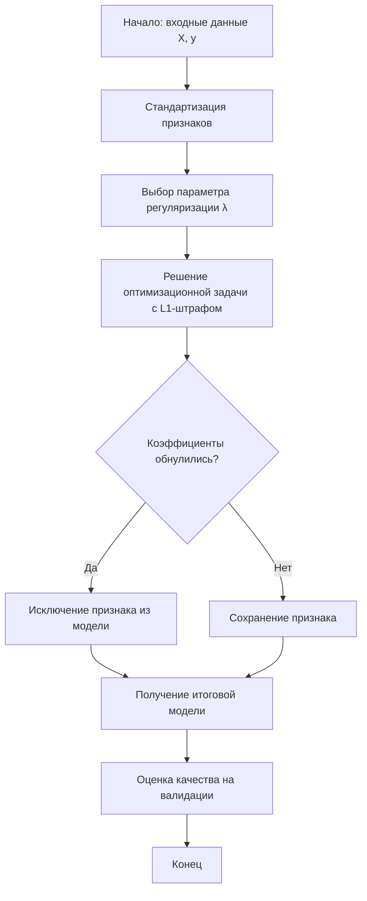

# Лассо-регрессия (Lasso Regression)

**Lasso-регрессия** (англ. _LASSO, Least Absolute Shrinkage and Selection Operator_) — это метод регуляризации линейных регрессионных моделей, который одновременно решает две задачи: **уменьшение** (shrinkage) абсолютных значений коэффициентов и **отбор** (selection) наиболее значимых признаков за счёт обнуления неинформативных переменных . Метод предложен Робертом Тибширани в 1996 году .

## Подробное описание

Lasso-регрессия применяется в ситуациях, когда:

- Количество признаков $p$ велико (возможно, больше числа наблюдений $n$);
- Между признаками существует **мультиколлинеарность** — линейная зависимость, приводящая к неустойчивости оценок коэффициентов обычного метода наименьших квадратов (МНК) ;
- Требуется построить интерпретируемую модель с небольшим числом значимых переменных.

**Входные данные:** выборка из $N$ наблюдений, где $y_i$ — целевая переменная, а $x_{ij}$ — значения $j$-го признака ($j=1,\dots,p$) для $i$-го объекта. Регрессоры должны быть предварительно **стандартизованы**: иметь нулевое среднее и единичную дисперсию .

**Выходные данные:** вектор оценок коэффициентов $\hat{\beta}$, в котором многие элементы равны нулю.

**Ключевая идея:** к стандартной МНК-целевой функции добавляется $L_1$-штраф на сумму абсолютных значений коэффициентов. Этот штраф «сжимает» коэффициенты и вынуждает некоторые из них стать в точности равными нулю, что эквивалентно автоматическому отбору признаков .

## Принцип работы

### Математическая формулировка

Оценка коэффициентов Lasso находится как решение задачи минимизации:

$$
\hat{\beta}^{\text{lasso}} = \arg\min_{\beta} \left\{ \frac{1}{2} \sum_{i=1}^{N} \left( y_i - \beta_0 - \sum_{j=1}^{p} x_{ij} \beta_j \right)^2 + \lambda \sum_{j=1}^{p} |\beta_j| \right\}
$$

Где:

- $\beta_0$ — свободный член (константа);
- $\beta_j$ — коэффициенты при $j$-м признаке;
- $\lambda \ge 0$ — параметр регуляризации, управляющий силой штрафа.

Эквивалентная форма с ограничением:

$$
\hat{\beta}^{\text{lasso}} = \arg\min_{\beta} \sum_{i=1}^{N} \left( y_i - \beta_0 - \sum_{j=1}^{p} x_{ij} \beta_j \right)^2 \quad \text{при} \quad \sum_{j=1}^{p} |\beta_j| \le t,
$$

где $t$ — параметр, обратно связанный с $\lambda$ .

При $\lambda = 0$ получается обычная МНК-регрессия. С ростом $\lambda$ штраф усиливается, коэффициенты сжимаются к нулю, и многие становятся равны нулю — это и есть встроенный **отбор признаков** .

### Блок-схема алгоритма



### Сравнение с гребневой регрессией

В отличие от **Ridge-регрессии**, использующей $L_2$-штраф $\lambda \sum \beta_j^2$, Lasso способна **обнулять** коэффициенты, а не просто уменьшать их до близких к нулю значений . Геометрически это объясняется формой области ограничений: для $L_1$ (ромб) точка касания с эллипсами функции потерь часто попадает на оси координат, что даёт нулевые значения некоторых коэффициентов .

## Пример реализации на Python

В приведённом примере используется библиотека `scikit-learn`. Модель обучается на синтетических данных с известными истинными коэффициентами, часть из которых равна нулю . Обратите внимание на стандартизацию признаков — важное требование для корректной работы Lasso.

```python
import numpy as np
from sklearn.model_selection import train_test_split
from sklearn.linear_model import Lasso
from sklearn.preprocessing import StandardScaler
from sklearn.metrics import mean_squared_error, r2_score

# 1. Генерация синтетических данных
np.random.seed(0)
n_samples, n_features = 100, 10
X = np.random.rand(n_samples, n_features)

# Истинные коэффициенты: часть равна нулю
true_coeffs = np.array([22.5, -1.5, 0, 100, 3, 0, 45, 0, 1, 0])
y = X @ true_coeffs + np.random.randn(n_samples) * 2  # Добавляем шум

# 2. Разделение на обучающую и тестовую выборки
X_train, X_test, y_train, y_test = train_test_split(
    X, y, test_size=0.2, random_state=0
)

# 3. Стандартизация признаков (обязательное условие для Lasso)
scaler = StandardScaler()
X_train_scaled = scaler.fit_transform(X_train)
X_test_scaled = scaler.transform(X_test)

# 4. Обучение модели Lasso
# Параметр alpha соответствует λ. Подбирается кросс-валидацией.
model = Lasso(alpha=0.01, random_state=0)
model.fit(X_train_scaled, y_train)

# 5. Предсказание и оценка качества
y_pred_train = model.predict(X_train_scaled)
y_pred_test = model.predict(X_test_scaled)

mse_train = mean_squared_error(y_train, y_pred_train)
mse_test = mean_squared_error(y_test, y_pred_test)
r2_train = r2_score(y_train, y_pred_train)
r2_test = r2_score(y_test, y_pred_test)

print(f"MSE на обучении: {mse_train:.4f}")
print(f"MSE на тесте: {mse_test:.4f}")
print(f"R² на обучении: {r2_train:.4f}")
print(f"R² на тесте: {r2_test:.4f}")

# 6. Анализ коэффициентов
print("Коэффициенты модели:")
for i, coef in enumerate(model.coef_):
    print(f"  Признак {i}: {coef:.4f}")

# Количество отобранных признаков (ненулевые коэффициенты)
n_selected = np.sum(np.abs(model.coef_) > 1e-6)
print(f"Отобрано признаков: {n_selected} из {n_features}")
```

Вывод программы показывает, что Lasso обнулила коэффициенты при неинформативных признаках (с истинными коэффициентами 0), автоматически выполнив отбор .

## Достоинства и недостатки

**Достоинства:**

1. **Встроенный отбор признаков.** Lasso автоматически выполняет выбор наиболее важных переменных, обнуляя остальные. Это упрощает интерпретацию модели и снижает размерность .
2. **Устойчивость к мультиколлинеарности.** Штраф улучшает обусловленность задачи, что стабилизирует оценки коэффициентов по сравнению с обычным МНК .
3. **Высокая вычислительная эффективность.** Подбор модели с Lasso значительно быстрее пошаговых методов отбора признаков, что позволяет исследовать больше вариантов моделей .
4. **Эффективность при большом числе признаков.** Метод хорошо работает в ситуациях, когда число признаков $p$ сравнимо или даже превышает число наблюдений $n$ .

**Недостатки:**

1. **Ограничение на число отобранных признаков.** Классическая Lasso не может выбрать больше $n$ признаков (где $n$ — число наблюдений) .
2. **Проблема с группами коррелированных признаков.** При наличии сильно коррелированных переменных Lasso склонна выбирать только одну из них, игнорируя остальные .
3. **Более высокие ошибки предсказания при сильной корреляции.** В ситуациях, когда признаки сильно коррелированы, Lasso может давать худшие предсказания, чем Ridge-регрессия .
4. **Смещение больших коэффициентов.** Lasso может чрезмерно «сжимать» коэффициенты, истинные значения которых велики .
5. **Отсутствие «оракульного» свойства в общем случае.** Метод не всегда обеспечивает такую же точность отбора признаков, как если бы истинная модель была известна заранее. Это свойство достигается лишь при строгих условиях .

## Области применения

1. **Экономика и финансы** — прогнозирование стоимости ценных бумаг на основе показателей компании, анализ эластичности спроса по цене, прогнозирование объёма продаж .

2. **Биотехнологии и медицина** — выявление факторов риска инфекционных заболеваний после клинических вмешательств (например, анализ влияния демографических и клинических признаков на риск развития осложнений) , работа с геномными данными .

3. **Обработка текста** — построение разреженных моделей для классификации документов по темам на основе частотных словарей, где число признаков (слов) может значительно превышать число документов.

4. **Компьютерное зрение** — отбор наиболее информативных пикселей или признаков, извлечённых из изображений, для задач распознавания образов при ограниченном объёме обучающих данных.

5. **Логистика** — прогнозирование загруженности веб-сервисов и управление вычислительными ресурсами на основе временных рядов и внешних факторов .
