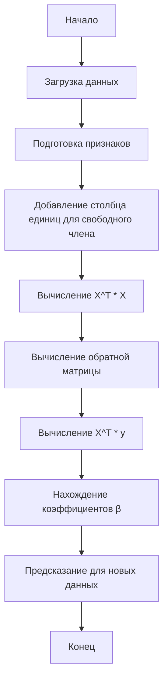

# Линейная регрессия (Linear Regression)

Линейная регрессия — это статистический метод и один из базовых алгоритмов машинного обучения, используемый для моделирования линейной зависимости между одной или несколькими независимыми переменными (признаками) и зависимой переменной (целевым значением).

## Подробное описание

**Постановка задачи:**  
На основе набора данных с известными значениями признаков и целевой переменной построить модель, которая позволит предсказывать значение целевой переменной для новых наблюдений.

**Входные данные:**

- Матрица признаков $X$ размером $n \times m$, где $n$ — количество наблюдений, $m$ — количество признаков
- Вектор целевых значений $y$ размером $n$

**Выходные данные:**

- Вектор коэффициентов модели $\beta$ размером $m+1$ (включая свободный член)
- Предсказанные значения $\hat{y}$ для новых данных

**Ключевая идея:**  
Найти такую гиперплоскость в пространстве признаков, которая минимизирует сумму квадратов отклонений между предсказанными и фактическими значениями целевой переменной.

**Исторический контекст:**  
Метод наименьших квадратов, лежащий в основе линейной регрессии, был разработан Карлом Фридрихом Гауссом и Адриеном-Мари Лежандром в начале XIX века.

## Основные принципы

### Математическая формулировка

Модель линейной регрессии описывается уравнением:

$$
\hat{y} = \beta_0 + \beta_1 x_1 + \beta_2 x_2 + ... + \beta_m x_m
$$

или в векторной форме:

$$
\hat{y} = X\beta
$$

Где:

- $\hat{y}$ — предсказанное значение целевой переменной
- $\beta_0$ — свободный член (intercept)
- $\beta_1, \beta_2, ..., \beta_m$ — коэффициенты при признаках
- $x_1, x_2, ..., x_m$ — значения признаков

Функция потерь (mean squared error):

$$
MSE = \frac{1}{n} \sum_{i=1}^{n} (y_i - \hat{y}_i)^2
$$

Оптимальные коэффициенты находятся по формуле:

$$
\beta = (X^T X)^{-1} X^T y
$$

### Блок-схема алгоритма



## Пример реализации на Python

```python
import numpy as np
from typing import Tuple, List


class LinearRegression:
    """Класс для реализации линейной регрессии методом наименьших квадратов."""

    def __init__(self):
        self.coefficients = None  # Коэффициенты модели (включая свободный член)

    def fit(self, X: np.ndarray, y: np.ndarray) -> None:
        """
        Обучение модели линейной регрессии.

        Args:
            X: Матрица признаков размером n x m
            y: Вектор целевых значений размером n
        """
        # Добавляем столбец единиц для учета свободного члена
        X_with_intercept = np.column_stack([np.ones(X.shape[0]), X])

        # Вычисляем коэффициенты по формуле: β = (X^T * X)^(-1) * X^T * y
        XtX = X_with_intercept.T @ X_with_intercept
        XtX_inv = np.linalg.inv(XtX)
        Xty = X_with_intercept.T @ y

        self.coefficients = XtX_inv @ Xty

    def predict(self, X: np.ndarray) -> np.ndarray:
        """
        Предсказание значений для новых данных.

        Args:
            X: Матрица признаков размером n x m

        Returns:
            Вектор предсказанных значений
        """
        if self.coefficients is None:
            raise ValueError("Модель еще не обучена. Сначала вызовите метод fit().")

        # Добавляем столбец единиц для учета свободного члена
        X_with_intercept = np.column_stack([np.ones(X.shape[0]), X])

        # Вычисляем предсказания: ŷ = X * β
        predictions = X_with_intercept @ self.coefficients

        return predictions

    def get_coefficients(self) -> np.ndarray:
        """Возвращает коэффициенты модели."""
        return self.coefficients


if __name__ == "__main__":
    # Пример использования
    print("Пример линейной регрессии")
    print("=" * 40)

    # Генерируем тестовые данные: y = 2*x1 + 3*x2 + 5 + шум
    np.random.seed(42)
    n_samples = 100

    X = np.random.randn(n_samples, 2)  # Два признака
    true_coefficients = np.array([5, 2, 3])  # [свободный член, коэфф1, коэфф2]
    y = true_coefficients[0] + true_coefficients[1] * X[:, 0] + true_coefficients[2] * X[:, 1] + np.random.randn(n_samples) * 0.1

    # Создаем и обучаем модель
    model = LinearRegression()
    model.fit(X, y)

    # Получаем найденные коэффициенты
    found_coefficients = model.get_coefficients()
    print(f"Истинные коэффициенты: {true_coefficients}")
    print(f"Найденные коэффициенты: {found_coefficients.round(3)}")

    # Делаем предсказания для новых данных
    X_new = np.array([[1.0, 2.0], [0.5, 1.5]])
    predictions = model.predict(X_new)
    print(f"\nПредсказания для новых данных:")
    for i, (x, pred) in enumerate(zip(X_new, predictions)):
        print(f"  X{i+1} = {x}, предсказание = {pred:.3f}")
```

## Достоинства и недостатки

**Достоинства:**

1. **Простота интерпретации** — коэффициенты модели напрямую показывают влияние каждого признака на целевую переменную
2. **Быстрота вычислений** — аналитическое решение позволяет быстро обучать модель даже на больших датасетах
3. **Хорошая база для сравнения** — служит отправной точкой для оценки более сложных моделей
4. **Устойчивость к переобучению** — при небольшом количестве признаков модель редко переобучается

**Недостатки:**

1. **Предположение о линейности** — не может моделировать нелинейные зависимости без предварительного преобразования признаков
2. **Чувствительность к выбросам** — квадратичная функция потерь сильно штрафует большие отклонения
3. **Требование независимости признаков** — мультиколлинеарность ухудшает качество модели
4. **Ограниченная выразительность** — не подходит для сложных паттернов в данных

## Области применения

1. Экономика и финансы (прогнозирование цен акций, анализ влияния макроэкономических показателей)
2. Обработка текста (оценка тональности текстов на основе частоты слов)
3. Компьютерное зрение (калибровка камер, простая аппроксимация зависимостей между параметрами изображений)
