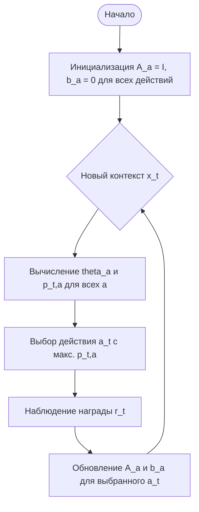

# Linear Upper Confidence Bound (LinUCB)

**Linear Upper Confidence Bound (LinUCB)** — это алгоритм обучения с подкреплением из класса контекстных многоруких бандитов (Contextual Bandits), который использует линейную регрессию для предсказания награды на основе признаков контекста и принцип доверительных интервалов для баланса между исследованием новых вариантов и эксплуатацией известных.

## Подробное описание

Алгоритм решает задачу последовательного принятия решений в условиях неопределенности, когда каждое действие (например, показ рекламы или выбор лечения) сопровождается вектором признаков (контекстом). В отличие от классических бандитов, LinUCB учитывает индивидуальные характеристики пользователя или ситуации, что позволяет строить персонализированные модели для каждого действия.

Ключевая идея заключается в том, что ожидаемая награда линейно зависит от контекста, но параметры этой зависимости неизвестны и оцениваются онлайн по мере поступления данных. Алгоритм поддерживает оценку неопределенности параметров через ковариационную матрицу, выбирая действия с наибольшим потенциалом (верхней границей доверительного интервала).

## Принцип работы

### Математическая формулировка

Для каждого действия $a$ алгоритм поддерживает матрицу $A_a$ и вектор $b_a$. На шаге $t$ при поступлении контекста $x_t$ вычисляется оценка весов $\theta_a$ и верхняя граница доверительного интервала:

$$
\theta_{t,a} = A_{t,a}^{-1} b_{t,a}
$$

$$
p_{t,a} = \theta_{t,a}^T x_{t,a} + \alpha \sqrt{x_{t,a}^T A_{t,a}^{-1} x_{t,a}}
$$

Где:

- $\theta_{t,a}$ — вектор весов для действия $a$ на момент времени $t$,
- $A_{t,a} = I_d + \sum_{s=1}^{t-1} x_{s,a} x_{s,a}^T$ — матрица, накопившая информацию о дисперсии признаков,
- $b_{t,a} = \sum_{s=1}^{t-1} r_s x_{s,a}$ — вектор, накопивший взвешенные награды,
- $\alpha$ — гиперпараметр, контролирующий степень исследования (exploration),
- $p_{t,a}$ — оптимистичная оценка награды для действия $a$.

Алгоритм выбирает действие $a_t = \arg\max_a p_{t,a}$.

После получения реальной награды $r_t$ обновляются параметры выбранного действия:

$$
A_{t+1, a_t} = A_{t, a_t} + x_{t, a_t} x_{t, a_t}^T
$$

$$
b_{t+1, a_t} = b_{t, a_t} + r_t x_{t, a_t}
$$

### Блок-схема алгоритма



## Пример реализации на Python

Реализация использует только стандартную библиотеку `numpy` для линейной алгебры.

```python
import numpy as np
from typing import List, Tuple

class LinUCB:
    def __init__(self, n_actions: int, context_dim: int, alpha: float = 1.0):
        """
        Инициализация алгоритма LinUCB.

        Args:
            n_actions: Количество возможных действий (рук).
            context_dim: Размерность вектора контекста.
            alpha: Параметр исследования (чем больше, тем больше exploration).
        """
        self.n_actions = n_actions
        self.context_dim = context_dim
        self.alpha = alpha

        # A_a: матрица размерности d x d для каждого действия
        # Инициализируем единичными матрицами
        self.A = [np.identity(context_dim) for _ in range(n_actions)]

        # b_a: вектор размерности d для каждого действия
        # Инициализируем нулями
        self.b = [np.zeros(context_dim) for _ in range(n_actions)]

    def act(self, context: np.ndarray) -> int:
        """
        Выбор действия на основе текущего контекста.

        Args:
            context: Вектор признаков пользователя/ситуации.

        Returns:
            Индекс выбранного действия.
        """
        scores = []

        for a in range(self.n_actions):
            # Вычисляем обратную матрицу A_a
            # В продакшене лучше использовать Cholesky decomposition для стабильности
            A_inv = np.linalg.inv(self.A[a])

            # Оценка весов theta_a = A_inv * b_a
            theta = A_inv @ self.b[a]

            # Линейная часть прогноза
            exploitation = theta.T @ context

            # Ширина доверительного интервала (исследование)
            exploration = self.alpha * np.sqrt(context.T @ A_inv @ context)

            # Общая оценка UCB
            score = exploitation + exploration
            scores.append(score)

        return int(np.argmax(scores))

    def update(self, action: int, context: np.ndarray, reward: float) -> None:
        """
        Обновление модели после получения награды.

        Args:
            action: Индекс выполненного действия.
            context: Вектор признаков, использованный при выборе действия.
            reward: Полученная награда (например, 1 за клик, 0 за пропуск).
        """
        # Обновление матрицы A: A += x * x^T
        self.A[action] += np.outer(context, context)

        # Обновление вектора b: b += r * x
        self.b[action] += reward * context


if __name__ == "__main__":
    # Параметры симуляции
    n_actions = 3       # 3 варианта рекомендации
    context_dim = 2     # 2 признака: [нормализованный возраст, время суток]
    alpha = 1.0         # Параметр исследования

    linucb = LinUCB(n_actions, context_dim, alpha)

    # Симуляция взаимодействий пользователей
    n_iterations = 100
    total_rewards = 0

    print("Запуск симуляции LinUCB...")

    for i in range(n_iterations):
        # Генерация случайного контекста пользователя
        user_context = np.array([np.random.rand(), np.random.rand()])

        # Выбор действия алгоритмом
        chosen_action = linucb.act(user_context)

        # Симуляция среды: награда зависит от соответствия действия скрытым предпочтениям
        # В реальности здесь был бы ответ пользователя (клик/покупка)
        true_reward = 1 if chosen_action == 0 else 0  # Упрощенная логика для примера

        # Обновление модели
        linucb.update(chosen_action, user_context, true_reward)
        total_rewards += true_reward

    print(f"Симуляция завершена. Всего наград: {total_rewards}")

    # Тестирование на новом пользователе
    new_user = np.array([0.5, 0.5])
    recommended_action = linucb.act(new_user)
    print(f"Рекомендация для нового пользователя: действие #{recommended_action}")
```

## Достоинства и недостатки

**Достоинства:**

1. **Учет контекста.** Позволяет персонализировать выбор действия на основе индивидуальных признаков пользователя, что значительно повышает точность по сравнению с неконтекстными методами.
2. **Теоретические гарантии.** Алгоритм имеет доказанные границы сожаления (regret bounds), гарантируя сходимость к оптимальной стратегии.
3. **Простота обновления.** Не требует переобучения всей модели с нуля; обновление параметров происходит инкрементально за $O(d^2)$ операций.

**Недостатки:**

1. **Вычислительная сложность обращения матриц.** Необходимость вычисления обратной матрицы $A^{-1}$ может быть затратной при высокой размерности признаков ($d > 1000$).
2. **Линейное предположение.** Модель предполагает линейную зависимость награды от признаков, что может быть неверно для сложных нелинейных паттернов поведения.
3. **Проблема холодного старта.** Для новых действий с отсутствующей историей оценки могут быть неточными, хотя параметр $\alpha$ частично смягчает эту проблему.

## Области применения

1. Машинное обучение и рекомендательные системы (Персонализация выдачи новостей, товаров или видео на основе истории просмотров и демографии)
2. Торговля и коммерция (Динамическое ценообразование и подбор рекламных креативов в реальном времени на основе поведения покупателя)
3. Биотехнологии и медицинская информатика (Подбор индивидуальной терапии или дозировки препаратов на основе клинических показателей пациента)
