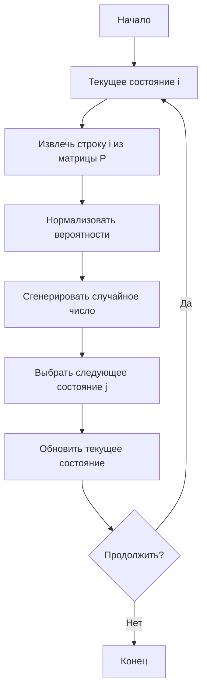

# Цепи Маркова

Цепь Маркова (Markov Chain) — это математическая модель последовательности случайных событий, в которой вероятность каждого следующего события зависит только от текущего состояния системы и не зависит от того, как система пришла в это состояние.

## Подробное описание

Цепи Маркова используются для моделирования систем, которые переходят из одного состояния в другое согласно определенным вероятностным правилам. Ключевой особенностью является **свойство Маркова** (или отсутствие памяти): будущее состояние зависит исключительно от настоящего, а прошлое не влияет на прогноз, если известно текущее состояние.

**Постановка задачи:**
Дана система, которая может находиться в одном из $N$ дискретных состояний $S = \{s_1, s_2, ..., s_N\}$. Необходимо описать динамику перехода системы между этими состояниями во времени.

**Входные данные:**

1. Множество состояний $S$.
2. Матрица переходных вероятностей $P$, где элемент $p_{ij}$ обозначает вероятность перехода из состояния $i$ в состояние $j$ за один шаг.
3. Начальное распределение вероятностей состояний $\pi^{(0)}$.

**Выходные данные:**

1. Последовательность состояний (траектория).
2. Стационарное распределение $\pi$ (если оно существует), показывающее долгосрочную вероятность нахождения системы в каждом состоянии.

**Исторический контекст:**
Модель названа в честь русского математика Андрея Андреевича Маркова, который впервые исследовал такие процессы в начале XX века. Изначально они применялись для анализа текста, но сейчас используются повсеместно — от физики до финансов.

## Основные принципы

### Математическая формулировка

Пусть $X_n$ — случайная величина, обозначающая состояние системы в момент времени $n$. Свойство Маркова записывается как:

$$
P(X_{n+1} = j \mid X_n = i, X_{n-1} = i_{n-1}, \dots, X_0 = i_0) = P(X_{n+1} = j \mid X_n = i)
$$

Матрица переходных вероятностей $P$ размером $N \times N$ определяется элементами:

$$
p_{ij} = P(X_{n+1} = j \mid X_n = i)
$$

Где:

- $p_{ij} \ge 0$ для всех $i, j$
- $\sum_{j=1}^{N} p_{ij} = 1$ для любого $i$ (сумма вероятностей выхода из состояния равна 1)

Стационарное распределение $\pi$ удовлетворяет уравнению:

$$
\pi P = \pi
$$

при условии $\sum_{i=1}^{N} \pi_i = 1$.

### Блок-схема алгоритма симуляции

Ниже представлена логика одного шага симуляции цепи Маркова:



## Пример реализации на Python

В данном примере реализован класс `MarkovChain`, который поддерживает симуляцию процессов, расчет стационарного распределения и визуализацию. Для работы требуются библиотеки `numpy` и `matplotlib`.

```python
import numpy as np
import matplotlib.pyplot as plt
from typing import List, Dict, Optional

class MarkovChain:
    def __init__(self, transition_matrix: List[List[float]], states: List[str]):
        """
        Инициализация цепи Маркова.

        Args:
            transition_matrix: Квадратная матрица переходных вероятностей.
            states: Список названий состояний.
        """
        self.transition_matrix = np.array(transition_matrix, dtype=float)
        self.states = states
        self.n_states = len(states)

        # Проверка размерности
        if self.transition_matrix.shape != (self.n_states, self.n_states):
            raise ValueError("Размерность матрицы не соответствует количеству состояний")

        # Проверка стохастичности (сумма строк ~ 1)
        row_sums = self.transition_matrix.sum(axis=1)
        if not np.allclose(row_sums, 1.0):
            raise ValueError("Сумма вероятностей в строках должна быть равна 1")

        self.current_state_idx: Optional[int] = None

    def set_state(self, state_name: str):
        """Установить начальное состояние по имени."""
        if state_name not in self.states:
            raise ValueError(f"Состояние '{state_name}' не найдено")
        self.current_state_idx = self.states.index(state_name)

    def step(self) -> str:
        """Совершить один шаг перехода и вернуть название нового состояния."""
        if self.current_state_idx is None:
            raise RuntimeError("Состояние не установлено. Используйте set_state().")

        # Получаем вероятности перехода из текущего состояния
        probabilities = self.transition_matrix[self.current_state_idx]

        # Выбираем следующее состояние на основе весов
        next_state_idx = np.random.choice(self.n_states, p=probabilities)
        self.current_state_idx = next_state_idx

        return self.states[next_state_idx]

    def simulate(self, start_state: str, n_steps: int) -> List[str]:
        """
        Симуляция цепи на n_steps шагов.

        Args:
            start_state: Начальное состояние.
            n_steps: Количество шагов.

        Returns:
            Список состояний (включая начальное).
        """
        self.set_state(start_state)
        sequence = [start_state]

        for _ in range(n_steps):
            next_state = self.step()
            sequence.append(next_state)

        return sequence

    def stationary_distribution(self, max_iter: int = 1000, tol: float = 1e-9) -> Dict[str, float]:
        """
        Вычисление стационарного распределения методом степенной итерации.

        Returns:
            Словарь {состояние: вероятность}.
        """
        # Начальное равномерное распределение
        pi = np.ones(self.n_states) / self.n_states

        for _ in range(max_iter):
            pi_new = pi @ self.transition_matrix

            # Проверка сходимости
            if np.linalg.norm(pi_new - pi) < tol:
                break
            pi = pi_new

        return {state: prob for state, prob in zip(self.states, pi)}

    def visualize_graph(self):
        """Визуализация графа переходов (требует networkx, опционально)."""
        try:
            import networkx as nx
        except ImportError:
            print("Для визуализации установите library networkx: pip install networkx")
            return

        G = nx.DiGraph()
        for state in self.states:
            G.add_node(state)

        for i, state_from in enumerate(self.states):
            for j, state_to in enumerate(self.states):
                prob = self.transition_matrix[i][j]
                if prob > 0.01: # Показываем только значимые связи
                    G.add_edge(state_from, state_to, weight=prob)

        pos = nx.spring_layout(G, seed=42)
        plt.figure(figsize=(10, 8))

        nx.draw_networkx_nodes(G, pos, node_size=2000, node_color='lightblue')
        nx.draw_networkx_labels(G, pos, font_size=12, font_weight='bold')

        edges = G.edges()
        weights = [G[u][v]['weight'] for u, v in edges]

        nx.draw_networkx_edges(G, pos, edge_color='gray', arrows=True, width=[w*3 for w in weights])

        edge_labels = {(u, v): f"{d['weight']:.2f}" for u, v, d in G.edges(data=True)}
        nx.draw_networkx_edge_labels(G, pos, edge_labels=edge_labels)

        plt.title("Граф переходов цепи Маркова")
        plt.axis('off')
        plt.show()


if __name__ == "__main__":
    # Пример: Модель погоды
    # Состояния: Sunny (0), Cloudy (1), Rainy (2)
    weather_matrix = [
        [0.6, 0.3, 0.1],  # Sunny -> [Sunny, Cloudy, Rainy]
        [0.4, 0.4, 0.2],  # Cloudy -> [Sunny, Cloudy, Rainy]
        [0.2, 0.3, 0.5]   # Rainy -> [Sunny, Cloudy, Rainy]
    ]
    weather_states = ['Sunny', 'Cloudy', 'Rainy']

    # Создание объекта цепи
    weather_chain = MarkovChain(weather_matrix, weather_states)

    # 1. Симуляция
    print("--- Симуляция погоды на 10 дней ---")
    sequence = weather_chain.simulate('Sunny', 10)
    print(f"Траектория: {' -> '.join(sequence)}")

    # 2. Стационарное распределение
    print("\n--- Стационарное распределение ---")
    stationary = weather_chain.stationary_distribution()
    for state, prob in stationary.items():
        print(f"{state}: {prob:.4f}")

    # 3. Визуализация (раскомментируйте для просмотра графа)
    # weather_chain.visualize_graph()
```

## Достоинства и недостатки

**Достоинства:**

1. **Простота вычислений.** Операции сводятся к умножению матриц и векторов, что эффективно реализуется на компьютере.
2. **Интерпретируемость.** Вероятности переходов имеют clear физический или бизнес-смысл (например, шанс ухода клиента).
3. **Аналитические решения.** Для многих задач (нахождение стационарного распределения) существуют точные математические методы, не требующие долгого моделирования.

**Недостатки:**

1. **Предположение об отсутствии памяти.** Модель игнорирует историю, предшествующую текущему состоянию, что может быть неверно для сложных систем (например, в лингвистике контекст часто шире одного слова).
2. **Дискретность состояний.** Классические цепи Маркова работают с конечным набором состояний. Для непрерывных процессов требуются обобщения (процессы Маркова).
3. **Стационарность переходов.** В базовой модели предполагается, что вероятности $p_{ij}$ не меняются со временем, что редко выполняется в реальных динамических системах.

## Области применения

1. Машинное обучение (построение рекомендательных систем, анализ последовательностей действий пользователей, скрытые марковские модели для распознавания речи).
2. Экономика и финансы (моделирование кредитных рейтингов, оценка рисков дефолта, прогнозирование смены рыночных режимов).
3. Обработка естественного языка (генерация текста, исправление опечаток, морфологический анализ, где выбор слова зависит от предыдущего).
