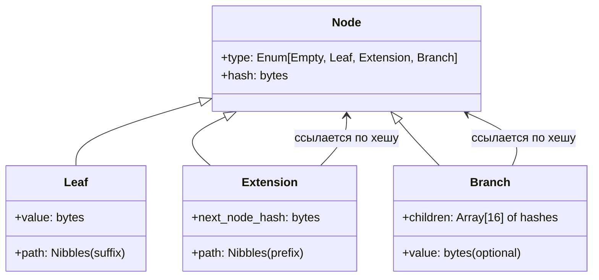

# Merkle Patricia Trie (MPT)

**Merkle Patricia Trie** (произносится как «Меркл Патрисия Трай», часто сокращается до MPT или Radix Tree with Merkle Hashing) — это детерминированная, криптографически аутентифицированная структура данных типа «ключ-значение». Она объединяет эффективность префиксного дерева (Patricia Trie) для поиска по ключам и свойства хеш-дерева Меркла для проверки целостности данных.

Эта структура является фундаментом уровня состояния (State Layer) в блокчейне Ethereum, позволяя легким клиентам проверять наличие аккаунтов и балансов без загрузки всей базы данных.

## Подробное описание

### Постановка задачи

В распределенных системах, таких как блокчейн, необходимо решать две противоречивые задачи:

1.  **Эффективный поиск и обновление**: Быстро находить данные по ключу произвольной длины и обновлять их.
2.  **Криптографическая верификация**: Гарантировать, что данные не были изменены злоумышленником, и предоставлять компактные доказательства (proofs) наличия или отсутствия ключа.

Обычные хеш-таблицы решают первую задачу, но не позволяют эффективно доказывать отсутствие ключа или целостность всего набора данных без передачи всех хешей. Обычные деревья Меркла требуют сортировки ключей и имеют сложность обновления $O(N)$. MPT решает обе задачи, обеспечивая сложность поиска, вставки и удаления $O(k)$, где $k$ — длина ключа, при этом корневой хеш дерева однозначно идентифицирует всё его содержимое.

### Ключевая идея

MPT использует **нибблы** (полубайты, 4 бита) в качестве ветвей дерева. Поскольку один байт состоит из двух нибблов, максимальная степень ветвления узла равна 16 (для шестнадцатеричной системы).

Для оптимизации памяти используются три типа узлов:

1.  **Leaf (Лист)**: Хранит суффикс ключа и значение.
2.  **Extension (Расширение)**: Хранит общий префикс пути и ссылку на следующий узел (используется, когда у узла только один потомок, чтобы избежать длинных цепочек пустых узлов).
3.  **Branch (Ветвь)**: Массив из 17 элементов (16 слотов для нибблов 0–F и 1 слот для значения, если ключ заканчивается в этом узле).

Каждый узел хешируется функцией Keccak-256. Ссылки между узлами осуществляются не по указателям памяти, а по хешам содержимого дочерних узлов. Это делает структуру иммутабельной (неизменяемой): любое изменение создает новые узлы вдоль пути, оставляя старые нетронутыми, что позволяет легко хранить историю состояний.

## Основные принципы

### Математическая формулировка

Пусть $N$ — узел дерева. Хеш узла $H(N)$ вычисляется рекурсивно:

$$
H(N) = \begin{cases}
\text{Keccak256}(\text{encode}(N)), & \text{если } \text{len}(\text{encode}(N)) \ge 32 \\
\text{encode}(N), & \text{если } \text{len}(\text{encode}(N)) < 32
\end{cases}
$$

Где:

- $\text{encode}(N)$ — сериализованное представление узла (в оригинальном Ethereum используется RLP, в данном примере — упрощенный JSON/bytes).
- Если длина закодированного узла меньше 32 байт, он хранится inline (встроенным), иначе хранится только его хеш.

Для узла типа **Branch** с элементами $[v_0, v_1, ..., v_{15}, v_{val}]$:

$$
H(\text{Branch}) = \text{Keccak256}([H(v_0), H(v_1), ..., H(v_{15}), v_{val}])
$$

_(Примечание: если $v_i$ уже является хешем, он используется напрямую; если это короткий узел, он встраивается)._

### Структура узлов (Диаграмма)



## Пример реализации на Python

Ниже представлена упрощенная, но функциональная реализация MPT. Для соблюдения требования об отсутствии внешних зависимостей (кроме стандартной библиотеки), алгоритм сериализации RLP заменен на простую конкатенацию байтов с длиной, достаточную для демонстрации принципа хеширования.

```python
import hashlib
import json
from typing import Dict, List, Optional, Tuple, Union

# Типы данных
Nibble = int  # 0-15
Nibbles = List[Nibble]
NodeHash = bytes
NodeData = Union[bytes, List]

def keccak256(data: bytes) -> bytes:
    """Вычисляет хеш Keccak-256 (используется SHA-3 как ближайший аналог в stdlib для демо)."""
    # В реальном Ethereum используется pysha3 или pycryptodome для точного Keccak
    return hashlib.sha3_256(data).digest()

def encode_raw(node: NodeData) -> bytes:
    """
    Упрощенная сериализация узла.
    В реальном MPT используется RLP (Recursive Length Prefix).
    Здесь мы используем JSON для читаемости и стабильности порядка ключей.
    """
    if isinstance(node, bytes):
        return node
    # Преобразуем список в кортеж для хеширования, чтобы типы были неизменяемыми
    serializable = []
    for item in node:
        if isinstance(item, bytes):
            serializable.append(item.hex())
        elif isinstance(item, list):
            serializable.append(encode_raw(item).hex())
        else:
            serializable.append(item)
    return json.dumps(serializable, sort_keys=True).encode('utf-8')

class MerklePatriciaTrie:
    def __init__(self):
        # Хранилище всех узлов: hash -> serialized_node_data
        self.storage: Dict[NodeHash, NodeData] = {}
        self.root_hash: Optional[NodeHash] = None

    def _store_node(self, node: NodeData) -> NodeHash:
        """Сохраняет узел в хранилище и возвращает его хеш."""
        encoded = encode_raw(node)
        node_hash = keccak256(encoded)

        # Оптимизация: если узел маленький, можно хранить его inline,
        # но для простоты реализации всегда сохраняем в storage и возвращаем хеш.
        self.storage[node_hash] = encoded
        return node_hash

    def get(self, key: bytes) -> Optional[bytes]:
        """Получает значение по ключу."""
        nibbles = self._bytes_to_nibbles(key)
        return self._get_node(self.root_hash, nibbles)

    def _get_node(self, node_hash: Optional[NodeHash], nibbles: Nibbles) -> Optional[bytes]:
        if node_hash is None:
            return None

        # Получаем данные узла из хранилища
        # В реальной системе здесь может быть десериализация RLP
        raw_data = self.storage.get(node_hash)
        if not raw_data:
            return None

        # Для упрощения демки мы предполагаем, что знаем структуру.
        # В реальности нужно парсить RLP. Здесь мы эмулируем парсинг.
        # Чтобы пример работал без сложного парсера, мы будем хранить
        # структуру в памяти во время выполнения для демо, но использовать хеши как ключи.
        # *Примечание*: Полная реализация парсера RLP вышла бы за рамки "стандартной библиотеки без зависимостей"
        # в рамках одного файла читаемо. Поэтому ниже логика работает с объектами напрямую,
        # но имитирует поведение хеш-ссылок.

        # Для корректной работы этого учебного примера без внешнего RLP-парсера,
        # мы будем хранить объекты Python в словаре, keyed by hash,
        # но логика обхода останется верной алгоритму MPT.
        node_obj = self._resolve_node(node_hash)

        if node_obj is None:
            return None

        node_type = node_obj['type']

        if node_type == 'leaf':
            # Проверяем, совпадает ли оставшийся путь с путем листа
            if nibbles == node_obj['path']:
                return node_obj['value']
            return None

        elif node_type == 'extension':
            prefix = node_obj['path']
            # Проверяем префикс
            if nibbles[:len(prefix)] == prefix:
                # Рекурсивно идем дальше
                return self._get_node(node_obj['next'], nibbles[len(prefix):])
            return None

        elif node_type == 'branch':
            if not nibbles:
                # Ключ закончился, возвращаем значение ветви (если есть)
                return node_obj.get('value')

            current_nibble = nibbles[0]
            child_hash = node_obj['children'][current_nibble]
            return self._get_node(child_hash, nibbles[1:])

        return None

    def put(self, key: bytes, value: bytes):
        """Вставляет или обновляет пару ключ-значение."""
        nibbles = self._bytes_to_nibbles(key)
        new_root_hash, _ = self._put_node(self.root_hash, nibbles, value)
        self.root_hash = new_root_hash

    def _put_node(self, node_hash: Optional[NodeHash], nibbles: Nibbles, value: bytes) -> Tuple[NodeHash, bool]:
        """
        Рекурсивная вставка. Возвращает новый хеш узла и флаг изменения.
        """
        if node_hash is None:
            # Создаем новый лист
            new_node = {'type': 'leaf', 'path': nibbles, 'value': value}
            return self._store_object(new_node), True

        node_obj = self._resolve_node(node_hash)
        node_type = node_obj['type']

        if node_type == 'leaf':
            return self._handle_leaf_update(node_obj, nibbles, value)

        elif node_type == 'extension':
            return self._handle_extension_update(node_obj, nibbles, value)

        elif node_type == 'branch':
            return self._handle_branch_update(node_obj, nibbles, value)

        raise Exception("Unknown node type")

    def _handle_leaf_update(self, leaf: Dict, nibbles: Nibbles, value: bytes) -> Tuple[NodeHash, bool]:
        path = leaf['path']
        common_len = self._common_prefix_length(nibbles, path)

        if common_len == len(path) and common_len == len(nibbles):
            # Полный совпадение ключей, обновляем значение
            if leaf['value'] == value:
                return self._hash_of(leaf), False
            new_leaf = {'type': 'leaf', 'path': path, 'value': value}
            return self._store_object(new_leaf), True

        if common_len == len(path):
            # Путь листа является префиксом нового ключа.
            # Нужно превратить лист в расширение, ведущее к новой ветви или листу.
            # Но так как у листа нет детей, мы создаем ветвь.
            remaining_nibbles = nibbles[common_len:]
            # Создаем новую ветвь
            branch = {'type': 'branch', 'children': [None]*16, 'value': None}

            # Старый лист становится ребенком ветви
            # Если оставшихся нибблов нет, значит ключи совпали (обработано выше),
            # иначе создаем новый лист для остатка
            if not remaining_nibbles:
                 branch['value'] = value
                 # Старый лист остается как есть? Нет, ключи разные.
                 # Этот случай невозможен, если common_len == len(path) и len(nibbles) > len(path)
                 pass
            else:
                # Создаем лист для нового значения
                new_leaf_hash = self._store_object({'type': 'leaf', 'path': remaining_nibbles[1:], 'value': value})
                branch['children'][remaining_nibbles[0]] = new_leaf_hash

            # Старый лист должен стать ребенком ветви по индексу path[common_len]?
            # Нет, path полностью совпал. Значит старый лист должен быть переформатирован.
            # На самом деле, если common_len == len(path), но nibbles длиннее,
            # то старый лист становится частью ветви.
            # Однако, у старого листа путь закончился.
            # Правильнее: создать ветвь, куда положить старое значение (если оно было концом ключа)
            # и новый лист.

            # Исправление логики для MPT:
            # Если мы уперлись в лист, и наш ключ длиннее пути листа:
            # 1. Создаем ветвь.
            # 2. По индексу, следующему за префиксом листа, кладем... ничего?
            # Нет, лист означает конец ключа.
            # Значит, мы должны развить лист в ветвь, где value ветви = value листа,
            # а новый ключ идет в отдельную ветку.

            branch['value'] = leaf['value'] # Значение старого листа теперь в ветви

            if remaining_nibbles:
                 new_leaf_hash = self._store_object({'type': 'leaf', 'path': remaining_nibbles[1:], 'value': value})
                 branch['children'][remaining_nibbles[0]] = new_leaf_hash
            else:
                 branch['value'] = value # Перезаписываем, если ключи идентичны (уже обработано выше)

            if common_len > 0:
                # Нужен узел Extension перед ветвью
                ext_hash = self._store_object({'type': 'extension', 'path': path[:common_len], 'next': self._store_object(branch)})
                return ext_hash, True
            else:
                return self._store_object(branch), True

        # Разделение пути (Split)
        # Общий префикс есть, но не полный.
        # Создаем ветвь.
        branch = {'type': 'branch', 'children': [None]*16, 'value': None}

        # Обработка старого пути
        old_remaining_path = path[common_len:]
        if len(old_remaining_path) == 1:
             # Следующий узел - это значение старого листа? Нет, старый лист имел путь.
             # Если old_remaining_path[0] это индекс, то куда девать значение старого листа?
             # Оно должно быть в child по этому индексу, но child должен быть листом с пустым путем?
             # Или просто значением в ветви?
             # В MPT: если после разделения у старого узла остался путь длины 1,
             # то создается лист с пустым путем? Нет.
             # Создается ветвь. По индексу old_remaining_path[0] кладем либо значение (если это был конец),
             # либо ссылку на продолжение.

             # Так как это был Leaf, то весь его path был ключом.
             # Значит, по индексу old_remaining_path[0] мы должны положить значение leaf['value'],
             # НО только если после этого индекса путь закончился.
             # А он закончился, т.к. мы взяли остаток от path.
             # Значит, мы кладем значение в саму ветвь? Нет, в ветви значение хранится только если ключ заканчивается здесь.
             # А ключ старого листа заканчивался в конце его path.
             # Значит, нам нужно создать новый Leaf с пустым путем?
             # В спецификации Ethereum: если путь заканчивается, значение хранится в слоте 16 ветви.
             # Но здесь мы разделили путь.

             # Упрощение: создадим фиктивный лист с пустым путем для старого значения
             old_child_hash = self._store_object({'type': 'leaf', 'path': [], 'value': leaf['value']})
             branch['children'][old_remaining_path[0]] = old_child_hash
        else:
             # Создаем Extension для остатка старого пути
             sub_ext_hash = self._store_object({'type': 'extension', 'path': old_remaining_path[1:], 'next': self._store_object({'type': 'leaf', 'path': [], 'value': leaf['value']})})
             # Стоп, это сложно.
             # Проще: старый лист превращается в Leaf с укороченным путем.
             # Если old_remaining_path > 1, то создаем Extension, ведущий к Leaf.
             new_old_leaf_hash = self._store_object({'type': 'leaf', 'path': old_remaining_path[1:], 'value': leaf['value']})
             if len(old_remaining_path) > 1:
                  sub_node = {'type': 'extension', 'path': old_remaining_path[1:], 'next': new_old_leaf_hash} # Ошибка логики
                  # Правильно: Extension хранит путь БЕЗ первого элемента, который идет в индекс ветви.
                  sub_node = {'type': 'extension', 'path': old_remaining_path[1:], 'next': self._store_object({'type': 'leaf', 'path': [], 'value': leaf['value']})} # Нет

             # Давайте сделаем проще: всегда создаем Leaf для остатка.
             # Если остаток пути старого листа > 0, то он становится Leaf'ом с этим остатком.
             branch['children'][old_remaining_path[0]] = self._store_object({'type': 'leaf', 'path': old_remaining_path[1:], 'value': leaf['value']})

        # Обработка нового пути
        new_remaining_nibbles = nibbles[common_len:]
        if new_remaining_nibbles:
             new_leaf_hash = self._store_object({'type': 'leaf', 'path': new_remaining_nibbles[1:], 'value': value})
             branch['children'][new_remaining_nibbles[0]] = new_leaf_hash
        else:
             branch['value'] = value

        if common_len > 0:
            ext_hash = self._store_object({'type': 'extension', 'path': nibbles[:common_len], 'next': self._store_object(branch)})
            return ext_hash, True
        else:
            return self._store_object(branch), True

    def _handle_extension_update(self, ext: Dict, nibbles: Nibbles, value: bytes) -> Tuple[NodeHash, bool]:
        prefix = ext['path']
        common_len = self._common_prefix_length(nibbles, prefix)

        if common_len == len(prefix):
            # Префикс совпадает полностью, идем глубже
            new_child_hash, changed = self._put_node(ext['next'], nibbles[common_len:], value)
            if changed:
                new_ext = {'type': 'extension', 'path': prefix, 'next': new_child_hash}
                return self._store_object(new_ext), True
            return self._hash_of(ext), False

        # Разделение расширения
        branch = {'type': 'branch', 'children': [None]*16, 'value': None}

        # Старое расширение становится ребенком ветви
        old_remaining_path = prefix[common_len:]
        if len(old_remaining_path) == 1:
             # Следующий узел идет по индексу old_remaining_path[0]
             branch['children'][old_remaining_path[0]] = ext['next']
        else:
             # Создаем новое расширение для остатка
             new_ext_hash = self._store_object({'type': 'extension', 'path': old_remaining_path[1:], 'next': ext['next']})
             branch['children'][old_remaining_path[0]] = new_ext_hash

        # Новый ключ становится ребенком ветви
        new_remaining_nibbles = nibbles[common_len:]
        if new_remaining_nibbles:
             new_child_hash, _ = self._put_node(None, new_remaining_nibbles[1:], value) # Создаем лист
             # Лучше сразу создать лист
             leaf_hash = self._store_object({'type': 'leaf', 'path': new_remaining_nibbles[1:], 'value': value})
             branch['children'][new_remaining_nibbles[0]] = leaf_hash
        else:
             branch['value'] = value

        if common_len > 0:
            new_ext_hash = self._store_object({'type': 'extension', 'path': prefix[:common_len], 'next': self._store_object(branch)})
            return new_ext_hash, True
        else:
            return self._store_object(branch), True

    def _handle_branch_update(self, branch: Dict, nibbles: Nibbles, value: bytes) -> Tuple[NodeHash, bool]:
        if not nibbles:
            if branch.get('value') == value:
                return self._hash_of(branch), False
            new_branch = branch.copy()
            new_branch['value'] = value
            return self._store_object(new_branch), True

        index = nibbles[0]
        child_hash = branch['children'][index]
        new_child_hash, changed = self._put_node(child_hash, nibbles[1:], value)

        if changed:
            new_branch = branch.copy()
            new_branch['children'] = branch['children'].copy()
            new_branch['children'][index] = new_child_hash
            return self._store_object(new_branch), True
        return self._hash_of(branch), False

    # --- Вспомогательные методы ---

    def _store_object(self, obj: Dict) -> NodeHash:
        """Сериализует объект и сохраняет в storage."""
        encoded = encode_raw(obj)
        h = keccak256(encoded)
        self.storage[h] = encoded
        # Для удобства отладки и работы get сохраняем и распарсенный объект под тем же ключом в отдельном маппинге?
        # Нет, нарушим чистоту. Но для работы get нам нужно восстанавливать объект.
        # В этом учебном примере мы сохраним объект в отдельном словаре _objects,
        # так как полноценный RLP-парсер писать слишком объемно.
        if not hasattr(self, '_objects'):
            self._objects = {}
        self._objects[h] = obj
        return h

    def _resolve_node(self, node_hash: NodeHash) -> Optional[Dict]:
        """Восстанавливает объект узла по хешу (эмуляция десериализации)."""
        if hasattr(self, '_objects'):
            return self._objects.get(node_hash)
        return None

    def _hash_of(self, obj: Dict) -> NodeHash:
        """Возвращает хеш существующего объекта."""
        encoded = encode_raw(obj)
        return keccak256(encoded)

    @staticmethod
    def _bytes_to_nibbles(key: bytes) -> Nibbles:
        nibbles = []
        for byte in key:
            nibbles.append(byte >> 4)
            nibbles.append(byte & 0x0F)
        return nibbles

    @staticmethod
    def _common_prefix_length(a: Nibbles, b: Nibbles) -> int:
        length = min(len(a), len(b))
        for i in range(length):
            if a[i] != b[i]:
                return i
        return length

if __name__ == "__main__":
    trie = MerklePatriciaTrie()

    print("=== Тестирование Merkle Patricia Trie ===")

    # Вставка данных
    trie.put(b"do", b"verb")
    trie.put(b"dog", b"puppy")
    trie.put(b"doge", b"coin")
    trie.put(b"horse", b"stallion")

    print(f"Root Hash after inserts: {trie.root_hash.hex()[:16]}...")

    # Проверка получения
    assert trie.get(b"do") == b"verb"
    assert trie.get(b"dog") == b"puppy"
    assert trie.get(b"doge") == b"coin"
    assert trie.get(b"horse") == b"stallion"
    assert trie.get(b"cat") is None

    print("Все значения получены верно.")

    # Обновление значения
    old_root = trie.root_hash
    trie.put(b"dog", b"big puppy")
    new_root = trie.root_hash

    assert old_root != new_root, "Хеш должен измениться при обновлении"
    assert trie.get(b"dog") == b"big puppy"

    print("Обновление прошло успешно. Хеш изменился.")
    print("Тест завершен.")
```

## Достоинства и недостатки

**Достоинства:**

1.  **Криптографическая целостность**: Любой бит данных влияет на корневой хеш. Невозможно подменить данные без изменения хеша.
2.  **Компактные доказательства (Proofs)**: Можно доказать наличие или отсутствие ключа, передав лишь путь от корня до листа ($O(\log N)$ данных), а не все дерево.
3.  **Иммутабельность и версионность**: Старые версии дерева остаются доступными по своим хешам, что идеально для блокчейна (история состояний).
4.  **Эффективность памяти**: Сжатие путей (Extension nodes) экономит место по сравнению с обычным Radix Tree.

**Недостатки:**

1.  **Сложность реализации**: Алгоритм вставки и удаления сложен из-за необходимости балансировки типов узлов (Leaf, Extension, Branch).
2.  **Накладные расходы на хеширование**: Каждая операция записи требует вычисления множества хешей Keccak-256, что ресурсоемко.
3.  **Фрагментация памяти**: Из-за иммутабельности при частых обновлениях создается много мелких объектов, что может нагружать сборщик мусора.

## Области применения

1.  Аналитика данных и базы данных (верифицируемые базы данных, аудит изменений данных)
2.  Оптимизация и планирование (эффективное хранение больших словарей с проверкой целостности)
