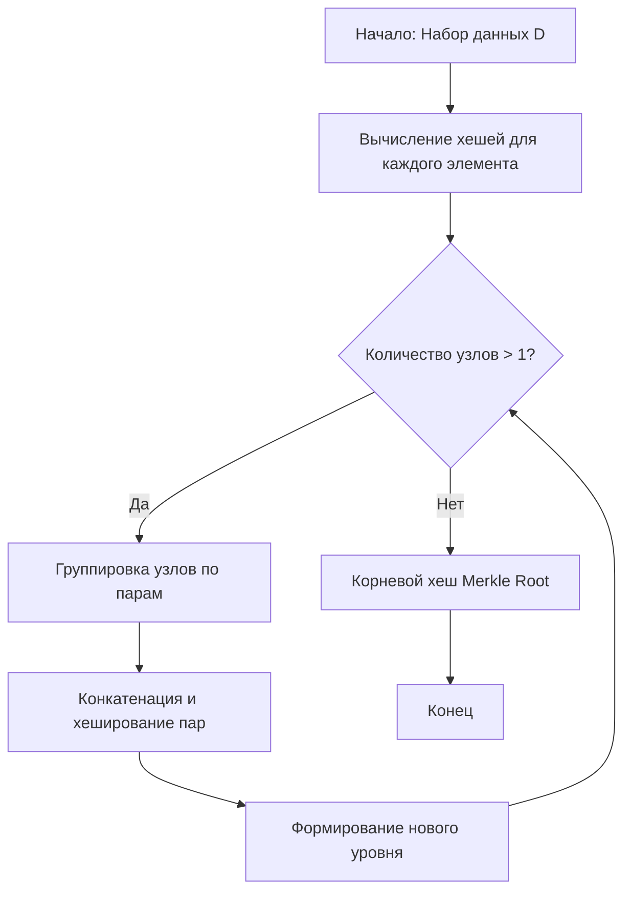

# Дерево Меркла (Merkle Tree)

Дерево Меркла (произносится как «Мёркл») — это древовидная структура данных, в которой каждый листовой узел содержит хеш блока данных, а каждый нелистовой узел — хеш своих дочерних узлов.

Эта структура позволяет эффективно и безопасно проверять целостность содержимого больших наборов данных, не требуя загрузки всего массива информации.

## Подробное описание

Дерево Меркла решает задачу верификации данных в распределённых системах, где участники не доверяют друг другу полностью или канал связи ограничен по пропускной способности. Вместо сравнения всех байтов файла или базы данных, стороны сравнивают только один короткий хеш — корень дерева (Merkle Root).

**Ключевая идея:** Если изменить хотя бы один бит исходных данных, изменится хеш соответствующего листа, что повлечёт изменение хешей всех родительских узлов вплоть до корня. Таким образом, расхождение в корневом хеше гарантирует наличие изменений в данных.

Исторически концепция была предложена Ральфом Мерклом в 1979 году в его диссертации и стала фундаментальной для технологий блокчейн (Bitcoin, Ethereum) и систем контроля версий (Git).

## Основные принципы

### Математическая формулировка

Пусть $D = \{d_1, d_2, ..., d_n\}$ — набор блоков данных.
Хеш-функция $H$ (например, SHA-256) обладает свойством лавинного эффекта.

Строительство дерева происходит снизу вверх:

1.  Листовые узлы $L_i$ вычисляются как:

    $$
    L_i = H(d_i)
    $$

2.  Внутренние узлы $N_{parent}$ вычисляются как хеш от конкатенации хешей дочерних узлов:

    $$
    N_{parent} = H(N_{left} || N_{right})
    $$

    Где $||$ обозначает операцию конкатенации строк.

3.  Корень дерева $Root$:
    $$
    Root = H(N_{level\_k\_left} || N_{level\_k\_right})
    $$

Если количество листьев нечётное, последний элемент обычно дублируется для сохранения бинарной структуры.

### Блок-схема построения



## Пример реализации на Python

Ниже представлена реализация дерева Меркла с использованием стандартной библиотеки `hashlib`.

```python
import hashlib
from typing import List, Optional

class MerkleTree:
    def __init__(self, data: List[str]):
        """
        Инициализирует дерево Меркла списком строковых данных.
        """
        if not data:
            raise ValueError("Data list cannot be empty")
        self.data = data
        self.tree: List[List[str]] = []
        self._build_tree()

    def _hash(self, value: str) -> str:
        """
        Вычисляет SHA-256 хеш от строки.
        """
        return hashlib.sha256(value.encode('utf-8')).hexdigest()

    def _build_tree(self):
        """
        Строит дерево от листьев к корню.
        """
        # Уровень 0: хеши исходных данных
        current_level = [self._hash(item) for item in self.data]
        self.tree.append(current_level)

        while len(current_level) > 1:
            next_level = []
            # Проходим по парам элементов
            for i in range(0, len(current_level), 2):
                left = current_level[i]
                # Если элемент нечётный, дублируем последний хеш
                right = current_level[i + 1] if (i + 1) < len(current_level) else left

                combined_hash = self._hash(left + right)
                next_level.append(combined_hash)

            self.tree.append(next_level)
            current_level = next_level

    def get_root(self) -> Optional[str]:
        """
        Возвращает корневой хеш дерева.
        """
        if not self.tree:
            return None
        return self.tree[-1][0]

    def get_merkle_path(self, index: int) -> List[str]:
        """
        Возвращает путь Меркла (список соседних хешей) для элемента с заданным индексом.
        Необходим для проверки принадлежности элемента дереву без знания всего дерева.
        """
        path = []
        current_index = index

        # Проходим по всем уровням, кроме последнего (корня)
        for level in self.tree[:-1]:
            # Определяем индекс соседа
            if current_index % 2 == 0:
                sibling_index = current_index + 1
            else:
                sibling_index = current_index - 1

            # Если сосед существует, добавляем его хеш в путь
            if sibling_index < len(level):
                path.append(level[sibling_index])
            else:
                # Если соседа нет (нечётное количество), считаем, что он равен текущему
                path.append(level[current_index])

            # Переходим к индексу родителя на следующем уровне
            current_index //= 2

        return path

if __name__ == "__main__":
    # Пример использования
    transactions = ["Tx1: Alice->Bob 10BTC", "Tx2: Bob->Charlie 5BTC", "Tx3: Charlie->Dave 2BTC"]

    merkle_tree = MerkleTree(transactions)

    print("Уровни дерева:")
    for i, level in enumerate(merkle_tree.tree):
        print(f"Level {i}: {level}")

    print(f"\nMerkle Root: {merkle_tree.get_root()}")

    # Проверка пути для первой транзакции
    path = merkle_tree.get_merkle_path(0)
    print(f"Merkle Path for Tx1: {path}")
```

## Достоинства и недостатки

**Достоинства:**

1. **Эффективность проверки:** Для подтверждения наличия элемента в наборе из $N$ элементов требуется передать всего $\log_2 N$ хешей (путь Меркла), а не весь набор данных.
2. **Целостность данных:** Любое изменение данных приводит к изменению корневого хеша, что легко детектируется.
3. **Масштабируемость:** Позволяет работать с огромными объёмами данных, храня только корневой хеш для верификации.

**Недостатки:**

1. **Вычислительные затраты:** Построение дерева требует вычисления множества хешей, что может быть ресурсоёмко при частых обновлениях данных.
2. **Сложность обновления:** При изменении одного листа необходимо пересчитать хеши всех родительских узлов до корня.
3. **Требования к памяти:** Необходимо хранить промежуточные узлы дерева или уметь их быстро восстанавливать.

## Области применения

1. Аналитика данных и базы данных (проверка целостности реплик баз данных, аудит изменений в таблицах)
2. Паттерны проектирования (реализация структур данных для безопасного хранения и передачи информации в распределённых системах)
