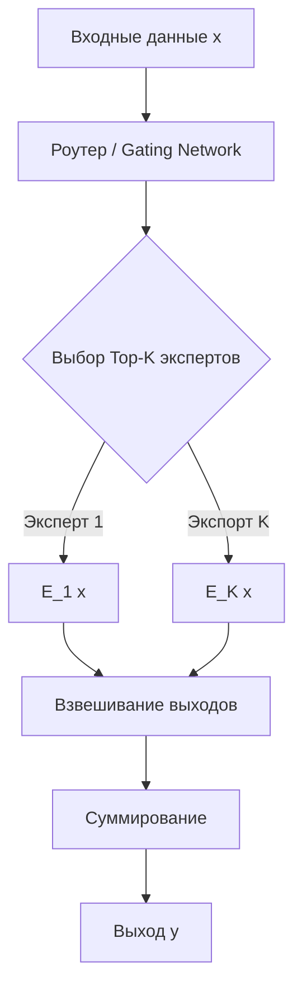

# Mixture of Experts (MoE)

Mixture of Experts (MoE, произносится как «микчер оф экспертс») — это архитектура машинного обучения, которая разделяет модель на несколько независимых подсетей («экспертов») и использует обучаемый механизм маршрутизации («роутер») для выбора наиболее подходящих экспертов для обработки каждого конкретного входного примера.

## Подробное описание

Традиционные плотные (dense) нейронные сети обрабатывают каждый входной сигнал, активируя все свои параметры. Это создает вычислительный瓶颈 при масштабировании моделей до миллиардов параметров. MoE решает эту проблему через принцип разреженности (sparsity): вместо одного гигантского универсального блока используется ансамбль специализированных блоков.

**Постановка задачи:** Необходимо обработать входные данные $x$ с максимальной эффективностью, используя лишь часть доступных вычислительных ресурсов, но сохраняя емкость модели, эквивалентную полной сети.

**Ключевая идея:** Разделить вычислительную нагрузку между $N$ экспертами, но для каждого токена или примера активировать только $K$ лучших из них (где $K \ll N$). Это позволяет увеличивать общее количество параметров модели (емкость знаний), не увеличивая пропорционально время инференса (forward pass).

Исторически концепция была предложена еще в 1991 году Джейкобсом и др., но широкое применение получила лишь с развитием трансформеров и появлением таких моделей, как Switch Transformer, GShard и Mixtral от Mistral AI.

## Основные принципы

### Математическая формулировка

Выходной сигнал слоя MoE $y$ для входного вектора $x$ вычисляется как взвешенная сумма выходов выбранных экспертов:

$$
y = \sum_{i=1}^{K} w_i(x) \cdot E_i(x)
$$

Где:

- $E_i(x)$ — выход $i$-го эксперта (обычно это Feed-Forward Network) для входа $x$.
- $w_i(x)$ — вес, назначенный $i$-му эксперту роутером.
- $K$ — количество активно используемых экспертов (top-k).

Роутер вычисляет вероятности выбора экспертов с помощью функции softmax:

$$
G(x)_i = \frac{e^{h(x)_i}}{\sum_{j=1}^{N} e^{h(x)_j}}
$$

Где $h(x)$ — логиты, полученные через линейный слой роутера. Выбираются индексы $K$ наибольших значений $G(x)$.

### Блок-схема работы



## Пример реализации на Python

Ниже представлена упрощенная реализация слоя MoE с использованием библиотеки PyTorch. Реализация включает механизм балансировки нагрузки (Auxiliary Loss), критически важный для предотвращения коллапса модели на нескольких экспертах.

```python
import torch
import torch.nn as nn
import torch.nn.functional as F

class Expert(nn.Module):
    """
    Один эксперт представляет собой простую полносвязную сеть (FFN).
    В реальных трансформерах это обычно двухслойный MLP с активацией.
    """
    def __init__(self, input_size, hidden_size, output_size):
        super().__init__()
        self.fc1 = nn.Linear(input_size, hidden_size)
        self.fc2 = nn.Linear(hidden_size, output_size)
        self.relu = nn.ReLU()

    def forward(self, x):
        # Прямой проход через эксперта
        out = self.fc1(x)
        out = self.relu(out)
        out = self.fc2(out)
        return out

class MoELayer(nn.Module):
    """
    Слой Mixture of Experts с поддержкой Top-K routing и Auxiliary Loss.
    """
    def __init__(self, input_size, hidden_size, output_size, num_experts=8, top_k=2):
        super().__init__()
        self.num_experts = num_experts
        self.top_k = top_k

        # Создаем пул экспертов
        self.experts = nn.ModuleList([
            Expert(input_size, hidden_size, output_size)
            for _ in range(num_experts)
        ])

        # Роутер: линейный слой, определяющий важность каждого эксперта
        self.router = nn.Linear(input_size, num_experts)

        # Переменная для хранения auxiliary loss (балансировка нагрузки)
        self.aux_loss = 0.0

    def forward(self, x):
        """
        Args:
            x: Тензор формы [batch_size, seq_len, input_size] или [batch_size, input_size]
        Returns:
            output: Взвешенная сумма выходов экспертов
        """
        # Сохраняем исходную форму для восстановления
        original_shape = x.shape
        if x.dim() == 3:
            batch_size, seq_len, _ = x.shape
            x_flat = x.view(-1, x.shape[-1]) # [batch * seq, input_size]
        else:
            batch_size = x.shape[0]
            seq_len = 1
            x_flat = x

        total_tokens = x_flat.shape[0]

        # 1. Вычисляем logits роутера
        router_logits = self.router(x_flat) # [total_tokens, num_experts]

        # 2. Получаем вероятности (gates)
        router_probs = F.softmax(router_logits, dim=-1)

        # 3. Выбираем Top-K экспертов и их веса
        top_k_weights, top_k_indices = torch.topk(router_probs, self.top_k, dim=-1)

        # Нормализуем веса выбранных экспертов, чтобы их сумма была равна 1
        top_k_weights = top_k_weights / top_k_weights.sum(dim=-1, keepdim=True)

        # 4. Инициализируем выходной тензор нулями
        final_output = torch.zeros_like(x_flat)

        # 5. Dispatching: распределяем данные по экспертам
        # Для каждого из top_k позиций
        for k in range(self.top_k):
            # Получаем индексы экспертов для k-й позиции
            expert_indices_for_k = top_k_indices[:, k] # [total_tokens]

            # Для каждого уникального эксперта собираем батч
            unique_experts = torch.unique(expert_indices_for_k)

            for expert_id in unique_experts:
                # Находим маски токенов, которые должны идти к этому эксперту на k-м шаге
                mask = (expert_indices_for_k == expert_id)
                if not mask.any():
                    continue

                # Извлекаем соответствующие входные данные
                expert_input = x_flat[mask]

                # Пропускаем через конкретного эксперта
                expert_output = self.experts[expert_id](expert_input)

                # Получаем веса для этих токенов
                weights = top_k_weights[mask, k].unsqueeze(1)

                # Добавляем взвешенный вклад в итоговый результат
                final_output[mask] += expert_output * weights

        # 6. Вычисляем Auxiliary Loss для балансировки нагрузки
        self._compute_aux_loss(router_probs, top_k_indices)

        # Восстанавливаем исходную размерность
        if len(original_shape) == 3:
            final_output = final_output.view(original_shape)

        return final_output

    def _compute_aux_loss(self, router_probs, top_k_indices):
        """
        Вычисляет вспомогательную потерю для обеспечения равномерного использования экспертов.
        Без этого роутер может 'сломаться' и использовать только 1-2 эксперта.
        """
        # Подсчет загрузки: сколько раз каждый эксперт был выбран в Top-K
        # one_hot преобразует индексы в матрицу [tokens, num_experts]
        one_hot = F.one_hot(top_k_indices, num_classes=self.num_experts).float() # [tokens, top_k, num_experts]

        # Суммируем по оси top_k, получаем [tokens, num_experts]
        gates_per_token = one_hot.sum(dim=1)

        # Средняя загрузка каждого эксперта по всему батчу
        load = gates_per_token.mean(dim=0) # [num_experts]

        # Средняя вероятность, которую роутер назначает каждому эксперту
        prob_mean = router_probs.mean(dim=0) # [num_experts]

        # Auxiliary loss = коэффициент * сумма(load * prob_mean)
        # Минимизация этого произведения заставляет распределение нагрузки совпадать с распределением вероятностей
        aux_loss = torch.sum(load * prob_mean)

        # Сохраняем loss с небольшим коэффициентом, чтобы не доминировать над основной задачей
        self.aux_loss = 0.01 * aux_loss

if __name__ == "__main__":
    # Параметры
    input_size = 512
    hidden_size = 1024
    output_size = 512
    num_experts = 8
    top_k = 2
    batch_size = 4
    seq_len = 10

    # Создание модели
    moe_layer = MoELayer(input_size, hidden_size, output_size, num_experts, top_k)

    # Генерация случайных входных данных (имитация эмбеддингов трансформера)
    x = torch.randn(batch_size, seq_len, input_size)

    # Forward pass
    output = moe_layer(x)

    print(f"Input shape: {x.shape}")
    print(f"Output shape: {output.shape}")
    print(f"Auxiliary Loss (Load Balancing): {moe_layer.aux_loss.item():.4f}")

    # Проверка: если aux_loss близка к 0, нагрузка распределена относительно равномерно
```

## Достоинства и недостатки

**Достоинства:**

1. **Эффективность вычислений.** Позволяет создавать модели с триллионами параметров, активируя лишь малую их часть (например, 10-20%) для каждого токена.
2. **Специализация.** Эксперты могут неявно обучаться обработке определенных типов данных (например, один эксперт лучше справляется с кодом, другой — с художественной литературой).
3. **Масштабируемость.** Увеличение количества экспертов линейно увеличивает емкость модели без квадратичного роста затрат на инференс.

**Недостатки:**

1. **Сложность обучения.** Требует тщательной настройки гиперпараметров и механизмов балансировки нагрузки, иначе возникает проблема «мертвых экспертов».
2. **Проблемы с памятью.** Хотя вычисления дешевы, все эксперты должны храниться в памяти GPU/TPU, что требует значительных ресурсов VRAM.
3. **Нестабильность градиентов.** Разреженная активация может приводить к шумным градиентам и сложностям со сходимостью на ранних этапах обучения.

## Области применения

1. Машинное обучение и рекомендательные системы (создание больших языковых моделей, таких как Mixtral, GShard, Switch Transformer).
2. Обработка естественного языка (машинный перевод, суммаризация текстов, где разные лингвистические конструкции требуют разных «экспертов»).
