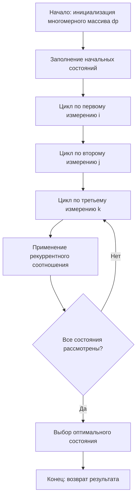

# Многомерное динамическое программирование

Многомерное динамическое программирование (Multidimensional Dynamic Programming) — это метод оптимизации, который расширяет классическое динамическое программирование на задачи с несколькими независимыми или слабозависимыми переменными состояния, позволяя эффективно решать задачи высокой размерности путём декомпозиции и использования многомерных таблиц состояний.

## Подробное описание

**Постановка задачи:** Многомерное динамическое программирование применяется в задачах, где состояние системы описывается не одним, а несколькими параметрами (измерениями). Классический пример — задача о рюкзаке с несколькими ограничениями, где нужно учитывать не только вес, но и объём, стоимость или другие характеристики предметов.

**Входные данные:**

- Множество объектов с векторами характеристик
- Ограничения по каждому измерению
- Целевая функция (обычно максимизация или минимизация)

**Выходные данные:**

- Оптимальное значение целевой функции
- Набор выбранных объектов (опционально)

**Ключевая идея:** Идея заключается в представлении задачи в виде многомерной таблицы, где каждое измерение соответствует одному параметру состояния. Переход между состояниями осуществляется путём перебора всех возможных комбинаций параметров, что позволяет учесть все ограничения одновременно. Для снижения вычислительной сложности часто применяются методы декомпозиции, такие как метод множителей Лагранжа или приближённые алгоритмы.

**Исторический контекст:** Многомерное динамическое программирование возникло как естественное обобщение классического DP, предложенного Ричардом Беллманом в 1950-х годах. С развитием вычислительных мощностей и появлением новых прикладных задач (логистика, биоинформатика, финансы) методы многомерной оптимизации получили широкое распространение. В 1970-80-х годах были разработаны эффективные алгоритмы для задач с двумя и тремя измерениями, а в настоящее время активно исследуются методы борьбы с «проклятием размерности» для задач более высокой размерности.

## Принцип работы

### Математическая формулировка

Общая задача многомерного DP формулируется следующим образом:

$$
dp[i][x_1][x_2][...][x_k] = \max_{0 \le j \le i} \big( dp[i-1][x_1 - w_{1j}][x_2 - w_{2j}][...][x_k - w_{kj}] + v_j \big)
$$

Где:

- $i$ — номер текущего объекта (измерение выбора)
- $x_1, x_2, ..., x_k$ — текущие ограничения по каждому из $k$ измерений
- $w_{mj}$ — вес объекта $j$ по измерению $m$
- $v_j$ — ценность объекта $j$

Для двумерного случая (задача о рюкзаке с двумя ограничениями) формула упрощается:

$$
dp[i][w][v] = \max \begin{cases}
dp[i-1][w][v] & \text{(не берём объект)} \\
dp[i-1][w - w_i][v - v_i] + p_i & \text{(берём объект)}
\end{cases}
$$

Где $w$ и $v$ — ограничения по весу и объёму соответственно, $p_i$ — прибыль от объекта.

**Рекуррентное соотношение для задачи поиска пути в 3D-пространстве:**

$$
dp[x][y][z] = \min \begin{cases}
dp[x-1][y][z] + c_1 \\
dp[x][y-1][z] + c_2 \\
dp[x][y][z-1] + c_3
\end{cases}
$$

Где $c_1, c_2, c_3$ — стоимости перемещения вдоль соответствующих осей.

### Блок-схема алгоритма



## Пример реализации на Python

```python
from typing import List, Tuple, Dict
from collections import defaultdict

def multidimensional_knapsack(
    items: List[Tuple[int, int, int]],
    max_weight: int,
    max_volume: int
) -> Tuple[int, List[int]]:
    """
    Решение задачи о рюкзаке с двумя ограничениями (вес и объём)
    методом многомерного динамического программирования.

    Аргументы:
        items: список кортежей (вес, объём, ценность)
        max_weight: максимальный допустимый вес
        max_volume: максимальный допустимый объём

    Возвращает:
        (максимальная ценность, список индексов выбранных предметов)
    """
    n = len(items)
    # Инициализация трёхмерной таблицы DP
    dp = [[[0] * (max_volume + 1) for _ in range(max_weight + 1)] for _ in range(n + 1)]
    # Массив для восстановления ответа
    chosen = [[[set() for _ in range(max_volume + 1)] for _ in range(max_weight + 1)] for _ in range(n + 1)]

    # Заполнение таблицы DP
    for i in range(1, n + 1):
        weight, volume, value = items[i - 1]
        for w in range(max_weight + 1):
            for v in range(max_volume + 1):
                # Вариант 1: не берём текущий предмет
                if dp[i - 1][w][v] > dp[i][w][v]:
                    dp[i][w][v] = dp[i - 1][w][v]
                    chosen[i][w][v] = chosen[i - 1][w][v].copy()

                # Вариант 2: берём текущий предмет (если помещается)
                if w >= weight and v >= volume:
                    new_value = dp[i - 1][w - weight][v - volume] + value
                    if new_value > dp[i][w][v]:
                        dp[i][w][v] = new_value
                        chosen[i][w][v] = chosen[i - 1][w - weight][v - volume].copy()
                        chosen[i][w][v].add(i - 1)

    # Возвращаем результат
    best_value = dp[n][max_weight][max_volume]
    selected_indices = list(chosen[n][max_weight][max_volume])
    return best_value, selected_indices


def find_shortest_path_3d(
    grid: List[List[List[int]]],
    start: Tuple[int, int, int],
    end: Tuple[int, int, int]
) -> Tuple[int, List[Tuple[int, int, int]]]:
    """
    Поиск кратчайшего пути в трёхмерной сетке методом многомерного DP.

    Аргументы:
        grid: трёхмерная сетка со стоимостями прохода через ячейки
        start: начальная координата (x, y, z)
        end: конечная координата (x, y, z)

    Возвращает:
        (минимальная стоимость, список координат пути)
    """
    x1, y1, z1 = start
    x2, y2, z2 = end

    # Создаём массив DP бесконечностей
    dp = [[[float('inf')] * (z2 + 1) for _ in range(y2 + 1)] for _ in range(x2 + 1)]
    # Создаём массив для хранения предыдущих координат
    parent = [[[None for _ in range(z2 + 1)] for _ in range(y2 + 1)] for _ in range(x2 + 1)]

    # Инициализация начальной точки
    dp[x1][y1][z1] = grid[x1][y1][z1]

    # Проход по всем координатам
    for x in range(x1, x2 + 1):
        for y in range(y1, y2 + 1):
            for z in range(z1, z2 + 1):
                # Пропускаем начальную точку
                if x == x1 and y == y1 and z == z1:
                    continue

                # Рассматриваем переходы из соседних точек
                candidates = []
                if x > x1:
                    candidates.append((dp[x-1][y][z], (x-1, y, z)))
                if y > y1:
                    candidates.append((dp[x][y-1][z], (x, y-1, z)))
                if z > z1:
                    candidates.append((dp[x][y][z-1], (x, y, z-1)))

                # Выбираем минимальный переход
                if candidates:
                    min_cost, prev = min(candidates)
                    if min_cost + grid[x][y][z] < dp[x][y][z]:
                        dp[x][y][z] = min_cost + grid[x][y][z]
                        parent[x][y][z] = prev

    # Восстановление пути
    path = []
    current = end
    while current is not None:
        path.append(current)
        x, y, z = current
        current = parent[x][y][z]
    path.reverse()

    return dp[x2][y2][z2], path


def optimize_production(
    resources: List[Tuple[int, int, int, int]],
    max_material: int,
    max_workers: int,
    max_time: int
) -> int:
    """
    Оптимизация производства с тремя ограничениями с использованием
    многомерного DP (упрощённая версия без восстановления ответа).

    Аргументы:
        resources: список (материал, рабочие, время, прибыль)
        max_material: максимальное количество материала
        max_workers: максимальное количество рабочих
        max_time: максимальное время
    """
    n = len(resources)
    # 4-мерный массив: предметы × материал × рабочие × время
    dp = [[[[0] * (max_time + 1) for _ in range(max_workers + 1)]
           for _ in range(max_material + 1)] for _ in range(n + 1)]

    for i in range(1, n + 1):
        mat, workers, time, profit = resources[i - 1]
        for m in range(max_material + 1):
            for w in range(max_workers + 1):
                for t in range(max_time + 1):
                    # Копируем предыдущее состояние
                    dp[i][m][w][t] = dp[i - 1][m][w][t]

                    # Пробуем добавить текущий ресурс
                    if m >= mat and w >= workers and t >= time:
                        new_profit = dp[i - 1][m - mat][w - workers][t - time] + profit
                        if new_profit > dp[i][m][w][t]:
                            dp[i][m][w][t] = new_profit

    return dp[n][max_material][max_workers][max_time]


if __name__ == "__main__":
    # Пример 1: двумерная задача о рюкзаке
    items = [
        (2, 3, 40),  # вес, объём, ценность
        (3, 2, 50),
        (4, 4, 70),
        (5, 6, 80),
        (6, 5, 90)
    ]
    max_w, max_v = 10, 10

    best_value, selected = multidimensional_knapsack(items, max_w, max_v)
    print(f"Максимальная ценность: {best_value}")
    print(f"Выбранные предметы (индексы): {selected}")
    print(f"Итого вес: {sum(items[i][0] for i in selected)}")
    print(f"Итого объём: {sum(items[i][1] for i in selected)}")
    print()

    # Пример 2: трёхмерный кратчайший путь
    grid = [
        [[1, 2, 3], [4, 5, 6], [7, 8, 9]],
        [[9, 8, 7], [6, 5, 4], [3, 2, 1]],
        [[1, 3, 5], [7, 9, 2], [4, 6, 8]]
    ]
    cost, path = find_shortest_path_3d(grid, (0, 0, 0), (2, 2, 2))
    print(f"Минимальная стоимость пути: {cost}")
    print(f"Путь: {path}")
    print()

    # Пример 3: оптимизация производства
    resources = [
        (2, 3, 4, 100),   # материал, рабочие, время, прибыль
        (3, 2, 3, 120),
        (4, 4, 2, 150),
        (5, 3, 5, 180),
        (6, 5, 3, 200)
    ]
    max_profit = optimize_production(resources, 12, 10, 10)
    print(f"Максимальная прибыль: {max_profit}")
```

## Достоинства и недостатки

**Достоинства:**

1. **Точность решения** — многомерное динамическое программирование гарантирует нахождение глобального оптимума в задачах с ограничениями, в отличие от эвристических методов, которые могут давать лишь приближённые решения.

2. **Гибкость моделирования** — метод позволяет учитывать произвольное количество ограничений и параметров, что делает его универсальным инструментом для широкого класса задач оптимизации.

3. **Возможность восстановления решения** — благодаря хранению промежуточных состояний, алгоритм позволяет не только найти оптимальное значение, но и восстановить набор объектов или последовательность действий, приведшую к этому результату.

4. **Однозначная интерпретация** — математическая строгость метода обеспечивает прозрачность всех этапов вычислений, что упрощает проверку и отладку решений.

**Недостатки:**

1. **Проклятие размерности** — вычислительная сложность растёт экспоненциально с увеличением числа измерений ($O(n \cdot W_1 \cdot W_2 \cdot ... \cdot W_k)$), что делает метод неприменимым для задач с большим количеством ограничений и большими значениями параметров.

2. **Высокие требования к памяти** — для хранения многомерной таблицы DP требуется большой объём оперативной памяти ($O(W_1 \cdot W_2 \cdot ... \cdot W_k)$), что ограничивает применение метода для задач с высокой точностью.

3. **Ограниченность дискретными значениями** — метод работает только с дискретными (целочисленными) значениями параметров. Для непрерывных величин требуется предварительная дискретизация, что может привести к потере точности.

4. **Сложность реализации** — с увеличением размерности растёт сложность кода и вероятность ошибок при индексации многомерных массивов.

## Области применения

1. **Экономика и финансы** (оптимизация инвестиционного портфеля с учётом рисков и доходности, планирование производства с множеством ресурсов, распределение бюджетов по проектам)

2. **Биотехнологии и медицина** (оптимизация дозировки лекарств с учётом веса, возраста и состояния пациента, анализ последовательностей ДНК с несколькими параметрами, моделирование биохимических реакций)

3. **Компьютерное зрение** (сегментация изображений с учётом цветовых, текстурных и пространственных характеристик, анализ видеопотоков в многомерном пространстве признаков, трёхмерная реконструкция объектов)

4. **Логистика** (оптимизация маршрутов доставки с учётом времени, веса и объёма груза, управление складскими запасами с несколькими ограничениями, планирование транспортных потоков в многомерном пространстве)
