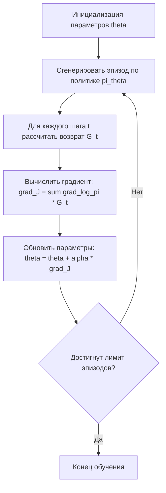

# Policy Gradient (Градиент политики)

Policy Gradient (PG, произносится как «полиси градиент») — это семейство алгоритмов обучения с подкреплением (Reinforcement Learning), которые оптимизируют политику $\pi_\theta$ напрямую, максимизируя ожидаемую награду, вместо того чтобы оценивать функцию ценности действий (Q-функцию), как это делается в методах вроде DQN.

Этот подход особенно эффективен в задачах с непрерывным пространством действий или там, где требуется стохастическая (вероятностная) стратегия поведения, например, в системах персонализированных рекомендаций.

## Подробное описание

### Постановка задачи

В классическом обучении с подкреплением агент взаимодействует со средой, находясь в состоянии $s$, выбирая действие $a$ и получая награду $r$. Цель агента — найти такую политику $\pi(a|s)$ (вероятность выбора действия $a$ в состоянии $s$), которая максимизирует суммарную дисконтированную награду за эпизод.

### Ключевая идея

В отличие от value-based методов (например, Q-Learning), которые сначала учатся оценивать «полезность» каждого действия, а затем выбирают лучшее, методы Policy Gradient параметризуют саму политику нейронной сетью или другой функцией с параметрами $\theta$. Алгоритм вычисляет градиент ожидаемой награды по этим параметрам и делает шаг в направлении его увеличения.

### Исторический контекст

Метод был формализован в работе Sutton et al. (2000) как алгоритм REINFORCE. Позже развитие получили гибридные методы Actor-Critic, сочетающие оценку ценности (Critic) и оптимизацию политики (Actor), а также современные алгоритмы PPO и TRPO, решающие проблему нестабильности обучения.

## Основные принципы

### Математическая формулировка

Целью является максимизация функции цели $J(\theta)$, представляющей собой ожидаемую сумму наград:

$$
J(\theta) = \mathbb{E}_{\tau \sim \pi_\theta} [R(\tau)]
$$

Где $\tau$ — траектория (последовательность состояний и действий), а $R(\tau)$ — сумма наград вдоль этой траектории.

Градиент этой функции вычисляется по теореме о логарифмической вероятности (Policy Gradient Theorem):

$$
\nabla_\theta J(\theta) = \mathbb{E}_{\pi_\theta} \left[ \nabla_\theta \log \pi_\theta(a|s) \cdot Q^{\pi_\theta}(s, a) \right]
$$

Где:

- $\pi_\theta(a|s)$ — вероятность выбора действия $a$ в состоянии $s$ при текущих параметрах $\theta$.
- $Q^{\pi_\theta}(s, a)$ — оценка качества действия (ожидаемая будущая награда).
- $\nabla_\theta \log \pi_\theta(a|s)$ — направление, в котором нужно изменить параметры, чтобы увеличить вероятность выбранного действия.

На практике $Q(s,a)$ часто заменяют на дисконтированный возврат $G_t$ или используют разницу между фактической наградой и базовой линией (baseline), чтобы снизить дисперсию оценки.

### Блок-схема алгоритма REINFORCE



## Пример реализации на Python

Ниже представлен пример реализации алгоритма REINFORCE с базовой линией (для снижения дисперсии) для простой задачи выбора рекомендации. Для соблюдения требований стандарта используется только стандартная библиотека Python и `math`.

```python
import math
import random

class PolicyNetwork:
    """Простая линейная политика для выбора действия."""
    def __init__(self, state_dim, action_dim):
        # Инициализируем веса случайными значениями
        self.weights = [[random.gauss(0, 0.1) for _ in range(state_dim)]
                        for _ in range(action_dim)]
        self.action_dim = action_dim
        self.state_dim = state_dim

    def get_probs(self, state):
        """Вычисляет вероятности действий через softmax."""
        logits = []
        for i in range(self.action_dim):
            logit = sum(self.weights[i][j] * state[j] for j in range(self.state_dim))
            logits.append(logit)

        # Softmax для преобразования логитов в вероятности
        max_logit = max(logits)
        exp_logits = [math.exp(l - max_logit) for l in logits]
        sum_exp = sum(exp_logits)
        probs = [e / sum_exp for e in exp_logits]
        return probs

    def choose_action(self, state):
        """Выбирает действие согласно распределению вероятностей."""
        probs = self.get_probs(state)
        r = random.random()
        cumulative = 0
        for i, p in enumerate(probs):
            cumulative += p
            if r <= cumulative:
                return i
        return len(probs) - 1

    def update_weights(self, state, action, advantage, lr=0.01):
        """Обновляет веса в направлении градиента."""
        probs = self.get_probs(state)
        # Градиент log-вероятности для softmax: (1 - p_a) для выбранного действия, -p_i для остальных
        # Упрощенное обновление: увеличиваем вес выбранного действия пропорционально преимуществу

        for j in range(self.state_dim):
            # Для выбранного действия
            grad = (1 - probs[action]) * state[j]
            self.weights[action][j] += lr * advantage * grad

            # Для невыбранных действий (штрафуем, если преимущество положительно)
            for i in range(self.action_dim):
                if i != action:
                    grad_other = -probs[i] * state[j]
                    self.weights[i][j] += lr * advantage * grad_other


class ReinforceAgent:
    def __init__(self, state_dim, action_dim, gamma=0.99, lr=0.01):
        self.policy = PolicyNetwork(state_dim, action_dim)
        self.gamma = gamma
        self.lr = lr
        self.memory = [] # Хранит (state, action, reward)

    def act(self, state):
        return self.policy.choose_action(state)

    def remember(self, state, action, reward):
        self.memory.append((state, action, reward))

    def learn(self):
        if not self.memory:
            return

        # Расчет дисконтированных возвратов (Returns)
        returns = []
        G = 0
        rewards = [x[2] for x in self.memory]

        for reward in reversed(rewards):
            G = reward + self.gamma * G
            returns.insert(0, G)

        # Нормализация возвратов для стабильности (Baseline)
        mean_return = sum(returns) / len(returns)
        std_return = (sum((r - mean_return) ** 2 for r in returns) / len(returns)) ** 0.5
        if std_return > 1e-8:
            normalized_returns = [(r - mean_return) / std_return for r in returns]
        else:
            normalized_returns = returns

        # Обновление политики
        for i, (state, action, _) in enumerate(self.memory):
            advantage = normalized_returns[i]
            self.policy.update_weights(state, action, advantage, self.lr)

        self.memory = [] # Очистка памяти после эпизода


if __name__ == "__main__":
    # Параметры задачи
    STATE_DIM = 4  # Например, вектор признаков пользователя
    ACTION_DIM = 3 # 3 варианта рекомендации

    agent = ReinforceAgent(STATE_DIM, ACTION_DIM)

    print("Начало обучения агента...")

    # Симуляция 100 эпизодов
    for episode in range(100):
        state = [random.random() for _ in range(STATE_DIM)]
        total_reward = 0

        # Эпизод из 5 шагов
        for step in range(5):
            action = agent.act(state)

            # Простая функция награды: если действие 0, награда высокая, иначе низкая
            # Агент должен научиться выбирать действие 0
            reward = 1.0 if action == 0 else -0.5

            agent.remember(state, action, reward)
            total_reward += reward

            # Переход в новое состояние (в реальности зависит от среды)
            state = [random.random() for _ in range(STATE_DIM)]

        agent.learn()

        if episode % 20 == 0:
            print(f"Эпизод {episode}, Средняя награда: {total_reward:.2f}")

    # Тестирование обученного агента
    print("\nТестирование:")
    test_state = [0.5, 0.5, 0.5, 0.5]
    actions_count = [0, 0, 0]
    for _ in range(100):
        a = agent.act(test_state)
        actions_count[a] += 1

    print(f"Распределение выборов действий: {actions_count}")
    print("Агент должен чаще выбирать действие 0.")
```

## Достоинства и недостатки

**Достоинства:**

1. **Работа с непрерывными действиями.** В отличие от DQN, PG может выдавать параметры непрерывного распределения (например, угол поворота руля), что критично для робототехники.
2. **Естественная стохастичность.** Политика выдает вероятности, что позволяет эффективно исследовать среду без дополнительных эвристик вроде $\epsilon$-greedy.
3. **Плавная сходимость.** Изменения политики происходят постепенно, что избегает резких скачков в поведении агента.

**Недостатки:**

1. **Высокая дисперсия градиентов.** Оценка градиента через Монте-Карло (как в REINFORCE) очень шумная, что замедляет обучение.
2. **Медленная сходимость.** Требует большого количества взаимодействий со средой по сравнению с off-policy методами.
3. **Локальные оптимумы.** Алгоритм может застрять в субоптимальной политике, так как он улучшает только текущую стратегию, не исследуя глобально все возможные.

## Области применения

1. Машинное обучение и рекомендательные системы (персонализация контента с учетом долгосрочной вовлеченности пользователя).
2. Робототехника и автономные системы (управление манипуляторами и дронами в непрерывном пространстве движений).
3. Игровая разработка (обучение ИИ-персонажей сложному поведению в стратегических играх).
4. Торговля и коммерция (динамическое ценообразование и оптимизация рекламных ставок в реальном времени).
