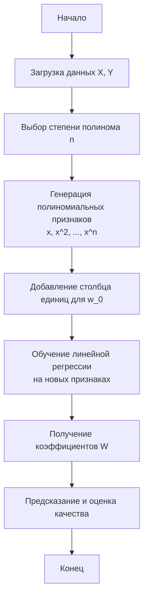

# Полиномиальная регрессия (Polynomial Regression)

Полиномиальная регрессия — это форма регрессионного анализа, в которой связь между независимой переменной $x$ и зависимой переменной $y$ моделируется как полином $n$-й степени.

## Подробное описание

Полиномиальная регрессия используется в тех случаях, когда данные демонстрируют нелинейную зависимость, которую невозможно адекватно описать простой линейной моделью. В отличие от линейной регрессии, где предполагается прямая линия ($y = ax + b$), полиномиальная регрессия позволяет строить кривые линии, лучше подгоняя сложные паттерны в данных.

**Постановка задачи:**
Дан набор данных $\{(x_1, y_1), (x_2, y_2), ..., (x_m, y_m)\}$. Необходимо найти коэффициенты полинома такой степени $n$, чтобы минимизировать ошибку предсказания значений $y$ на основе $x$.

**Входные данные:**

- Вектор признаков $X$ (независимые переменные).
- Вектор целевых значений $Y$ (зависимая переменная).
- Степень полинома $n$ (гиперпараметр).

**Выходные данные:**

- Набор коэффициентов полинома $[w_0, w_1, ..., w_n]$.
- Предсказанные значения $\hat{Y}$.

**Ключевая идея:**
Идея заключается в расширении пространства признаков путем добавления степеней исходных признаков ($x^2, x^3, ...$). После этого задача сводится к обычной задаче линейной регрессии в новом, более высоком измерении. Несмотря на название "полиномиальная", с математической точки зрения это все еще линейная модель относительно весов $w$.

## Принцип работы

### Математическая формулировка

Модель полиномиальной регрессии степени $n$ описывается следующим уравнением:

$$
y = w_0 + w_1 x + w_2 x^2 + w_3 x^3 + ... + w_n x^n + \epsilon
$$

Где:

- $y$ — предсказываемое значение.
- $x$ — входная переменная.
- $w_0, w_1, ..., w_n$ — коэффициенты (веса) модели, которые необходимо обучить.
- $n$ — степень полинома.
- $\epsilon$ — случайная ошибка (шум).

Для нахождения оптимальных весов $W$ обычно используется метод наименьших квадратов (OLS). Целевая функция (функция потерь) выглядит так:

$$
J(W) = \frac{1}{m} \sum_{i=1}^{m} (y_i - \hat{y}_i)^2
$$

Где:

- $m$ — количество примеров в обучающей выборке.
- $y_i$ — истинное значение.
- $\hat{y}_i$ — предсказанное значение моделью.

### Блок-схема процесса обучения



## Пример реализации на Python

Ниже приведена реализация полиномиальной регрессии с использованием только библиотеки `numpy` для генерации признаков и решения системы линейных уравнений.

```python
import numpy as np
import matplotlib.pyplot as plt

class PolynomialRegression:
    def __init__(self, degree=2):
        """
        Инициализация модели полиномиальной регрессии.

        Args:
            degree (int): Степень полинома.
        """
        self.degree = degree
        self.weights = None

    def _create_polynomial_features(self, X):
        """
        Преобразует входные данные в полиномиальные признаки.

        Args:
            X (np.ndarray): Входные данные формы (m, 1).

        Returns:
            np.ndarray: Матрица признаков формы (m, degree+1).
        """
        # Создаем матрицу, где каждый столбец - это X в степени i
        # X_poly[i, j] = X[i]^j
        X_poly = np.ones((X.shape[0], self.degree + 1))
        for i in range(1, self.degree + 1):
            X_poly[:, i] = (X ** i).flatten()
        return X_poly

    def fit(self, X, y):
        """
        Обучает модель, находя оптимальные веса методом наименьших квадратов.

        Args:
            X (np.ndarray): Входные данные.
            y (np.ndarray): Целевые значения.
        """
        # Генерируем полиномиальные признаки
        X_poly = self._create_polynomial_features(X)

        # Решаем нормальное уравнение: W = (X^T * X)^-1 * X^T * y
        # Используем псевдообратную матрицу для численной стабильности
        self.weights = np.linalg.pinv(X_poly.T @ X_poly) @ X_poly.T @ y

    def predict(self, X):
        """
        Делает предсказания на основе обученной модели.

        Args:
            X (np.ndarray): Входные данные для предсказания.

        Returns:
            np.ndarray: Предсказанные значения.
        """
        if self.weights is None:
            raise Exception("Модель еще не обучена. Сначала вызовите fit().")

        X_poly = self._create_polynomial_features(X)
        return X_poly @ self.weights

if __name__ == "__main__":
    # Генерация синтетических данных с нелинейной зависимостью
    np.random.seed(42)
    X = np.linspace(-3, 3, 100).reshape(-1, 1)
    # Истинная функция: y = 0.5*x^2 - 2*x + 1 + шум
    y_true = 0.5 * X**2 - 2 * X + 1
    noise = np.random.normal(0, 0.5, X.shape)
    y = y_true + noise

    # Создание и обучение модели
    model = PolynomialRegression(degree=2)
    model.fit(X, y)

    # Предсказание
    y_pred = model.predict(X)

    # Визуализация результатов
    plt.figure(figsize=(10, 6))
    plt.scatter(X, y, color='blue', label='Данные с шумом', alpha=0.6)
    plt.plot(X, y_true, color='green', label='Истинная зависимость', linewidth=2)
    plt.plot(X, y_pred, color='red', label='Предсказание модели', linewidth=2)
    plt.title('Полиномиальная регрессия (степень 2)')
    plt.xlabel('X')
    plt.ylabel('Y')
    plt.legend()
    plt.grid(True, linestyle='--', alpha=0.5)
    plt.show()

    print(f"Найденные коэффициенты: {model.weights}")
    print(f"Истинные коэффициенты (примерно): [1, -2, 0.5]")
```

## Достоинства и недостатки

**Достоинства:**

1. **Гибкость:** Способность моделировать широкий спектр нелинейных зависимостей путем изменения степени полинома.
2. **Простота реализации:** Алгоритм сводится к линейной регрессии после преобразования признаков, что делает его вычислительно эффективным и легким для понимания.
3. **Интерпретируемость:** Коэффициенты полинома имеют четкий математический смысл, влияющий на форму кривой.

**Недостатки:**

1. **Риск переобучения:** При высокой степени полинома модель может начать "запоминать" шум в данных вместо выявления общей закономерности, что приводит к плохой обобщающей способности.
2. **Чувствительность к выбросам:** Как и обычная линейная регрессия, метод наименьших квадратов сильно реагирует на аномальные значения в данных.
3. **Экстраполяция:** Модель ведет себя непредсказуемо за пределами диапазона обучающих данных, так как полиномы стремятся к бесконечности при больших значениях $x$.

## Области применения

1. Экономика и финансы (моделирование кривых доходности, прогнозирование нелинейного роста продаж)
2. Обработка текста (аппроксимация частотности слов или сложности текста в зависимости от длины документа)
