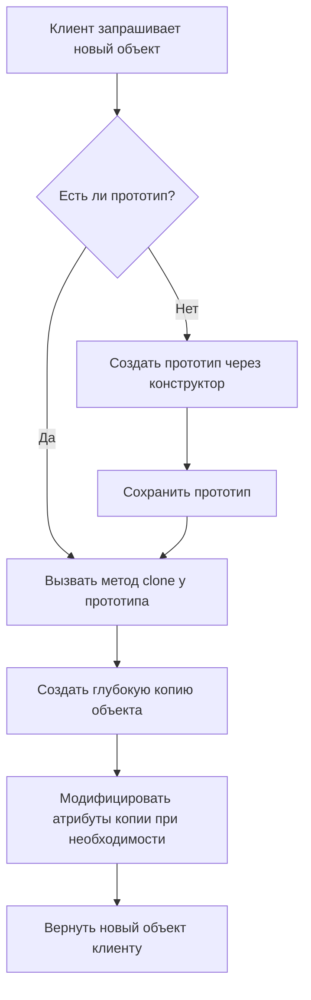

# Паттерн Prototype (Прототип)

Паттерн Prototype (Прототип) — это порождающий паттерн проектирования, который позволяет создавать новые объекты путем копирования существующих экземпляров (прототипов), вместо создания объектов через конструктор.

Этот подход особенно полезен, когда создание объекта требует значительных затрат ресурсов (например, обращение к базе данных или сложные вычисления при инициализации) или когда система должна быть независимой от способа создания, композиции и представления своих продуктов.

## Подробное описание

### Постановка задачи

Необходимо создать множество объектов, которые имеют схожую структуру и начальное состояние, но могут незначительно отличаться друг от друга. Прямое создание каждого объекта через конструктор (`new Class()`) может быть дорогостоящим или невозможным, если классы неизвестны на этапе компиляции.

### Входные и выходные данные

- **Вход:** Существующий объект-прототип, полностью настроенный и готовый к использованию.
- **Выход:** Новый объект, являющийся точной копией прототипа (или его модифицированной версией).

### Ключевая идея

Вместо того чтобы описывать процесс создания объекта шаг за шагом, мы берем уже созданный объект и клонируем его. Клиентский код работает с интерфейсом клонирования, не зная конкретных классов создаваемых объектов.

### Исторический контекст

Паттерн был описан в книге «Банды четырех» (Gang of Four) как один из 23 классических паттернов проектирования. В языках со строгой типизацией (C++, Java) он часто требует реализации специального интерфейса `Cloneable`. В Python эта задача решается проще благодаря встроенному модулю `copy`.

## Принцип работы

Логика паттерна строится вокруг метода `clone()`, который возвращает копию текущего объекта.

### Блок-схема процесса клонирования



Важно различать два типа копирования:

1.  **Поверхностное копирование (Shallow Copy):** Копируется только сам объект, но ссылки на вложенные объекты остаются прежними. Изменение вложенного объекта в копии повлияет на оригинал.
2.  **Глубокое копирование (Deep Copy):** Рекурсивно копируются все вложенные объекты. Это предпочтительный вариант для паттерна Prototype, чтобы обеспечить полную независимость объектов.

## Пример реализации на Python

В Python для реализации глубокого копирования используется модуль `copy`. Ниже представлен пример системы управления персонажами в игре, где прототипы используются для быстрого создания юнитов одного типа.

```python
import copy
from typing import Dict, Any

class GameUnit:
    """Базовый класс игрового юнита, поддерживающий клонирование."""

    def __init__(self, name: str, health: int, attack_power: int, position: tuple):
        self.name = name
        self.health = health
        self.attack_power = attack_power
        # Позиция - неизменяемый кортеж, но для демонстрации deepcopy используем список внутри
        self.position = list(position)
        self.inventory = [] # Сложный вложенный объект

    def clone(self) -> 'GameUnit':
        """
        Создает глубокую копию объекта.
        Возвращает новый экземпляр класса с теми же данными.
        """
        return copy.deepcopy(self)

    def move(self, x: int, y: int):
        """Изменяет позицию юнита."""
        self.position[0] += x
        self.position[1] += y

    def add_item(self, item: str):
        """Добавляет предмет в инвентарь."""
        self.inventory.append(item)

    def __str__(self):
        return (f"Unit: {self.name}, HP: {self.health}, "
                f"Atk: {self.attack_power}, Pos: {self.position}, "
                f"Inv: {self.inventory}")

class UnitFactory:
    """Фабрика, хранящая прототипы юнитов."""

    def __init__(self):
        self._prototypes: Dict[str, GameUnit] = {}

    def register_prototype(self, key: str, prototype: GameUnit):
        """Регистрирует прототип под определенным ключом."""
        self._prototypes[key] = prototype

    def create_unit(self, key: str, **overrides: Any) -> GameUnit:
        """
        Клонирует прототип и применяет переопределения атрибутов.
        """
        if key not in self._prototypes:
            raise ValueError(f"Prototype with key '{key}' not found")

        # Клонируем базовый прототип
        new_unit = self._prototypes[key].clone()

        # Применяем изменения (например, имя или позицию)
        for attr, value in overrides.items():
            if hasattr(new_unit, attr):
                setattr(new_unit, attr, value)

        return new_unit

if __name__ == "__main__":
    # 1. Создаем и настраиваем прототипы (это дорогая операция, делаем один раз)
    warrior_proto = GameUnit("Warrior", health=100, attack_power=20, position=(0, 0))
    warrior_proto.add_item("Sword")

    mage_proto = GameUnit("Mage", health=60, attack_power=50, position=(0, 0))
    mage_proto.add_item("Staff")
    mage_proto.add_item("Mana Potion")

    # 2. Регистрируем прототипы в фабрике
    factory = UnitFactory()
    factory.register_prototype("warrior", warrior_proto)
    factory.register_prototype("mage", mage_proto)

    # 3. Быстрое создание юнитов через клонирование
    print("--- Создание армии ---")

    # Создаем воина и двигаем его
    warrior1 = factory.create_unit("warrior", name="Warrior-1")
    warrior1.move(10, 5)
    print(warrior1)

    # Создаем другого воина с другим именем, но теми же характеристиками
    warrior2 = factory.create_unit("warrior", name="Warrior-2")
    warrior2.move(-5, 10)
    print(warrior2)

    # Создаем мага
    mage1 = factory.create_unit("mage", name="Archmage", position=(100, 100))
    print(mage1)

    # Проверка независимости объектов (deep copy)
    print("\n--- Проверка изоляции ---")
    warrior1.add_item("Shield")
    print(f"Warrior-1 Inv: {warrior1.inventory}")
    print(f"Warrior-2 Inv: {warrior2.inventory}") # Инвентарь warrior2 не изменился
```

## Достоинства и недостатки

**Достоинства:**

1. **Уменьшение количества подклассов.** Вместо создания иерархии фабрик для каждого типа продукта, можно использовать одну фабрику с разными прототипами.
2. **Динамическая конфигурация.** Позволяет добавлять и удалять типы объектов во время выполнения программы, просто регистрируя новые прототипы.
3. **Производительность.** Клонирование готового объекта часто быстрее, чем его создание через конструктор с сложной логикой инициализации.
4. **Скрытие сложности.** Клиентскому коду не нужно знать детали создания объекта, достаточно вызвать метод `clone()`.

**Недостатки:**

1. **Сложность клонирования сложных объектов.** Если объект содержит циклические ссылки или ссылки на внешние ресурсы (файлы, сетевые соединения), реализовать корректное глубокое копирование может быть трудно.
2. **Проблемы с наследованием.** В некоторых языках клонирование объектов с закрытыми полями может нарушать инкапсуляцию.
3. **Риск ошибок.** Необходимо тщательно следить за тем, чтобы клонирование было именно глубоким там, где это требуется, иначе изменения в копии могут повлиять на оригинал.

## Области применения

1. **Паттерны проектирования** (реализация механизмов кэширования объектов, снижение связанности модулей при создании сложных структур)
2. **Игровая разработка** (быстрое создание множества одинаковых врагов, снарядов или частиц с небольшими вариациями параметров)
