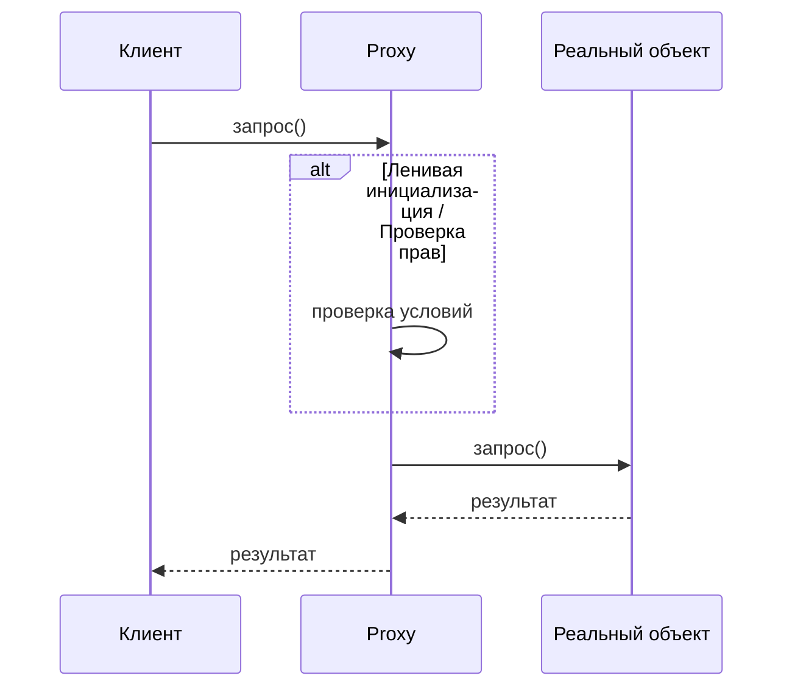

# Паттерн Proxy (Заместитель)

Паттерн Proxy (Заместитель) — это структурный шаблон проектирования, который предоставляет объект-суррогат или «заместитель» другого объекта. Прокси контролирует доступ к оригинальному объекту, позволяя выполнить какие-то действия до или после передачи запроса оригиналу.

## Подробное описание

Паттерн решает задачу контроля доступа к объекту без изменения его кода. Он полезен, когда создание объекта требует больших ресурсов (например, загрузка изображения из сети или подключение к базе данных), либо когда необходимо ограничить права доступа, вести логирование операций или реализовать удаленный вызов методов.

Ключевая идея заключается в том, что прокси реализует тот же интерфейс, что и реальный субъект (Real Subject). Это позволяет клиенту работать с прокси так же, как с реальным объектом, не подозревая о подмене.

**Участники паттерна:**

1. **Subject (Субъект)**: общий интерфейс для RealSubject и Proxy.
2. **RealSubject (Реальный субъект)**: объект, содержащий основную бизнес-логику.
3. **Proxy (Заместитель)**: хранит ссылку на RealSubject, контролирует доступ к нему и может выполнять дополнительные операции.

## Принцип работы

Логика работы паттерна строится на делегировании вызовов. Клиент обращается к методам Proxy, который решает, нужно ли создавать реальный объект (в случае ленивой инициализации), проверять права доступа или возвращать данные из кэша.

### Блок-схема взаимодействия



## Пример реализации на Python

Ниже представлены примеры различных типов прокси: Virtual Proxy (ленивая загрузка), Protection Proxy (контроль доступа) и Caching Proxy (кеширование).

### 1. Virtual Proxy (Ленивая инициализация)

Используется для отложенного создания ресурсоёмких объектов.

```python
class HeavyResource:
    """Ресурсоёмкий объект, создание которого занимает время."""
    def __init__(self, name):
        print(f"Загрузка тяжелого ресурса: {name}")
        self.name = name
        # Имитация долгой загрузки
        import time
        time.sleep(1)

    def operation(self):
        return f"Работа с ресурсом {self.name}"

class ResourceProxy:
    """Прокси, который создает HeavyResource только при первом обращении."""
    def __init__(self, name):
        self._name = name
        self._resource = None

    def operation(self):
        if self._resource is None:
            self._resource = HeavyResource(self._name)
        return self._resource.operation()

if __name__ == "__main__":
    print("Создание прокси...")
    proxy = ResourceProxy("BigData")
    print("Прокси создан, ресурс еще не загружен.")

    print("\nПервый вызов:")
    print(proxy.operation()) # Здесь произойдет загрузка

    print("\nВторой вызов:")
    print(proxy.operation()) # Ресурс уже загружен, задержки нет
```

### 2. Protection Proxy (Контроль доступа)

Ограничивает доступ к объекту в зависимости от роли пользователя.

```python
from abc import ABC, abstractmethod

class Document(ABC):
    @abstractmethod
    def read(self, user_role: str) -> str:
        pass

class SecretDocument(Document):
    def read(self, user_role: str) -> str:
        return "Секретная информация: Проект X"

class DocumentProxy(Document):
    def __init__(self):
        self._document = SecretDocument()
        self._allowed_roles = ["admin", "manager"]

    def read(self, user_role: str) -> str:
        if user_role in self._allowed_roles:
            return self._document.read(user_role)
        else:
            return "Доступ запрещен: недостаточно прав"

if __name__ == "__main__":
    proxy = DocumentProxy()

    print(proxy.read("user"))    # Доступ запрещен
    print(proxy.read("admin"))   # Секретная информация: Проект X
```

### 3. Caching Proxy (Кеширование)

Сохраняет результаты предыдущих запросов для ускорения повторных обращений.

```python
class DatabaseService:
    """Имитация медленного сервиса базы данных."""
    def get_data(self, query: str) -> dict:
        print(f"Выполнение запроса к БД: {query}")
        return {"data": f"Result for {query}"}

class CachedDatabaseProxy:
    def __init__(self):
        self._service = DatabaseService()
        self._cache = {}

    def get_data(self, query: str) -> dict:
        if query in self._cache:
            print("Возврат данных из кэша")
            return self._cache[query]

        result = self._service.get_data(query)
        self._cache[query] = result
        return result

if __name__ == "__main__":
    proxy = CachedDatabaseProxy()

    print(proxy.get_data("SELECT * FROM users")) # Запрос к БД
    print(proxy.get_data("SELECT * FROM users")) # Из кэша
```

## Достоинства и недостатки

**Достоинства:**

1. **Контроль доступа**: Позволяет управлять доступом к объекту без изменения его кода (например, проверка прав).
2. **Оптимизация производительности**: Ленивая инициализация экономит ресурсы, а кеширование ускоряет повторные запросы.
3. **Прозрачность для клиента**: Клиент работает с тем же интерфейсом, что и с реальным объектом.
4. **Безопасность**: Можно скрыть реальный объект от прямого доступа, особенно в случае Remote Proxy.

**Недостатки:**

1. **Усложнение кода**: Появляются дополнительные классы, что увеличивает общую сложность системы.
2. **Накладные расходы**: Каждый запрос проходит через прокси, что может немного увеличить время отклика (особенно если прокси выполняет сложные проверки).
3. **Проблемы с жизненным циклом**: В некоторых случаях (например, Remote Proxy) управление временем жизни объектов может стать сложнее.
