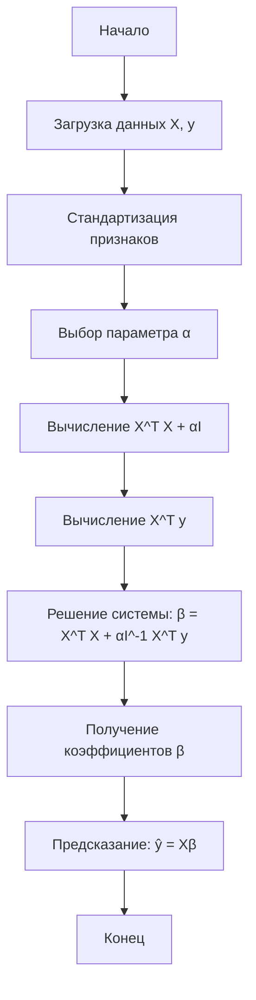

# Гребневая регрессия (Ridge Regression)

Алгоритм гребневой регрессии (Ridge Regression, произносится как "ридж ригрешн") — это метод регуляризованной линейной регрессии, который добавляет штраф за величину коэффициентов модели для предотвращения переобучения и улучшения обобщающей способности.

## Подробное описание

Гребневая регрессия решает задачу множественной линейной регрессии с L2-регуляризацией. В отличие от обычной линейной регрессии методом наименьших квадратов, ridge regression минимизирует не только сумму квадратов ошибок предсказания, но и сумму квадратов значений коэффициентов модели.

**Постановка задачи:** Дана обучающая выборка из n наблюдений, где каждое наблюдение состоит из p признаков и целевой переменной. Необходимо найти вектор коэффициентов β, который минимизирует функцию потерь с учётом регуляризации.

**Входные данные:**

- Матрица признаков X размера n × p
- Вектор целевых значений y размера n
- Параметр регуляризации α (lambda) ≥ 0

**Выходные данные:**

- Вектор коэффициентов модели β размера p + 1 (включая свободный член)
- Предсказанные значения ŷ

**Ключевая идея:** Добавление штрафа L2-нормы к функции потерь заставляет модель использовать меньшие по абсолютной величине коэффициенты, что снижает дисперсию модели и уменьшает риск переобучения, особенно когда признаки сильно коррелированы или когда количество признаков велико относительно количества наблюдений.

**Исторический контекст:** Метод был предложен Артуром Хорлом (Arthur Hoerl) и Робертом Кеннардом (Robert Kennard) в 1970 году как решение проблемы мультиколлинеарности в регрессионном анализе. Название "гребневая" происходит от формы поверхности функции потерь, которая напоминает гребень при визуализации в пространстве параметров.

## Основные принципы

### Математическая формулировка

Функция потерь гребневой регрессии имеет вид:

$$
J(\beta) = \sum_{i=1}^{n} (y_i - \hat{y}_i)^2 + \alpha \sum_{j=1}^{p} \beta_j^2
$$

или в матричной форме:

$$
J(\beta) = ||y - X\beta||^2_2 + \alpha ||\beta||^2_2
$$

Оптимальные коэффициенты находятся аналитически:

$$
\hat{\beta} = (X^T X + \alpha I)^{-1} X^T y
$$

Где:

- $y$ — вектор целевых значений размера n
- $X$ — матрица признаков размера n × p
- $\beta$ — вектор коэффициентов размера p
- $\alpha$ — параметр регуляризации (controls strength of regularization)
- $I$ — единичная матрица размера p × p
- $||\cdot||_2$ — L2-норма (евклидова норма)

При $\alpha = 0$ гребневая регрессия вырождается в обычную линейную регрессию методом наименьших квадратов. При увеличении $\alpha$ коэффициенты стремятся к нулю, но никогда не достигают его точно (в отличие от Lasso-регрессии).

### Блок-схема алгоритма



## Пример реализации на Python

```python
import numpy as np
from typing import Tuple


class RidgeRegression:
    """
    Класс для реализации гребневой регрессии (Ridge Regression).

    Parameters
    ----------
    alpha : float, optional
        Параметр регуляризации (по умолчанию 1.0).
        Чем больше значение, тем сильнее регуляризация.
    fit_intercept : bool, optional
        Нужно ли использовать свободный член (по умолчанию True).
    """

    def __init__(self, alpha: float = 1.0, fit_intercept: bool = True):
        self.alpha = alpha
        self.fit_intercept = fit_intercept
        self.coefficients = None  # Вектор коэффициентов beta
        self.intercept = None     # Свободный член (intercept)

    def _add_intercept(self, X: np.ndarray) -> np.ndarray:
        """
        Добавляет столбец единиц к матрице признаков для учёта свободного члена.

        Parameters
        ----------
        X : np.ndarray
            Матрица признаков размера n_samples x n_features

        Returns
        -------
        np.ndarray
            Матрица с добавленным столбцом единиц размера n_samples x (n_features + 1)
        """
        intercept_column = np.ones((X.shape[0], 1))
        return np.hstack([intercept_column, X])

    def fit(self, X: np.ndarray, y: np.ndarray) -> 'RidgeRegression':
        """
        Обучает модель гребневой регрессии.

        Вычисляет оптимальные коэффициенты по формуле:
        beta = (X^T X + alpha * I)^(-1) X^T y

        Parameters
        ----------
        X : np.ndarray
            Матрица признаков размера n_samples x n_features
        y : np.ndarray
            Вектор целевых значений размера n_samples

        Returns
        -------
        self
            Возвращает экземпляр класса для цепочки вызовов
        """
        # Преобразуем входные данные в массивы numpy
        X = np.asarray(X, dtype=np.float64)
        y = np.asarray(y, dtype=np.float64)

        # Проверяем размерности
        if X.ndim == 1:
            X = X.reshape(-1, 1)
        if y.ndim == 2 and y.shape[1] == 1:
            y = y.ravel()

        n_samples, n_features = X.shape

        # Если требуется, добавляем столбец для свободного члена
        if self.fit_intercept:
            X_augmented = self._add_intercept(X)
        else:
            X_augmented = X

        # Создаём матрицу регуляризации
        # Для свободного члена регуляризация не применяется
        n_params = X_augmented.shape[1]
        regularization_matrix = self.alpha * np.eye(n_params)

        # Если есть свободный член, не регуляризуем его (первый элемент)
        if self.fit_intercept:
            regularization_matrix[0, 0] = 0

        # Вычисляем X^T X
        XtX = X_augmented.T @ X_augmented

        # Добавляем регуляризацию: X^T X + alpha * I
        regularized_XtX = XtX + regularization_matrix

        # Вычисляем X^T y
        Xty = X_augmented.T @ y

        # Решаем систему уравнений для нахождения коэффициентов
        # beta = (X^T X + alpha * I)^(-1) X^T y
        try:
            coefficients = np.linalg.solve(regularized_XtX, Xty)
        except np.linalg.LinAlgError:
            # Если матрица вырожденная, используем псевдообратную
            coefficients = np.linalg.pinv(regularized_XtX) @ Xty

        # Разделяем коэффициенты и свободный член
        if self.fit_intercept:
            self.intercept = coefficients[0]
            self.coefficients = coefficients[1:]
        else:
            self.intercept = 0.0
            self.coefficients = coefficients

        return self

    def predict(self, X: np.ndarray) -> np.ndarray:
        """
        Делает предсказания для новых данных.

        Parameters
        ----------
        X : np.ndarray
            Матрица признаков размера n_samples x n_features

        Returns
        -------
        np.ndarray
            Вектор предсказанных значений размера n_samples
        """
        if self.coefficients is None:
            raise ValueError("Модель ещё не обучена. Сначала вызовите метод fit().")

        X = np.asarray(X, dtype=np.float64)

        # Вычисляем предсказания: y_hat = X @ beta + intercept
        predictions = X @ self.coefficients + self.intercept

        return predictions

    def score(self, X: np.ndarray, y: np.ndarray) -> float:
        """
        Вычисляет коэффициент детерминации R².

        Parameters
        ----------
        X : np.ndarray
            Матрица признаков
        y : np.ndarray
            Истинные значения целевой переменной

        Returns
        -------
        float
            Коэффициент детерминации R² (чем ближе к 1, тем лучше)
        """
        y_pred = self.predict(X)
        y = np.asarray(y, dtype=np.float64)

        # Вычисляем сумму квадратов остатков (SS_res)
        ss_res = np.sum((y - y_pred) ** 2)

        # Вычисляем общую сумму квадратов (SS_tot)
        ss_tot = np.sum((y - np.mean(y)) ** 2)

        # Избегаем деления на ноль
        if ss_tot == 0:
            return 1.0 if ss_res == 0 else 0.0

        # R² = 1 - SS_res / SS_tot
        r_squared = 1 - (ss_res / ss_tot)

        return r_squared


def standardize_features(X: np.ndarray) -> Tuple[np.ndarray, np.ndarray, np.ndarray]:
    """
    Стандартизирует признаки (вычитает среднее, делит на стандартное отклонение).

    Важно: гребневая регрессия чувствительна к масштабу признаков,
    поэтому стандартизация рекомендуется перед обучением.

    Parameters
    ----------
    X : np.ndarray
        Матрица признаков

    Returns
    -------
    Tuple[np.ndarray, np.ndarray, np.ndarray]
        Стандартизированная матрица, вектор средних, вектор стандартных отклонений
    """
    means = np.mean(X, axis=0)
    stds = np.std(X, axis=0)

    # Избегаем деления на ноль для константных признаков
    stds[stds == 0] = 1.0

    X_standardized = (X - means) / stds

    return X_standardized, means, stds


if __name__ == "__main__":
    # Пример использования гребневой регрессии

    # Генерируем синтетические данные
    np.random.seed(42)
    n_samples = 100
    n_features = 5

    # Создаём матрицу признаков
    X = np.random.randn(n_samples, n_features)

    # Создаём истинные коэффициенты
    true_coefficients = np.array([2.5, -1.3, 0.8, 0.0, 1.2])
    true_intercept = 3.0

    # Генерируем целевую переменную с шумом
    noise = np.random.randn(n_samples) * 0.5
    y = X @ true_coefficients + true_intercept + noise

    print("=" * 60)
    print("Пример использования гребневой регрессии")
    print("=" * 60)

    # Стандартизируем признаки
    X_std, means, stds = standardize_features(X)

    # Создаём и обучаем модель с разными значениями alpha
    alphas = [0.0, 0.1, 1.0, 10.0, 100.0]

    print("\nСравнение моделей с разными параметрами регуляризации:")
    print("-" * 60)
    print(f"{'Alpha':<10} {'R² Score':<12} {'Коэфф. (первые 3)':<30}")
    print("-" * 60)

    for alpha in alphas:
        model = RidgeRegression(alpha=alpha, fit_intercept=True)
        model.fit(X_std, y)

        r2 = model.score(X_std, y)
        coeffs = model.coefficients[:3]  # Первые 3 коэффициента для демонстрации

        print(f"{alpha:<10.1f} {r2:<12.4f} {[f'{c:.3f}' for c in coeffs]}")

    # Выбираем оптимальную модель
    print("\n" + "=" * 60)
    print("Обучение финальной модели (alpha=1.0)")
    print("=" * 60)

    final_model = RidgeRegression(alpha=1.0, fit_intercept=True)
    final_model.fit(X_std, y)

    print(f"\nНайденные коэффициенты: {final_model.coefficients}")
    print(f"Свободный член: {final_model.intercept:.4f}")
    print(f"R² на обучающей выборке: {final_model.score(X_std, y):.4f}")

    # Делаем предсказания для новых данных
    X_new = np.random.randn(5, n_features)
    X_new_std = (X_new - means) / stds
    predictions = final_model.predict(X_new_std)

    print(f"\nПредсказания для 5 новых наблюдений:")
    for i, pred in enumerate(predictions):
        print(f"  Наблюдение {i+1}: {pred:.4f}")

    # Демонстрация эффекта регуляризации
    print("\n" + "=" * 60)
    print("Эффект регуляризации на величину коэффициентов")
    print("=" * 60)

    model_no_reg = RidgeRegression(alpha=0.0, fit_intercept=True)
    model_no_reg.fit(X_std, y)

    model_strong_reg = RidgeRegression(alpha=100.0, fit_intercept=True)
    model_strong_reg.fit(X_std, y)

    print(f"\nБез регуляризации (alpha=0.0):")
    print(f"  Коэффициенты: {model_no_reg.coefficients}")
    print(f"  Норма коэффициентов: {np.linalg.norm(model_no_reg.coefficients):.4f}")

    print(f"\nСильная регуляризация (alpha=100.0):")
    print(f"  Коэффициенты: {model_strong_reg.coefficients}")
    print(f"  Норма коэффициентов: {np.linalg.norm(model_strong_reg.coefficients):.4f}")

    print("\n" + "=" * 60)
    print("Примечание: при увеличении alpha коэффициенты уменьшаются,")
    print("но никогда не становятся точно равными нулю.")
    print("=" * 60)
```

## Достоинства и недостатки

**Достоинства:**

1. **Предотвращает переобучение** — L2-регуляризация ограничивает рост коэффициентов, что улучшает обобщающую способность модели на новых данных.
2. **Работает с мультиколлинеарностью** — когда признаки сильно коррелированы, гребневая регрессия даёт более стабильные оценки коэффициентов по сравнению с обычной линейной регрессией.
3. **Аналитическое решение** — в отличие от некоторых других методов машинного обучения, ridge regression имеет закрытую форму решения, что делает обучение быстрым и детерминированным.
4. **Численная устойчивость** — добавление αI к матрице X^T X улучшает её обусловленность, что особенно важно при работе с плохо обусловленными матрицами.
5. **Сохраняет все признаки** — в отличие от Lasso, гребневая регрессия не зануляет коэффициенты, что полезно когда все признаки потенциально информативны.

**Недостатки:**

1. **Не выполняет отбор признаков** — все коэффициенты остаются ненулевыми, даже если некоторые признаки неинформативны. Это может ухудшить интерпретируемость модели при большом количестве признаков.
2. **Требует стандартизации признаков** — поскольку регуляризация зависит от масштаба коэффициентов, признаки необходимо стандартизировать перед обучением, иначе результат будет зависеть от единиц измерения.
3. **Чувствительность к выбору α** — производительность модели сильно зависит от правильного выбора параметра регуляризации, что требует использования кросс-валидации.
4. **Предположение о линейности** — как и обычная линейная регрессия, предполагает линейную зависимость между признаками и целевой переменной.
5. **Не работает с категориальными признаками напрямую** — требует предварительного кодирования категориальных переменных (one-hot encoding, label encoding и т.д.).

## Области применения

1. **Экономика и финансы** (прогнозирование цен активов, оценка рисков кредитования, анализ макроэкономических показателей)
2. **Биотехнологии и медицина** (предсказание эффективности лекарств на основе молекулярных дескрипторов, анализ генетических данных с большим количеством признаков)
3. **Компьютерное зрение** (регрессионные задачи в обработке изображений, предсказание координат объектов, оценка возраста по фотографии)
4. **Обработка текста** (предсказание тональности текста с использованием bag-of-words или TF-IDF признаков, где количество признаков часто превышает количество наблюдений)
5. **Логистика** (прогнозирование времени доставки, оптимизация маршрутов на основе множества факторов, предсказание спроса на товары)
