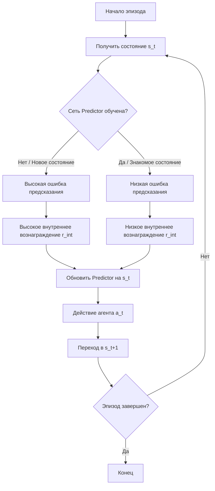

# Random Network Distillation (RND)

Random Network Distillation (RND) — это алгоритм поощрения исследования (exploration) в обучении с подкреплением (Reinforcement Learning, RL), который использует ошибку предсказания выхода случайно инициализированной нейронной сети как внутреннее вознаграждение за новизну состояния. Метод был предложен исследователями из OpenAI в 2018 году для решения проблемы разреженных вознаграждений.

## Подробное описание

В задачах обучения с подкреплением агент часто сталкивается с проблемой «разреженных вознаграждений» (sparse rewards), когда внешняя награда выдается редко или только в конце эпизода. Стандартные алгоритмы могут застревать в локальных оптимумах, не исследуя среду достаточно глубоко.

RND решает эту проблему, добавляя к внешней награде внутреннее вознаграждение (intrinsic reward). Идея заключается в том, что агент получает дополнительную награду за посещение состояний, которые он плохо «понимает» или которые являются для него новыми.

**Ключевая идея:** Если состояние новое, нейросеть, пытающаяся предсказать его характеристики, будет делать это с большой ошибкой. По мере того как агент чаще посещает это состояние, ошибка предсказания уменьшается, и внутреннее вознаграждение падает. Это заставляет агента искать новые, неизученные области пространства состояний.

**Входные данные:** Вектор состояния среды $s_t$.
**Выходные данные:** Скалярное значение внутреннего вознаграждения $r^{int}_t$.

## Принцип работы

Алгоритм RND состоит из двух нейронных сетей с одинаковой архитектурой:

1.  **Целевая сеть (Target Network)** $f(s; \theta_{target})$: Инициализируется случайными весами и **замораживается** (не обновляется в процессе обучения). Она служит генератором случайных, но детерминированных признаков для каждого состояния.
2.  **Предсказывающая сеть (Predictor Network)** $\hat{f}(s; \theta_{predictor})$: Обучается минимизировать разницу между своим выходом и выходом целевой сети для состояний, которые агент уже посетил.

### Математическая формулировка

Внутреннее вознаграждение вычисляется как квадрат ошибки предсказания (MSE) между выходами двух сетей:

$$
r^{int}_t = \| \hat{f}(s_t; \theta_{predictor}) - f(s_t; \theta_{target}) \|^2
$$

Функция потерь для обновления предсказывающей сети:

$$
L(\theta_{predictor}) = \| \hat{f}(s_t; \theta_{predictor}) - f(s_t; \theta_{target}) \|^2
$$

Где:

- $s_t$ — состояние среды в момент времени $t$.
- $f(s; \theta_{target})$ — выход замороженной целевой сети.
- $\hat{f}(s; \theta_{predictor})$ — выход обучаемой предсказывающей сети.
- $\| \cdot \|^2$ — квадрат евклидовой нормы (сумма квадратов разностей элементов вектора).

По мере обучения $\theta_{predictor}$ подстраивается так, чтобы $\hat{f}(s)$ приближалось к $f(s)$ для часто встречающихся состояний. Для новых состояний ошибка остается высокой, что дает высокий $r^{int}_t$.

### Блок-схема алгоритма



## Пример реализации на Python

Реализация использует библиотеку `torch` (PyTorch), так как алгоритм основан на нейронных сетях. Для демонстрации также используется `numpy`.

```python
import torch
import torch.nn as nn
import torch.optim as optim
import numpy as np

class RNDNetwork(nn.Module):
    """
    Нейронная сеть для генерации признаков состояния.
    Используется как для Target, так и для Predictor сети.
    """
    def __init__(self, input_dim, hidden_dim=64, output_dim=64):
        super(RNDNetwork, self).__init__()
        self.net = nn.Sequential(
            nn.Linear(input_dim, hidden_dim),
            nn.ReLU(),
            nn.Linear(hidden_dim, hidden_dim),
            nn.ReLU(),
            nn.Linear(hidden_dim, output_dim)
        )

    def forward(self, x):
        return self.net(x)

class RandomNetworkDistillation:
    """
    Класс реализующий механизм Random Network Distillation.
    """
    def __init__(self, state_dim, hidden_dim=64, lr=1e-3, device='cpu'):
        self.device = device

        # Инициализация сетей
        self.target_net = RNDNetwork(state_dim, hidden_dim).to(device)
        self.predictor_net = RNDNetwork(state_dim, hidden_dim).to(device)

        # Замораживание весов целевой сети
        for param in self.target_net.parameters():
            param.requires_grad = False

        # Оптимизатор только для предсказывающей сети
        self.optimizer = optim.Adam(self.predictor_net.parameters(), lr=lr)
        self.loss_fn = nn.MSELoss()

    def compute_intrinsic_reward(self, states):
        """
        Вычисляет внутреннее вознаграждение для батча состояний.

        Args:
            states: numpy array формы (batch_size, state_dim)

        Returns:
            numpy array внутренних вознаграждений
        """
        if not isinstance(states, torch.Tensor):
            states_tensor = torch.FloatTensor(states).to(self.device)
        else:
            states_tensor = states.to(self.device)

        with torch.no_grad():
            # Получаем целевые признаки (не требуют градиентов)
            target_features = self.target_net(states_tensor)

        # Получаем предсказанные признаки
        predicted_features = self.predictor_net(states_tensor)

        # Вычисляем MSE по последнему измерению (признакам)
        # Результат имеет форму (batch_size,)
        errors = torch.mean((predicted_features - target_features)**2, dim=1)

        return errors.cpu().detach().numpy()

    def update(self, states):
        """
        Обновляет веса предсказывающей сети на основе текущих состояний.

        Args:
            states: numpy array или torch tensor

        Returns:
            Значение функции потерь
        """
        if not isinstance(states, torch.Tensor):
            states_tensor = torch.FloatTensor(states).to(self.device)
        else:
            states_tensor = states.to(self.device)

        with torch.no_grad():
            target_features = self.target_net(states_tensor)

        predicted_features = self.predictor_net(states_tensor)

        loss = self.loss_fn(predicted_features, target_features)

        self.optimizer.zero_grad()
        loss.backward()
        self.optimizer.step()

        return loss.item()

if __name__ == "__main__":
    # Параметры среды
    state_dim = 10
    batch_size = 32

    # Инициализация RND
    rnd = RandomNetworkDistillation(state_dim=state_dim, hidden_dim=64)

    # Генерация случайных состояний (имитация опыта агента)
    states = np.random.randn(batch_size, state_dim).astype(np.float32)

    print("--- До обучения ---")
    # Вычисляем вознаграждение для новых состояний
    rewards_before = rnd.compute_intrinsic_reward(states)
    print(f"Среднее внутреннее вознаграждение: {np.mean(rewards_before):.4f}")
    print(f"Дисперсия вознаграждения: {np.var(rewards_before):.4f}")

    print("\n--- Процесс обучения ---")
    # Обучаем предсказывающую сеть на этих же состояниях
    losses = []
    for i in range(100):
        loss = rnd.update(states)
        if i % 20 == 0:
            losses.append(loss)
            print(f"Шаг {i}, Loss: {loss:.4f}")

    print("\n--- После обучения ---")
    # Вычисляем вознаграждение снова
    rewards_after = rnd.compute_intrinsic_reward(states)
    print(f"Среднее внутреннее вознаграждение: {np.mean(rewards_after):.4f}")
    print(f"Дисперсия вознаграждения: {np.var(rewards_after):.4f}")

    # Проверка на совершенно новых данных
    new_states = np.random.randn(batch_size, state_dim).astype(np.float32)
    rewards_new = rnd.compute_intrinsic_reward(new_states)
    print(f"Вознаграждение для новых состояний: {np.mean(rewards_new):.4f}")
```

## Достоинства и недостатки

**Достоинства:**

1. **Масштабируемость:** Не требует хранения истории посещенных состояний (в отличие от count-based методов), что позволяет работать с высокоразмерными пространствами состояний (например, изображениями).
2. **Простота реализации:** Алгоритм легко интегрируется в существующие RL-фреймворки (PPO, DQN) как дополнительный модуль вознаграждения.
3. **Эффективность в разреженных средах:** Позволяет агенту находить решения в задачах, где внешняя награда отсутствует большую часть времени.

**Недостатки:**

1. **Зависимость от инициализации:** Качество работы зависит от случайной инициализации целевой сети. Если сеть слишком проста или сложна, сигнал новизны может быть шумным.
2. **Проблема «забывания»:** Если среда нестационарна или агент должен вернуться к ранее изученным, но важным состояниям, низкое внутреннее вознаграждение может демотивировать его к повторному посещению.
3. **Вычислительные затраты:** Требует обучения дополнительной нейронной сети параллельно с основной политикой агента.

## Области применения

1. Машинное обучение и рекомендательные системы (обучение агентов в сложных симуляторах с разреженными наградами, например, в стратегических играх).
2. Робототехника и автономные системы (обучение роботов новым навыкам манипуляции без явного программирования каждой траектории, исследование неизвестных территорий дронами).
