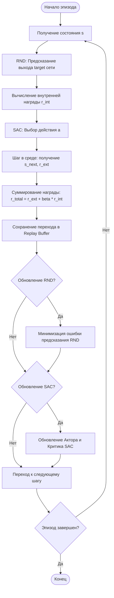

# SAC-RND (Soft Actor-Critic with Random Network Distillation)

SAC-RND (произносится как «Сак-Ар-Эн-Ди») — это гибридный алгоритм обучения с подкреплением, объединяющий метод Soft Actor-Critic (SAC) с механизмом внутренней мотивации Random Network Distillation (RND).

Алгоритм предназначен для решения проблемы разреженных вознаграждений (sparse rewards), добавляя к внешней награде внутренний бонус за посещение новых, плохо предсказуемых состояний среды.

## Подробное описание

В задачах обучения с подкреплением (Reinforcement Learning, RL) агент часто сталкивается с ситуацией, когда внешняя награда от среды поступает крайне редко или только при достижении конечной цели. В таких условиях стандартные алгоритмы могут долго блуждать случайно, не находя полезного поведения.

**Постановка задачи:**
Необходимо обучить агента действовать в среде $E$ так, чтобы максимизировать совокупную награду, состоящую из внешней награды $r_{ext}$ и внутренней награды $r_{int}$, которая стимулирует исследование неизвестных областей пространства состояний.

**Ключевая идея:**

1.  **SAC (Soft Actor-Critic):** Обеспечивает стабильное обучение за счет максимизации не только ожидаемой награды, но и энтропии политики (стохастичности действий). Это предотвращает преждевременную сходимость к субоптимальным стратегиям.
2.  **RND (Random Network Distillation):** Служит механизмом «любопытства». Агент получает дополнительную награду за состояния, которые он плохо понимает (то есть, которые сложно предсказать с помощью простой нейронной сети).

## Принцип работы

Алгоритм состоит из двух основных компонентов: основного агента SAC и модуля исследования RND.

### Математическая формулировка

**1. Внутренняя награда (RND):**
Модуль RND состоит из двух нейронных сетей:

- **Target network ($f$):** Фиксированная случайная сеть, веса которой не обновляются.
- **Predictor network ($\hat{f}$):** Обучаемая сеть, которая пытается предсказать выход target-сети.

Ошибка предсказания для состояния $s_t$ вычисляется как среднеквадратичное отклонение:

$$
r_{int}(s_t) = \| \hat{f}(s_t; \theta) - f(s_t) \|^2
$$

Где:

- $f(s_t)$ — выход фиксированной target-сети для состояния $s_t$.
- $\hat{f}(s_t; \theta)$ — выход обучаемой predictor-сети с параметрами $\theta$.
- $\| \cdot \|^2$ — квадрат евклидовой нормы.

Чем хуже predictor предсказывает выход target для нового состояния, тем выше внутренняя награда. По мере обучения predictor ошибка уменьшается, и агент переключается на исследование других, еще не изученных состояний.

**2. Общая функция награды SAC-RND:**
Итоговая награда, используемая для обновления политики актора и критика в SAC, формируется как взвешенная сумма:

$$
r_{total} = r_{ext} + \beta \cdot r_{int}
$$

Где:

- $r_{ext}$ — внешняя награда от среды.
- $\beta$ — коэффициент масштабирования внутренней награды (hyperparameter).

**3. Обновление Predictor:**
Параметры $\theta$ predictor-сети обновляются путем минимизации ошибки предсказания на батче состояний из replay buffer:

$$
L_{RND}(\theta) = \mathbb{E}_{s \sim D} \left[ \| \hat{f}(s; \theta) - f(s) \|^2 \right]
$$

### Блок-схема процесса



## Пример реализации на Python

Ниже представлен упрощенный пример реализации модуля RND и его интеграции с абстрактным классом SAC. Для работы требуется библиотека `torch`.

```python
import torch
import torch.nn as nn
import torch.optim as optim
import numpy as np

# --- Компонент RND ---

class RNDModule(nn.Module):
    """
    Модуль Random Network Distillation.
    Состоит из фиксированной target сети и обучаемой predictor сети.
    """
    def __init__(self, state_dim, hidden_dim=256):
        super(RNDModule, self).__init__()

        # Target network (фиксированная, случайная инициализация)
        self.target = nn.Sequential(
            nn.Linear(state_dim, hidden_dim),
            nn.ReLU(),
            nn.Linear(hidden_dim, hidden_dim),
            nn.ReLU(),
            nn.Linear(hidden_dim, hidden_dim)
        )

        # Predictor network (обучаемая)
        self.predictor = nn.Sequential(
            nn.Linear(state_dim, hidden_dim),
            nn.ReLU(),
            nn.Linear(hidden_dim, hidden_dim),
            nn.ReLU(),
            nn.Linear(hidden_dim, hidden_dim)
        )

        # Замораживаем веса target сети
        for param in self.target.parameters():
            param.requires_grad = False

        # Инициализируем optimizer только для predictor
        self.optimizer = optim.Adam(self.predictor.parameters(), lr=1e-4)

    def forward(self, state):
        """
        Возвращает выходы target и predictor сетей.
        """
        # Target вычисляется без градиентов
        with torch.no_grad():
            target_feat = self.target(state)
        predictor_feat = self.predictor(state)
        return target_feat, predictor_feat

    def compute_intrinsic_reward(self, state):
        """
        Вычисляет внутреннюю награду как MSE между выходами сетей.
        """
        target_feat, predictor_feat = self.forward(state)
        # Ошибка предсказания
        error = (target_feat - predictor_feat).pow(2).sum(dim=1)
        return error

    def update(self, states):
        """
        Обновляет predictor сеть, минимизируя ошибку предсказания.
        """
        target_feat, predictor_feat = self.forward(states)
        loss = nn.MSELoss()(predictor_feat, target_feat.detach())

        self.optimizer.zero_grad()
        loss.backward()
        self.optimizer.step()

        return loss.item()

# --- Интеграция с SAC (Упрощенная обертка) ---

class SAC_RND_Agent:
    def __init__(self, state_dim, action_dim, rnd_scale=0.1, device='cpu'):
        self.device = torch.device(device)
        self.rnd_scale = rnd_scale

        # Инициализация модуля RND
        self.rnd = RNDModule(state_dim).to(self.device)

        # Здесь должна быть инициализация базового агента SAC
        # self.sac_agent = SAC(state_dim, action_dim, ...)
        # Для краткости мы пропускаем реализацию самого SAC,
        # фокусируясь на интеграции RND.

    def get_total_reward(self, state_tensor, ext_reward):
        """
        Вычисляет итоговую награду для передачи в SAC.
        state_tensor: torch.Tensor формы (batch_size, state_dim)
        ext_reward: np.array или torch.Tensor внешних наград
        """
        # Вычисляем внутреннюю награду
        int_reward = self.rnd.compute_intrinsic_reward(state_tensor)

        # Масштабируем и складываем
        # Примечание: необходимо согласовать размерности и устройства
        total_reward = ext_reward + self.rnd_scale * int_reward.cpu().numpy()
        return total_reward

    def train_step(self, batch_states, batch_rewards, ...):
        """
        Шаг обучения: сначала обновляем RND, затем SAC.
        """
        states_tensor = torch.FloatTensor(batch_states).to(self.device)

        # 1. Обновляем модуль исследования (RND)
        rnd_loss = self.rnd.update(states_tensor)

        # 2. Пересчитываем награды с учетом внутренней мотивации
        # В реальном коде это делается при формировании батча для SAC
        updated_rewards = self.get_total_reward(
            states_tensor,
            np.array(batch_rewards)
        )

        # 3. Передаем обновленные награды в основной алгоритм SAC
        # sac_loss = self.sac_agent.update(..., rewards=updated_rewards)

        return {'rnd_loss': rnd_loss}

# --- Пример использования ---

if __name__ == "__main__":
    # Параметры среды
    state_dim = 4
    action_dim = 2

    # Создаем агента
    agent = SAC_RND_Agent(state_dim, action_dim, rnd_scale=0.1)

    # Генерируем случайные данные для демонстрации
    dummy_states = np.random.rand(32, state_dim).astype(np.float32)
    dummy_ext_rewards = np.random.rand(32)

    # Тестируем шаг обучения
    losses = agent.train_step(dummy_states, dummy_ext_rewards)

    print(f"RND Loss: {losses['rnd_loss']:.4f}")
    print("Модуль RND успешно интегрирован.")
```

## Достоинства и недостатки

**Достоинства:**

1.  **Эффективное исследование:** Позволяет агенту находить решения в средах, где внешняя награда отсутствует или появляется только после длинной серии правильных действий.
2.  **Автоматическая адаптация:** По мере изучения среды внутренняя награда уменьшается, позволяя агенту сфокусироваться на максимизации внешней награды (exploitation).
3.  **Стабильность SAC:** Наследует преимущества SAC, такие как устойчивость к гиперпараметрам и способность работать в непрерывных пространствах действий.

**Недостатки:**

1.  **Вычислительная сложность:** Требует обучения дополнительной нейронной сети (predictor), что увеличивает затраты на вычисления.
2.  **Чувствительность к масштабу:** Параметр $\beta$ (rnd_scale) требует тщательной настройки. Слишком высокое значение может привести к тому, что агент будет игнорировать цель задачи ради исследования шума.
3.  **Проблема шумных сред:** В средах со стохастическим переходом (где одно и то же действие дает разные результаты) RND может интерпретировать шум как «новизну», получая высокую внутреннюю награду за непредсказуемость, а не за полезное исследование.

## Области применения

1.  Робототехника и автономные системы (автономное обучение роботов ходьбе или манипуляции объектами без заранее размеченных данных)
2.  Игровая разработка (обучение NPC сложному поведению в открытых мирах с редкими событиями)
3.  Машинное обучение и рекомендательные системы (использование RL для оптимизации долгосрочных метрик пользователя в условиях неясной обратной связи)
4.  Научные вычисления и физическое моделирование (поиск оптимальных конфигураций молекул или материалов методом проб и ошибок в симуляторах)
