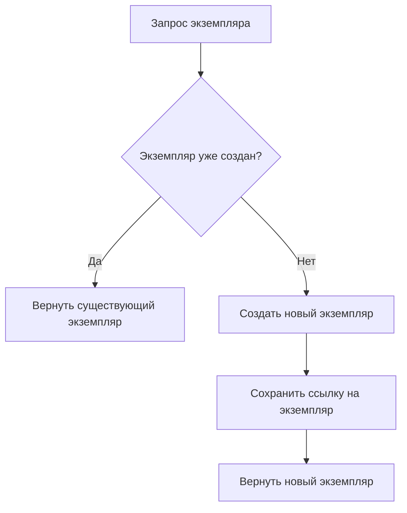

# Паттерн Singleton (Одиночка)

Singleton (Одиночка) — это порождающий паттерн проектирования, который гарантирует, что у класса есть только один экземпляр, и предоставляет глобальную точку доступа к этому экземпляру.

## Подробное описание

Паттерн решает задачу контроля за количеством создаваемых объектов определенного типа. Это необходимо, когда создание объекта требует значительных ресурсов (например, подключение к базе данных) или когда наличие нескольких экземпляров может привести к конфликтам состояния (например, запись в один лог-файл).

**Постановка задачи:**
Необходимо обеспечить, чтобы при любом обращении к классу возвращался один и тот же объект, независимо от того, сколько раз был вызван конструктор или метод создания экземпляра.

**Входные и выходные данные:**

- **Вход:** Запрос на создание экземпляра класса.
- **Выход:** Ссылка на единственный существующий экземпляр класса.

**Ключевая идея:**
Скрыть конструктор класса от прямого вызова извне и предоставить статический метод (или переопределить механизм создания объекта), который проверяет наличие созданного экземпляра. Если экземпляр уже существует, возвращается он; если нет — создается новый и сохраняется для последующих обращений.

## Основные принципы

Логика работы паттерна строится на проверке наличия внутреннего статического поля, хранящего ссылку на экземпляр.

### Блок-схема алгоритма



### Потокобезопасность

В многопоточных средах простая проверка `if instance is None` недостаточна, так как два потока могут одновременно пройти проверку и создать два разных объекта. Для решения этой проблемы используются механизмы синхронизации (блокировки) или двойная проверка блокировки (Double-Checked Locking).

## Пример реализации на Python

Ниже представлен универсальный пример реализации потокобезопасного Singleton с использованием метакласса, а также примеры его использования для логгера и конфигурации.

```python
import threading
from typing import Any

class SingletonMeta(type):
    """
    Метакласс для реализации потокобезопасного Singleton.
    Использует блокировку для предотвращения создания нескольких экземпляров
    в многопоточной среде.
    """
    _instances = {}
    _lock: threading.Lock = threading.Lock()

    def __call__(cls, *args: Any, **kwargs: Any) -> Any:
        # Быстрая проверка без блокировки для повышения производительности
        if cls not in cls._instances:
            # Блокируем поток только если экземпляр еще не создан
            with cls._lock:
                # Повторная проверка внутри блокировки (Double-Checked Locking)
                if cls not in cls._instances:
                    instance = super().__call__(*args, **kwargs)
                    cls._instances[cls] = instance
        return cls._instances[cls]

class Logger(metaclass=SingletonMeta):
    """
    Пример класса-логгера, реализованного через Singleton.
    Гарантирует, что все части приложения пишут в один и тот же объект лога.
    """
    def __init__(self):
        # Инициализация выполняется только один раз при первом создании
        self.logs = []

    def log(self, message: str):
        self.logs.append(message)
        print(f"[LOG]: {message}")

class AppConfig(metaclass=SingletonMeta):
    """
    Пример класса конфигурации.
    """
    def __init__(self):
        self.settings = {
            "debug": True,
            "version": "1.0.0"
        }

    def get_setting(self, key: str) -> Any:
        return self.settings.get(key)

if __name__ == "__main__":
    # Демонстрация работы Singleton

    # 1. Создание экземпляров логгера
    logger1 = Logger()
    logger2 = Logger()

    # Проверяем, что это один и тот же объект
    print(f"logger1 is logger2: {logger1 is logger2}")  # True

    # Логируем сообщение через первый экземпляр
    logger1.log("Приложение запущено")

    # Проверяем состояние второго экземпляра (оно должно быть общим)
    print(f"Логи во втором экземпляре: {logger2.logs}")

    # 2. Работа с конфигурацией
    config1 = AppConfig()
    config2 = AppConfig()

    print(f"config1 is config2: {config1 is config2}")  # True
    print(f"Версия приложения: {config2.get_setting('version')}")
```

## Достоинства и недостатки

**Достоинства:**

1. **Контроль над экземпляром**: Гарантирует, что класс имеет ровно один экземпляр, что важно для ресурсов с ограниченным доступом (БД, файлы).
2. **Глобальный доступ**: Предоставляет удобную точку доступа к объекту из любой части программы без передачи ссылок через параметры методов.
3. **Ленивая инициализация**: Объект создается только при первом обращении, что экономит ресурсы, если объект никогда не используется.

**Недостатки:**

1. **Нарушение принципа единственной ответственности (SRP)**: Класс решает две задачи: свою основную бизнес-логику и управление своим жизненным циклом.
2. **Сложность тестирования**: Singleton скрывает зависимости, что затрудняет подмену реальных объектов на моки (mocks) при модульном тестировании.
3. **Скрытые зависимости**: Использование Singleton делает связи между компонентами неявными, что усложняет понимание архитектуры больших приложений.
4. **Проблемы в многопоточности**: Неправильная реализация может привести к гонкам данных (race conditions) или созданию дубликатов.
