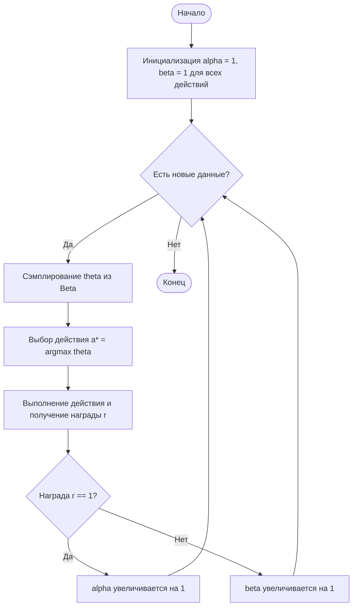

# Выборка Томпсона (Thompson Sampling)

Выборка Томпсона (Thompson Sampling, TS) — это вероятностный алгоритм для решения задачи многорукого бандита (Multi-Armed Bandit), который использует байесовский вывод для балансировки между исследованием новых вариантов (exploration) и использованием лучших известных вариантов (exploitation).

## Подробное описание

Задача многорукого бандита заключается в выборе одного из нескольких действий («рычагов»), каждое из которых дает случайную награду с неизвестным распределением. Цель агента — максимизировать суммарную награду за определенное количество шагов.

Ключевая идея алгоритма состоит в том, чтобы моделировать неопределенность относительно истинной вероятности успеха каждого действия. Вместо того чтобы выбирать действие с максимальной оценкой (как в жадных алгоритмах), TS выбирает действие, которое с наибольшей вероятностью является лучшим, согласно текущим апостериорным распределениям.

Исторически метод был предложен Уильямом Р. Томпсоном в 1933 году для задач клинических испытаний, но широкую популярность в IT получил благодаря эффективности в онлайн-рекламе, A/B-тестировании и рекомендательных системах.

## Принцип работы

### Математическая формулировка

Для случая бинарных наград (успех/неудача, клик/пропуск) удобно использовать сопряженное априорное распределение — Бета-распределение.

Для каждого действия $a$ поддерживаются два параметра:

- $\alpha_a$ — количество успехов (например, кликов).
- $\beta_a$ — количество неудач (например, показов без клика).

Апостериорное распределение вероятности успеха $\theta_a$ для действия $a$ описывается как:

$$
\theta_a \sim \text{Beta}(\alpha_a, \beta_a)
$$

Плотность вероятности Бета-распределения:

$$
f(x; \alpha, \beta) = \frac{x^{\alpha-1}(1-x)^{\beta-1}}{B(\alpha, \beta)}
$$

Где $B(\alpha, \beta)$ — бета-функция (нормировочная константа).

**Алгоритм выбора действия:**

1. Для каждого действия $a$ сгенерировать случайную выборку $\hat{\theta}_a$ из распределения $\text{Beta}(\alpha_a, \beta_a)$.
2. Выбрать действие $a^*$ с максимальным значением выборки:
   $$
   a^* = \arg\max_a \hat{\theta}_a
   $$

**Обновление параметров:**
После получения награды $r \in \{0, 1\}$ для выбранного действия $a^*$:

- Если $r=1$: $\alpha_{a^*} \leftarrow \alpha_{a^*} + 1$
- Если $r=0$: $\beta_{a^*} \leftarrow \beta_{a^*} + 1$

### Блок-схема алгоритма



## Пример реализации на Python

Ниже представлен полный пример использования Выборки Томпсона для задачи оптимизации заголовков новостей (бинарная награда: клик или нет).

```python
import numpy as np
import matplotlib.pyplot as plt

class ThompsonSampling:
    """
    Реализация алгоритма Thompson Sampling для бинарных наград.
    Использует Бета-распределение для моделирования неопределенности.
    """
    def __init__(self, n_arms: int):
        self.n_arms = n_arms
        # Инициализация параметров Бета-распределения (равномерный prior)
        # alpha - количество успехов, beta - количество неудач
        self.alpha = np.ones(n_arms)
        self.beta = np.ones(n_arms)

    def select_arm(self) -> int:
        """
        Выбирает действие путем сэмплирования из апостериорных распределений.
        Возвращает индекс выбранного действия.
        """
        # Генерируем по одной случайной величине из Beta(alpha, beta) для каждого рычага
        samples = np.random.beta(self.alpha, self.beta)
        # Возвращаем индекс рычага с максимальным сэмплированным значением
        return np.argmax(samples)

    def update(self, chosen_arm: int, reward: int) -> None:
        """
        Обновляет параметры распределения для выбранного действия.

        Args:
            chosen_arm: Индекс выбранного действия.
            reward: Награда (1 - успех, 0 - неудача).
        """
        if reward == 1:
            self.alpha[chosen_arm] += 1
        else:
            self.beta[chosen_arm] += 1

def simulate_thompson_sampling():
    """
    Симуляция работы алгоритма в среде с известными истинными вероятностями.
    """
    # Параметры среды
    n_arms = 3
    true_means = [0.3, 0.5, 0.7]  # Истинные вероятности клика (CTR)
    n_trials = 1000

    # Инициализация алгоритма
    ts_agent = ThompsonSampling(n_arms)

    # Хранение истории
    choices = []
    rewards_history = []
    cumulative_regret = []

    optimal_mean = max(true_means)
    current_regret = 0.0

    print("Запуск симуляции Thompson Sampling...")

    for t in range(n_trials):
        # 1. Выбор действия
        chosen_arm = ts_agent.select_arm()
        choices.append(chosen_arm)

        # 2. Получение награды из среды (Бернулли)
        reward = np.random.binomial(1, true_means[chosen_arm])
        rewards_history.append(reward)

        # 3. Обновление модели агента
        ts_agent.update(chosen_arm, reward)

        # 4. Расчет сожаления (regret)
        # Regret = (Лучшая возможная награда) - (Полученная ожидаемая награда)
        current_regret += (optimal_mean - true_means[chosen_arm])
        cumulative_regret.append(current_regret)

    # Визуализация результатов
    plot_results(ts_agent, cumulative_regret, choices, true_means)

def plot_results(agent: ThompsonSampling, regret: list, choices: list, true_means: list):
    """
    Построение графиков распределений и сожаления.
    """
    fig, axes = plt.subplots(1, 2, figsize=(14, 5))

    # График 1: Апостериорные распределения
    x = np.linspace(0, 1, 200)
    for arm in range(agent.n_arms):
        y = np.exp(np.log(np.power(x, agent.alpha[arm]-1)) +
                   np.log(np.power(1-x, agent.beta[arm]-1))) # Упрощенная PDF для визуализации формы
        # Нормализация для красивого отображения
        from scipy.stats import beta
        y_norm = beta.pdf(x, agent.alpha[arm], agent.beta[arm])
        axes[0].plot(x, y_norm, label=f'Arm {arm} (True CTR: {true_means[arm]})')

    axes[0].set_title('Posterior Distributions after Simulation')
    axes[0].set_xlabel('Probability of Click (CTR)')
    axes[0].set_ylabel('Density')
    axes[0].legend()
    axes[0].grid(True, linestyle='--', alpha=0.5)

    # График 2: Кумулятивное сожаление
    axes[1].plot(regret, color='red')
    axes[1].set_title('Cumulative Regret over Time')
    axes[1].set_xlabel('Trial Number')
    axes[1].set_ylabel('Regret')
    axes[1].grid(True, linestyle='--', alpha=0.5)

    plt.tight_layout()
    plt.show()

    # Вывод статистики
    print(f"\nИтоговые параметры Alpha: {agent.alpha}")
    print(f"Итоговые параметры Beta:  {agent.beta}")
    print(f"Финальное сожаление: {regret[-1]:.2f}")

if __name__ == "__main__":
    simulate_thompson_sampling()
```

## Достоинства и недостатки

**Достоинства:**

1. **Естественный баланс Exploration/Exploitation**: Алгоритм автоматически исследует действия с высокой неопределенностью (широкое распределение) и эксплуатирует действия с высокой ожидаемой наградой.
2. **Вычислительная эффективность**: Не требует решения сложных оптимизационных задач на каждом шаге, только генерацию случайных чисел.
3. **Теоретические гарантии**: Доказано, что TS достигает логарифмического роста сожаления ($O(\ln T)$), что является оптимальным порядком для задачи бандита.
4. **Простота параллелизации**: Легко распределяется между несколькими серверами, так как обновления аддитивны.

**Недостатки:**

1. **Зависимость от модели**: Требует знания типа распределения наград (например, Бернулли для кликов, Гауссово для времени просмотра). При неверном выборе модели эффективность падает.
2. **Сложность анализа в реальном времени**: В отличие от UCB, где граница доверия явна, поведение TS стохастично и сложнее интерпретируется детерминированно.
3. **Чувствительность к начальной инициализации**: При очень малом количестве данных результаты могут сильно варьироваться от случайного зерна (seed).

## Области применения

1. Машинное обучение и рекомендательные системы (персонализация выдачи контента, Cold Start проблема)
2. Торговля и коммерция (A/B-тестирование заголовков, баннеров, динамическое ценообразование)
3. Оптимизация и планирование (распределение рекламных бюджетов между каналами, выбор стратегий в условиях неопределенности)
