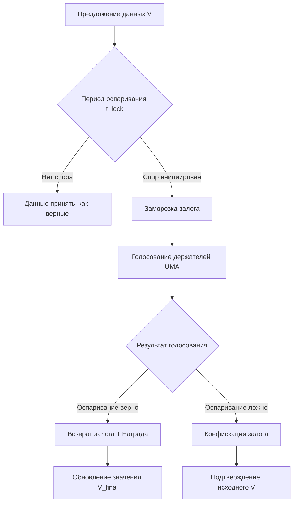

# Оптимистический оракул UMA Protocol

UMA (Universal Market Access) — это децентрализованный протокол оракулов, использующий оптимистическую модель верификации данных и экономические гарантии для обеспечения смарт-контрактов надежной внешней информацией.

Протокол решает фундаментальную проблему «оракула» в блокчейн-системах: как безопасно передать данные из внешнего мира в детерминированную среду смарт-контракта без единой точки отказа. В отличие от традиционных подходов, где данные проверяются _до_ записи, UMA предполагает, что предложенные данные верны, если они не были оспорены в течение заданного периода, что существенно снижает затраты на транзакции и задержки.

## Основные принципы

### Математическая формулировка

В основе UMA лежит оптимистическая модель верификации. Пусть $V$ — предложенное значение цены или данных, а $t_{lock}$ — период оспаривания. Значение считается финальным ($V_{final}$), если выполняется условие отсутствия спора:

$$
V_{final} =
\begin{cases}
V, & \text{если } \neg \exists \text{Dispute}(V, t) \forall t < t_{lock} \\
\text{Resolve}(V, \text{Votes}), & \text{иначе}
\end{cases}
$$

Экономическая безопасность обеспечивается залоговой моделью. Для оспаривания значения необходимо внести залог $B$, который возвращается с вознаграждением $R$ при успешном споре:

$$
\text{Profit}_{\text{disputer}} = B + R - \text{GasCost}
$$

Где:

- $V$ — предложенное значение (цена, результат события).
- $t_{lock}$ — длительность окна оспаривания (liveness period).
- $\text{Resolve}$ — функция голосования держателей токенов UMA (Data Verification Mechanism).
- $B$ — размер залога для инициирования спора.
- $R$ — награда за корректное оспаривание.

### Блок-схема разрешения споров

Процесс верификации через Data Verification Mechanism (DVM):



## Пример реализации на Python

Поскольку прямое взаимодействие с блокчейном требует внешних зависимостей (`web3.py`), ниже представлена самодостаточная симуляция ядра логики UMA: оптимистической верификации и механизма разрешения споров через голосование. Код демонстрирует алгоритмическую основу протокола.

```python
import time
from typing import Dict, Optional, List, Tuple
from enum import Enum

class DisputeStatus(Enum):
    NONE = "no_dispute"
    ACTIVE = "active"
    RESOLVED_CORRECT = "dispute_valid"
    RESOLVED_FALSE = "dispute_invalid"

class OptimisticOracleSimulator:
    """
    Симулятор ядра UMA Protocol.
    Демонстрирует логику оптимистической верификации и разрешения споров
    без использования внешних блокчейн-библиотек.
    """

    def __init__(self, liveness_period: int = 5, dispute_bond: float = 100.0):
        # Период ожидания перед принятием данных (секунды в симуляции)
        self.liveness_period = liveness_period
        # Размер залога для оспаривания
        self.dispute_bond = dispute_bond
        # Хранилище предложенных цен: {identifier: (value, timestamp, status)}
        self.price_requests: Dict[str, Tuple[float, float, DisputeStatus]] = {}
        # История голосований для аудита
        self.vote_history: List[Dict] = []

    def propose_price(self, identifier: str, price: float) -> bool:
        """
        Предложение новой цены.
        В реальной системе это транзакция proposePrice в смарт-контракте.
        """
        current_time = time.time()
        if identifier in self.price_requests:
            _, _, status = self.price_requests[identifier]
            if status == DisputeStatus.ACTIVE:
                print(f"Ошибка: активный спор по {identifier}")
                return False

        # Сохраняем предложение со статусом "нет спора"
        self.price_requests[identifier] = (price, current_time, DisputeStatus.NONE)
        print(f"[PROPOSE] {identifier}: ${price:.2f} (ожидание {self.liveness_period}с)")
        return True

    def dispute_price(self, identifier: str) -> bool:
        """
        Инициирование спора. Требует внесения залога.
        Переводит запрос в состояние ACTIVE.
        """
        if identifier not in self.price_requests:
            print(f"Ошибка: запрос {identifier} не найден")
            return False

        price, ts, status = self.price_requests[identifier]

        # Проверка: можно ли еще оспорить (не истек ли liveness period)
        if time.time() - ts > self.liveness_period and status == DisputeStatus.NONE:
            print(f"Ошибка: период оспаривания для {identifier} истек")
            return False

        if status != DisputeStatus.NONE:
            print(f"Ошибка: спор по {identifier} уже идет или разрешен")
            return False

        # Блокируем залог и меняем статус
        self.price_requests[identifier] = (price, ts, DisputeStatus.ACTIVE)
        print(f"[DISPUTE] Спор по {identifier} инициирован. Залог: ${self.dispute_bond}")
        return True

    def resolve_vote(self, identifier: str, is_dispute_valid: bool) -> Optional[float]:
        """
        Разрешение спора голосованием (симуляция DVM).
        Возвращает финальную цену после разрешения.
        """
        if identifier not in self.price_requests:
            return None

        price, ts, status = self.price_requests[identifier]

        if status != DisputeStatus.ACTIVE:
            print(f"Ошибка: нет активного спора по {identifier}")
            return None

        # Определение финального значения на основе результата голосования
        if is_dispute_valid:
            final_status = DisputeStatus.RESOLVED_CORRECT
            # В реальности цена обновляется на значение, предложенное диспутером
            # Здесь для простоты возвращаем None как сигнал необходимости нового предложения
            final_price = None
            outcome = "Спор признан обоснованным. Залог возвращен."
        else:
            final_status = DisputeStatus.RESOLVED_FALSE
            final_price = price
            outcome = "Спор признан необоснованным. Залог конфискован."

        self.price_requests[identifier] = (price, ts, final_status)
        self.vote_history.append({
            "id": identifier,
            "original_price": price,
            "valid": is_dispute_valid,
            "timestamp": time.time()
        })

        print(f"[RESOLVE] {identifier}: {outcome}")
        return final_price

    def get_settled_price(self, identifier: str) -> Optional[float]:
        """
        Получение подтвержденной цены.
        Возвращает значение только если спор разрешен или время вышло.
        """
        if identifier not in self.price_requests:
            return None

        price, ts, status = self.price_requests[identifier]
        elapsed = time.time() - ts

        # Если спора не было и время вышло — цена принята
        if status == DisputeStatus.NONE and elapsed >= self.liveness_period:
            return price

        # Если спор был и разрешен в пользу оригинала
        if status == DisputeStatus.RESOLVED_FALSE:
            return price

        # Если спор активен или разрешен в пользу диспутера — цена не определена
        return None


if __name__ == "__main__":
    # Инициализация симулятора с коротким периодом для демонстрации
    oracle = OptimisticOracleSimulator(liveness_period=2, dispute_bond=50.0)

    # Сценарий 1: Успешная верификация без спора
    print("--- Сценарий 1: Честное предложение ---")
    oracle.propose_price("ETH/USD", 3500.00)
    time.sleep(2.1)  # Ждем окончания периода оспаривания
    settled = oracle.get_settled_price("ETH/USD")
    print(f"Финальная цена ETH/USD: ${settled}\n")

    # Сценарий 2: Оспаривание некорректной цены
    print("--- Сценарий 2: Спор по цене ---")
    oracle.propose_price("BTC/USD", 999999.00)  # Явно неверная цена
    oracle.dispute_price("BTC/USD")
    # Голосование подтверждает, что цена была неверной (dispute valid)
    result = oracle.resolve_vote("BTC/USD", is_dispute_valid=True)
    print(f"Результат после спора: {result} (требуется новое предложение)\n")
```

## Достоинства и недостатки

**Достоинства:**

1.  **Низкая стоимость операций.** Оптимистическая модель исключает необходимость ончейн-верификации каждой транзакции; ресурсы тратятся только при возникновении споров.
2.  **Высокая степень децентрализации.** Отсутствие централизованного поставщика данных устраняет единую точку отказа и риск цензуры.
3.  **Гибкость типов данных.** Протокол поддерживает любые идентификаторы данных (цены, результаты выборов, погодные условия), а не только финансовые котировки.
4.  **Экономическая криптобезопасность.** Безопасность гарантируется стоимостью атаки на систему (стоимостью покупки 51% токенов управления), а не доверием к конкретным нодам.

**Недостатки:**

1.  **Задержка подтверждения.** Необходимость ожидания периода оспаривания (liveness period) делает протокол непригодным для высокочастотных приложений.
2.  **Сложность интеграции.** Разработчики должны самостоятельно проектировать механизмы обработки споров и резервные источники данных.
3.  **Риск манипуляций при низкой ликвидности.** При малой капитализации токена управления стоимость атаки на оракул может стать приемлемой для злоумышленников.
4.  **Требование залогов.** Участники должны замораживать средства для предложений и споров, что создает барьер входа и риски потерь при ошибках.

## Области применения

1.  Экономика и финансы (синтетические активы, децентрализованные деривативы, страхование параметров).
2.  Торговля и коммерция (предсказательные рынки, динамическое ценообразование на основе внешних индексов, верификация условий поставок).
